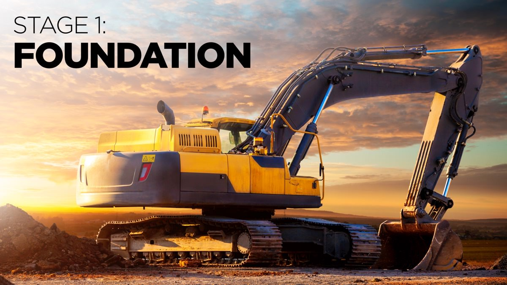

+++
draft 			= false
title 			= "Business Presentation Revolution – Stage 1: Foundation"
disallowbots		= true
+++

The Foundation stage is amazingly important, yet most presenters don’t take the time to set a strong foundation for their presentations. Too many presentations misunderstand their audiences, ignore their burning needs, and take no account of the context.

The additional resources for this stage should help you to create a strong foundation for your presentation, and set you on the path to success.

## Useful Articles

* [An overview of the Foundation stage](https://www.ideasonstage.com/news/2021/06/10/2021-06-10-the_foundation_stage/)

## Video Resources

These videos can help you to go deeper and may also help you to convince your colleagues that they should also take the time to join the Business Presentation Revolution!

{}

## Templates & Checklists

There is a set of 20 questions to answer about your Audience, their Burning Needs and the Context in Section 1 of Business Presentation Revolution. You may find it helpful to download the ABC Template to help you to answer these questions and understand the ABC of your presentation.

{}

[Click here to go back to the main Business Presentation Revolution Bonus Resources page](/business-presentation-revolution/book/bonus-content/)
