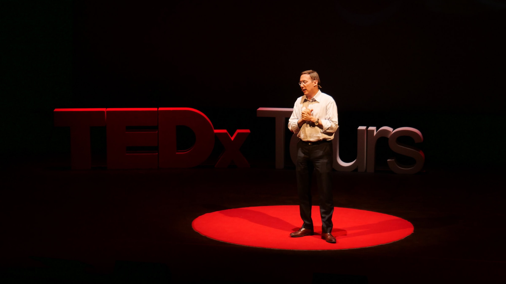

+++
draft		= false
title		= "TEDx Tours 2019"
description	= "How to create a great TEDx event, with Fabien Boutard, curator of TEDx Tours"
weight		= 1
categories	= [ "Public Speaking", "Events", "TEDx" ]
showrefs	= false
redirect	= false
redirectlink= ""
picture		= "tedx-tours-2019-1.jpg"
url	 		= "/public-speaking-coaching/tedx-coaching/events/tedx-tours-2019/"
+++

## How to create a great TEDx event, with Fabien Boutard, curator of TEDx Tours

This summer we coached the speakers for TEDx Tours 2019, which took place on June 25 in the historical region of Touraine in France. The event space was none other than the Grand Théâtre de Tours, a beautiful piece of architecture à l’italienne. This region is also home to world-famous sites such as the Clos Lucé, where Leonardo da Vinci spent his last years in France, the charming castles of Amboise, Blois, Chenonceau, Chambord and many more. 

TEDx Tours is so successful it sells out every year. So to learn more about how to make such a successful event, Pierre Morsa sat down with their curator, Fabien Boutard, to discuss the challenges of organizing a TEDx and how to find great speakers. Whether you want to create a TEDx or TED-inspired business event, we hope this sparks some new ideas for you!

**Pierre**: Fabien, it's the fifth year in a row that you are the TEDx Tours curator. What drives you to organize these events?

**Fabien**: The story began five years ago in Tours on my couch on a summer night. I was watching a TEDx video and I said to myself: “It’s incredible that in a city with so many medical researchers, universities and so much intellectual potential, there is no way to communicate the results to the general public in a clear and simple way.” I then realized that the TEDx format was in fact perfect to showcase the bright ideas of our region and its inhabitants. It was also a way for me to satisfy my curiosity and find more inspiration.

**Pierre**: We know that it can be stressful. What advice would you give to other organizers to make things easier?

**Fabien**: TEDx events are organized by non-profit organizations, by teams entirely made of volunteers. The quality of the team is what really makes the difference. You’re often going to work for one year without knowing what the end result will be. To stay on track, each member has to know why he’s taking part in this adventure, what is his role and why it’s important. Then everything happens in the course of four hours. Months of work get rewarded, and it’s truly a magical moment! The other critical element is the quality of the speakers. 

**Pierre**: Over the past years, you've found some great speakers that nobody knew. What is your secret?

**Fabien**: What we do is probably different from other events. We first list the ideas we would like to see on stage, then we find the best speakers we can find for each topic. We try to foresee what will be interesting in 1 year from now, not what is interesting today. With social networks, everything goes in and out of fashion incredibly quickly nowadays. Something that was on everyone’s mind may have become old news three months later; it already happened to us. 

**Pierre**: How important is the preparation?

**Fabien**: No matter how famous your speaker is, the preparation phase is crucial. You should never compromise on the quality of the preparation. The best speakers spend between 30 and 50 hours writing, illustrating and practicing their talk. That may sound like a lot, but it is what it takes. The first step is to make sure the talk is going to be structured around a clear, key idea. Then there is a fairly long writing phase. Some prefer to write everything, others prefer to write the storyline only. It’s a fine balance between respecting what the speaker wants to say and making sure it’s going to be clear and impactful for the public. The last step is to practice, practice, practice until perfect. 

**Pierre**: What advice would you give to people who want to be invited to give a TEDx talk?

**Fabien**: Why would your topic be of interest for the TEDx audience? We never select a personality or an ability to speak in public first: we always give more importance to the message that you want to communicate. It’s not necessary to send us a CV; having a message worth spreading is what counts. 

**Pierre**: What do you think is the most important thing on D-Day?

**Fabien**: What we realized since the first edition, what worked, and sometimes didn’t, is when the audience experiences something greater than the sum of the talks. It then becomes a unique adventure, for the audience, for the speakers and for us. It’s our responsibility to ensure that everyone has a pleasurable and enjoyable evening, that the subtle alchemy between the various elements creates something unique and unforgettable.

*Thank you very much, Fabien, for your inspiring tips to organize a great TEDx event!*
