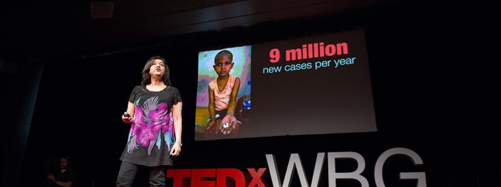
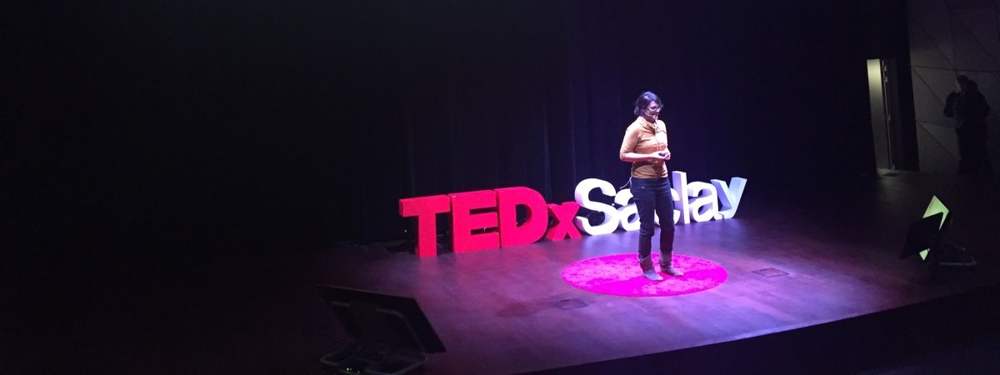
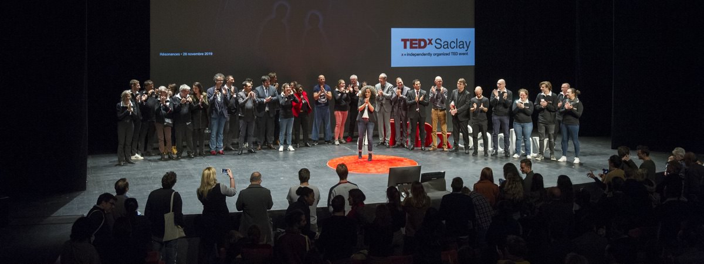

+++
draft 			= false
title	 		= "Ultimate Inspiring Speaker Guide"
description		= "Everything that you wanted to know about being a TEDx speaker without needing to ask."
categories		= [ "TEDx Events" ]
url				= "/tedx-speaker-guide/"
translationKey  = "guides/tedx-speaker-guide"
picture			= "tedx-speaker.jpg"
summary			= "Congratulations, you’ve just been contacted to be a speaker at a TED or TEDx talk! Or it could be that you have the ambition to organize one yourself. If it’s either of those, this guide was made for you."
+++

Congratulations, you’ve just been contacted to speak at a TED or TEDx event! Or you’re embarking upon organizing one yourself. If either of these scenarios are true, this guide was made for you. We have compiled everything that you need to know about how to be or train a successful public speaker for TED without needing to ask.

## Why an ultimate TED Speaker guide?

We have come to realize that a lot of speakers ask themselves the same questions. Therefore, we decided to create a practical guide without any bla bla bla to help you prepare your speakers or your TED talk.

## Authorized use of this Ultimate TEDx Speaker Guide

You can use this guide freely on the condition that you cite its source and create a visible web link to this page in the following cases:

*	In the context of a TEDx event: you can freely distribute it to your speakers in virtual or printed format. For a PDF copy of this article please leave a comment below.
*	Using extracts for non-commercial means (student notes, personal blogs, etc.).
*	For educational purposes.

If you are an organizer of a conference, you are welcome to contact us at info@ideasonstage.com and we will create a personalized version of this guide for distribution to your participants, without reference to TED, TEDx and with your branding.

All commercial use of this document without our agreement is strictly forbidden. Honor code activated.

<aside><blockquote>
This article is independent research conducted by Ideas on Stage. TED and TEDx are registered trademarks belonging to TED Conferences LLC. Ideas on Stage is an independent company and has no affiliation with TED or TEDx.
</blockquote></aside>

## Acknowledgements

The creation of this ultimate TEDx speaker guide wouldn’t have been possible without the help of my colleagues Phil, Rose and Michael, all of whom are certified presentation directors and better coaches than me. We would equally like to thank all the organizers who have already entrusted us with the organization of TEDx and other events and continue to do so.

## The Path to Building Your TEDx

The euphoric invitation moment has passed, you have come back to earth. Now what? Where to begin?

First, make sure that you are available for the date of the event and be certain that you can participate. Nothing is worse for an organizer than to have a speaker abandon their commitment halfway through the preparation process, above all when the program has been already announced. Be sure that you are 100% certain that you can and want to do it before confirming your participation to the organizers.

### Reply to the invitation like a professional speaker

So you’re certain that you want to take part as a TEDx speaker? Great! Start by sending an email to the organizers with 3 pieces of information and 4 questions. 

Your information:

1.	Confirm your participation in the event along with the reason why you wish to take part. 
2.	Mention the subject that you intend to speak about and ask the organizers to confirm that they approve of this topic.
3.	Send them your mini biography. Who are you? What is your story? What makes you original? Why do you want to speak at a TED? Don’t write a novel. Ten lines are more than enough. Be very clear about your title (CEO of …, mad inventor of, futurologist, …) because your bio is what will be the most visible on the site and in the program.

Questions to the Organizer:

1.	How long will I have to speak? One of the golden rules of a TED presentation is to never go over time. Respect the duration given, usually set by the organizers. Popular talk time lengths range between 5 and 18 minutes; between 12 and 15 minutes is the standard for many TEDx events.
2.	What are the specifications for my presentation? Should I use PowerPoint, Keynote, Prezi? Do they need it in 4:3 or 16:9? Light or dark backgrounds? Are there visual guidelines to follow?
3.	Will there be coaching, and if so, what are the dates? If the organizers are worth their salt, they should provide at least one presentation director or coach who will help speakers to prepare their talks. Plan your sessions with the coach in advance as much as possible. It is strongly advised that you accept their help. Working with a professional to hone your TED talk will render your story more impactful, dynamic and memorable. What they will teach you will not only be useful for that particular event, but will offer you knowledge and tools useful for your entire professional career.
4.	May I have a speaker release form? This is “the contract” by which you will engage and respect the rules of TEDx. If the organizers don’t send it to you, ask for it, it’s an obligation on their part.

If you send all these elements to the organizers from the beginning, they will not only be impressed by your professionalism, but you will feel more at ease and informed at the gate.

### Organize your preparation

Once you confirm your participation, the organizers should confirm the following elements with you:

*	Your travel arrangements and accommodation if necessary. 
*	The dates and venue for the preparation of your talk with the coach or director. 
*	For local conferences, rehearsal times and location details; often a meeting room or theater. 
*	For international speakers, coaching sessions are often conducted via videoconferencing using platforms like Zoom, Skype or Teams; be sure to have login details and for that.
*	Expected arrival or show times for the big day. 
*	Any tech rehearsal information so you can plan accordingly. If you have the chance to rehearse on stage or in the event space, we highly recommend seizing this opportunity as being familiar with the layout, technicalities and challenges of the space before speaking does everything run more smoothly and relaxes presenter nerves.

## Prepare to be coached

Once you have fixed a date for your first coaching session, you can prepare by doing several things.

Know TED: “Have you met TED?” Excuse the pop-culture reference (see How I met your Mother). If you are not familiar with TED or TEDx, the first thing you need to do is visit [www.ted.com](https://www.ted.com) and watch a few videos to understand why the conference has garnered such a globally positive reputation. Here are some links in English, which will give you a hint of the style and quality of the talks.

Al Gore: new thinking on the climate crisis


Sarah Kay: If I Should Have a Daughter

	
Seth Godin: how to get your ideas to spread


Hans Rösling: Asia’s rise how and when


Amanda Gorman: The Hill We Climb/Using your voice is a political choice


Title it: provide the organizers with the title of your talk. They will need it to prepare the event web site and print their programs. In order to do that they need the title of your talk. Try to be original with your title and avoid non-specific, generalized titles. Try to find something that will hook people’s attention. A question perhaps, or a slogan. Don’t worry, it is common for this step to feel problematic since you are still working on your content.

Share it: deliver your work in progress! Before your first session, send your coach, and possibly the organizers, your story or script plus any slides for your talk. This will allow the coach to prepare and to better advise you during the session. It is possible that your coach would prefer to help you from scratch. Structure your ideas and visualize or storyboard your slides. If you don’t know how to do this, then the next chapter is for you.

## Write your story.

A good presentation sits on an axis of 3 key elements, which serve the message of your talk:

1. A well-structured and captivating Story
2. Strong visuals or Slides
3. A clear and passionate Speaker

### Define your objective and key messages

Before launching yourself into detailed preparation for your talk, don’t forget to take into account the expectations of the organizers, the audience and the context, questions to consider as you define the objective of your talk, or what we call a transformational objective:

*	What is the current cultural context surrounding your topic at this time? This could be for your subject, market, or in the world. What recent events could alter audience perception of my talk?
*	Why did the organizers choose you? What are their expectations of you or your subject matter? How does it fit into the theme and goal of the event?
*	What change would you like to see in your audience? Fill in the question, “After my presentation, the audience will__________” (know, believe, feel, do) what differently?

Transformational objective examples: “After my talk, my audience will … participate in the circular economy.” Or, “ … share about this initiative.” “ … better understand quantum physics.” “ … be more interested in space exploration!” “ … see the humanitarian side of plastic surgery.” “ … feel more optimistic about the world.”

After you set your objective, define your key messages. What is the 1 to 3 things you most want your audience to remember after your talk? Example: 1) AI is changing everything. 2) Humans need to control it or it will control us. 3) Stay curious about AI development and take privacy measures on your devices. This follows a “what, so what, what next” model for setting your key messages.

The art of presenting is the subject of a lot of books, it is impossible to explain everything in this document otherwise it would be 500 pages long and no one would read it. So, I made a choice: you’ll find for each point mentioned below, a few yet very powerful tips to help you give a great presentation, “TED Style”.

### Know How to SCORE

Now that you have your objective and key messages, how will you bring them to life powerfully within time? First, know the constraints. One step is to map out your word count by taking the allotted time (say, 10mins) and multiply it by 150 (words per minute), giving you about 1500 words. Now you have a rough idea of the maximum length to speak at a reasonable (Steve Jobs like) pace. Go faster, and you risk sounding rushed or losing your audience.

How do you make your talk SCORE?, you’ll find 5 characteristics to help you tell a great story.

1. **Simple**. One way to lose your audience is in complexity. 8–18minutes is not enough time to teach the intricacies of your subject. But it is enough time to make a change in what they know, believe, feel and do.
2. **Clear**. Is your story clear, concise and concrete? Avoid ideas and terms which are too conceptual. Use examples and anecdotes to show, not tell.
3. **Original**. The most memorable TEDx speakers do something original, even surprising, to punctuate their point that engages our senses. Bill Gates brought mosquitos on stage. Jamie Oliver presented a wheelbarrow filled with sugar. Phil Waknell launched dozens of balloons while Isaac Getz flung toy monkeys into the crowd. These gestures make a strong impression by being original and unexpected.
4. **Related**. Everything in your talk should relate to your key messages and ultimately your objective and how it fits into the theme of the event. The more related, the more connected your subject is to the world, current events and the audience.
5. **Enjoyable**. Don’t push aside your emotions, let them shine. Recount your own powerful experiences to take listeners on an enjoyable ride. If you follow the first five criteria, it’s hard to go wrong. Even if the previous ingredients can help you to build a great TED Talk, ask yourself how your talk can bring something new to your subject, a point of view not yet shared.

One more thing: include tweetable lines. The audiences of TED/TEDx are generally very active on social media sites such as Twitter, Facebook and the like. You will have a better chance of your talk being, er, talked about and shared if you give shareable phrases during your talk that encapsulate your key ideas. It helps to punctuate your presentation and provides the audience sound bites to share. At a similar TED like conference in France, the renowned American speaker and campaigner John Hope Bryant gave many of these great messages. One that really stuck was “Nothing stops a bullet like a job,” which was shared rampantly by the audience afterwards.

### Tell Your Story

Hook them. As a TEDx speaker, your first words have a huge influence on the rest of your talk. They can arouse curiosity and sympathy from the outset, or put them off, or worse, put them to sleep. This also concerns those watching your talk online. The first 15 seconds are critical in determining whether viewers continue watching or click on to something else. First impressions last. Make sure your introduction hooks your audience. You can do this a question, a shocking statistic, a theatrical demonstration, a piece of music … whatever brings the tone of your topic to life.

> Tip: Don’t hesitate to tell the audience where you intend to take them. It’s much easier to follow a speaker when they share outright where they intend to take us. For example “Today, I’m going to tell you how twitter became a tool that can dethrone dictators” I’m going to show you if India and China are going to overtake the average western salary and if so, when…. Then, use a structure that is coherent and simple to develop your story. There are many ways to tell a story. You can use a “chronological structure,” where you give the events in a chronological order. Or follow a question and answer structure. You could tell the end at the beginning. Or take them through the ideal into reality and end with solution.

If you’re presenting numbers, give them meaning and make them concrete. For example

* Conceptual (bad): The ecological footprint of a European equals X times m2. 
* Concrete (good): The ecological footprint of a European equals 2 football fields. 

Compare: the fact that Apple sold x million iPhones in one day is impressive. But the fact that apple sold enough iPhone in one day to completely fill Michigan stadium is something else. 

One more: imagining 1 billion hungry humans is impossible to visualize. But saying 1 human out of 7 is hungry, is much more impactful.

Don’t try to “sell” your product, your service or your company. It’s forbidden at TED. If you’ve been invited to present your last invention, put the focus on the story behind the conception of the product and the surprises that came from its development. You don’t want to sound like a used car dealer.

Think about eliminating technical or specialized terms or acronyms. Acronyms do work, however, if you employ them as a pneumonic, such as I.M.P.A.C.T or M.I.R.R.O.R. where the letters stand for something vital in your talk, which you then define.

Avoid the “Armageddon” syndrome. It’s all a catastrophe, it’s all doomed, everybody is out for themselves. There are more than enough manipulative and pessimistic sources on the internet for messages such as those. This is not part of the TED philosophy, or part of the wider positive mentality your audience is seeking. The conclusion serves as a wrap-up or summary of the key message(s) but can equally be a call to action. What do want your audience to do after your presentation? It’s time to remind them.

## Create TED-Worthy Slides

If there’s one thing a TEDx audience likes to criticize, it’s bad slides. Are there ever bad slides at TED? Here are five key slide traps to avoid:

*	Slides covered in text. Text-heavy slides are associated with long, rambling lectures, not TED. 
*	Slides with overused or outdated images. Forget Microsoft clip art. They went out of fashion at the end of the 1990s.
*	Slides with poor quality visuals and watermarks. This just tells your audience that you’re too cheap to buy them from a decent image bank. Go for the good stuff (iStock, Getty Images…)
*	Slides showing inappropriate fonts. Avoid Comic Sans.
*	Slides with inconsistent fonts, sizing, colors.

Creating good visuals for a TED talk isn’t rocket science, and your coach will help you. But here are a few tips to get you started:

*	Respect the golden rule: only use slides that clarify or reinforce your message.
*	Choose black backgrounds over white backgrounds as spectators are usually under dim lighting where bright backgrounds are more visually aggressive and tire the eyes.
*	Use words sparingly. Only include one sentence or idea per slide. Once in a while you can break the rule, but not too often! If you make it easier on the audience, they’ll make it easier on you.
*	Favor sans serif fonts over serif fonts. Go for Arial, Helvetica, Futura, Avenir and Gill sans. These fonts are generally easier to read from a distance than serif fonts such as Times and Palatino.
*	Only use slides when you need them. It is possible to only have slides for a part of your presentation. We like using a black slide to bring attention back to the speaker and reconnect with the audience.
*	Use beautiful, fresh, good quality images. These engage emotion and add an aesthetic touch to your talk. Make sure you have the legal rights to use these images, either by buying them from an image bank or getting photographer permission. Without permission, your talk will not be published online. 
*	Use **VERY** simple graphs and graphics.
*	If you’re using videos, check that they work and are embedded in your slides (**NEVER** rely on internet connection for your content).

## Rehearse effectively

Rehearsal for TED is crucial. Some people don’t like rehearsing, but that’s often because they don’t rehearse well or enough. Without rehearsing, your presentation might be good, but it won’t be excellent. If you rehearse once, or twice, you will have rehearsed but not enough to really assimilate your content and be fully present on stage; you will hesitate, fumble and feel uncomfortable. Keep going! Move through the uncanny valley by practicing at least 10 times, ideally before sleep the few weeks before the event. Persist and you will be ready for the nerves and excitement that will be there the day of the event. Working with a coach will also bring your mastery, ease and confidence to the next level.

Here are a few tips to help you rehearse more effectively:

1. Don’t spend too long presenting yourself. If the event is well organized, the master of ceremony will do it for you, leaving you to take the stage and head straight into your introduction. If you have to present yourself, keep it short. Stick to what they need to know in order to help the audience understand your talk. 
2. Practice making eye contact in different areas of the room. We suggest clients place Post-it notes with smiley faces around their space to simulate people in different areas. 
3. Familiarize yourself with the slide-changing clicker which you will use during the event. You don’t want to be the speaker that clicks their slides through in reverse order. Or the one who presses the blocking option, rendering it impossible to advance the slides. 
4. Be mindful of your pacing. Are you speaking too fast or too slow? Use pauses when you want to give the audience time to think about something, emphasize a point or create suspense. Record yourself. I know you don’t feel like doing that, but it’s the best way to improve by yourself. 
5. Rehearse a lot and rehearse early on. Rehearse more than you think you need to. Once you don’t need to think about your content, then you can embody it. The best TEDx speakers rehearse a LOT!

## On the Big Day

You’ve finished your rehearsals. You’re finally ready to give your TED talk and be a star on stage. There’s nothing left to do, right? Well, actually … there is.

### Choose your attire wisely

When speaking at TED (x), we suggest dressing in the same way that you dress for your work. Of course there are exceptions depending on your domain. For instance, if you work in a research laboratory you are not required to turn up in a lab coat. But it’s a good idea to dress in a way that corresponds to who you are in relation to what you do professionally or in your topic of expertise. If you’re a fashion designer, you probably won’t be wearing a suit and tie. If you are a politician, you probably won’t come in jeans and a t-shirt.

A few dress tips for the occasion (to be adapted depending on the context):

* Don’t over dress. Aim for comfort, confidence and class. For reasons of credibility, don’t come scruffy or underdressed. As I said, jeans and a t-shirt will work if it corresponds to you, such as a class Silicon Valley entrepreneur.
* Avoid checkered or striped clothing as they don’t always look good on camera.
* Think about wearing a belt or have something where you can attach a microphone transmitter, it’s a small box about the size of a pack of cigarettes. Gents rarely have this problem, as they wear trousers with pockets, but dresses can be difficult. You don’t want to be the person who had to hook their transmitter to their underwear. Think about a place where you can hook a microphone tie pincer if this type of microphone is being used. Lapels can work very well or even a large shirt collar.
* Avoid complicated or very tight clothes. Don’t wear dangly earrings as they can rattle against the microphone and cause unwanted noise.

### The Final Rehearsal

If you can, rehearse in the event space. I cannot recommend this enough, as it provides valuable information to you as you try to get your bearings around the stage and the auditorium in front of you. Ask the event organizer if you can do this early on, as there are some important elements to take into account that you couldn’t have clocked during previous rehearsal.

Make a b-line for the technical person in charge of the slides and check with them that all videos and slide animations are working. They are one of your best friends on the big day. A good rapport there works wonders for confidence and any technical support.

Test the microphone and check the volume. Be particularly careful of its position in relation to your mouth, this will have a big impact on your audibility. Too vertical or close to the mouth and we’ll hear the ’P’s and ’B’s more than is enjoyable.

Get your bearings; memorize the position of the screen behind you and where your monitor screen is. Where is the timer? Where is the best lit part of the stage? Often, TEDx organizers will place the famous red circle on the floor for the speaker to stand on. Anyone lighting the stage will automatically prioritize this spot. This is all useful to know, as you will be filmed, and it’s important the camera person can easily track you.

Rehearse imagining the audience present. Don’t forget to practice looking at every corner of the room. If the room is dark and the stage is lit with very bright lights or a follow spot, you won’t see the audience. This is not a problem in an empty venue as a rehearsal, but during the event itself it’s quite different. Some speakers might take comfort in the idea of not seeing their audience, but I would recommend that you see the audience whenever possible. You are not an actor in a play, you are messenger conversing with each and every person in the room. You need their eyes. You need real-time audience feedback.

### Before Going on Stage

You have finished your final rehearsal. Now comes possibly the most stressful moment: the waiting around (did you know that most people prefer to do something pointless rather than do nothing?) So, here are a few tips to help you cope with this difficult moment:

*	Avoid coffee, tea, fruit juice and very cold drinks. The drinks will either make you more nervous, dry your mouth out altering your vocal cords or provoke the need to use the restroom.
*	Find the way to your dressing room or lounge where you are made up and where you will keep your belongings (not all events offer such luxuries, but you may be pleasantly surprised).
*	Find out your exact time on stage and find out who will take you there.
*	Familiarize yourself with the route from the lounge to the stage: sometimes it can be long and we have known speakers who got lost.
*	Breathe calmly and deeply to help you to relax if you have any kind of stage fright.
*	If it helps you, try to find out where your friends are sitting in the theater to take comfort in envisioning them supporting and listening attentively to you. 
*	Don’t isolate yourself: don’t let your mind go down the rabbit hole. Present yourself and talk to the other speakers, assistants and organizers.

### It’s time!

There you have it. You are a TED speaker. The wait is over. You make your way to make up if you haven’t already done it. The previous speaker has finished. The MC comes on stage, thanks the previous speaker and begins to introduce you. This is your moment! Walk on confidently, breath, ground yourself in the red dot, and begin. Your hard work is paying off and you are ready to shine!

### What’s next?

Being a TEDx Speaker can often open new doors. Many people say that it changed their life. Be ready to share, discuss with your audience and enjoy the experience during and after. Also, be ready to share your talk widely as soon it goes live online!

## To Conclude

We really believe a great presentation can change the world. I hope that this guide was useful, and that it will help you make your TED talk an unforgettable moment in your life.

## Revision History 

* Jan. 27, 2022: English version/SCORE
* June 22, 2016: added advice on not wearing big earrings and improved a few sentences.
