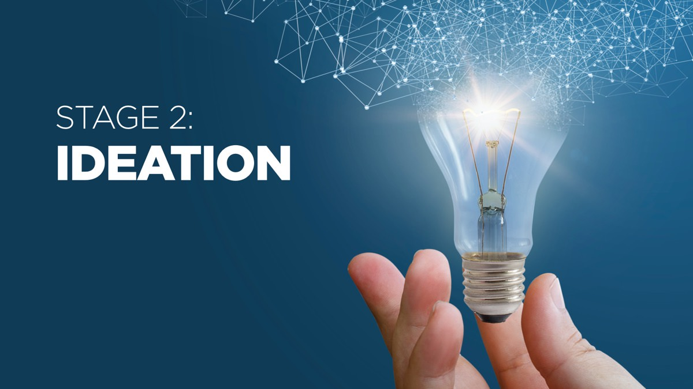

In the Ideation stage, you take the transformational objectives you established in the Foundation stage, and find things to say, show and do to achieve those objectives: the raw materials of your presentation.

The additional resources for this stage should help you to use the pSCORE method to brainstorm effectively and find the right ingredients, which you can later mix together into a presentation storyline in the Creation stage.

## Useful Articles

* [An overview of the Ideation phase](https://www.ideasonstage.com/news/2021/06/18/2021-06-18-pscore_stage_2_ideation/)
* [Don’t inform – transform!](https://www.ideasonstage.com/news/2019/01/07/2019-01-07-dont-inform-transform/)
* [Is the Pyramid Principle outdated?](https://www.ideasonstage.com/news/2019/04/16/2019-04-16-is-barbara-minto-s-pyramid-principle-outdated/)
* [The Audience Transformation Roadmap](https://www.ideasonstage.com/communication-consulting/audience-transformation-roadmap/)

## Video Resources

These videos can help you to go deeper and may also help you to convince your colleagues that they should also take the time to join the Business Presentation Revolution!



 



## Templates & Checklists

We recommend drawing the Audience Transformation Roadmap on a whiteboard or flipchart for a group brainstorm. If you need to fill it in during an online brainstorm, you may find it useful to download our templates in Microsoft® Office formats.



## Recommended Reading

In addition to Business Presentation Revolution, we recommend reading other useful books. In this section, we particularly recommend:

* [The Art of Thought, by Graham Wallas](https://www.amazon.com/Art-Thought-Graham-Wallas/dp/1910146056/ref=sr_1_1)
* [Presentation Zen, by Garr Reynolds](https://www.amazon.com/Presentation-Zen-Simple-Design-Delivery/dp/0135800919/ref=sr_1_1)

[Click here to go back to the main Business Presentation Revolution Bonus Resources page](/resources/books/business-presentation-revolution-book/bonus-content/)

