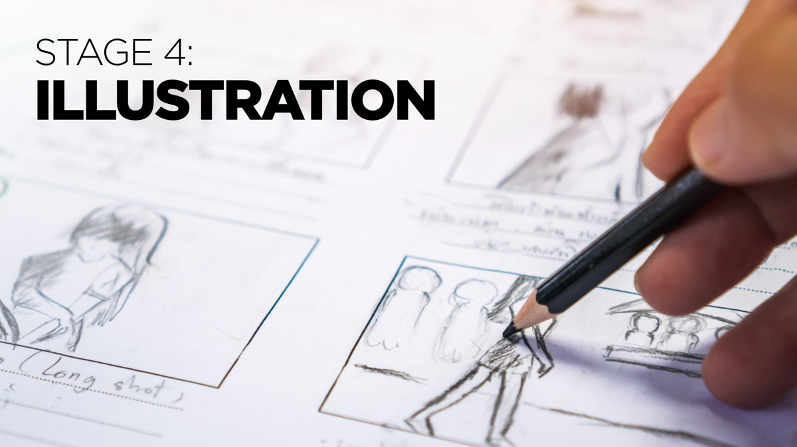

In the Illustration stage, you prepare appropriate supporting materials for your storyline. In some cases, this may mean documents that you should share before, during or after your presentation. In many cases, it means slides – but not just any old kind of boring slides.

The additional resources for this stage should help you to use the pSCORE method to prepare strong visual aids for your presentation.

## Useful Articles

* [The 7 deadly sins of slide design](https://www.ideasonstage.com/news/2019/04/23/2019-04-23-the-7-deadly-sins-of-slide-design/)
* [How to use slides effectively in online meetings](https://www.ideasonstage.com/news/2020/04/10/2020-04-10-how_to_use_slides_effectively_in_online_meetings/)
* [Three major problems with PowerPoint presentations](https://www.ideasonstage.com/news/2019/12/10/2019-12-10-three-most-annoying-problems-presentations-powerpoint/)
* [Cliché slides](https://www.ideasonstage.com/news/2019/11/05/2019-11-05-cliche-slides/)
* [How to disable animations in PowerPoint](https://www.ideasonstage.com/news/2020/07/07/2020-07-07-how-to-skip-all-animations-in-a-presentation/)

## Playlists of Example Presentations

In Business Presentation Revolution you’ll find references to several playlists featuring presentations that excel in different aspects. Here is a playlist of talks with slides we think are particularly powerful.

* <a href="https://www.youtube.com/playlist?list=PLZzM50I6k_S6Gi1aY17fR9qC49K3sFEXr" target="_blank">Talks with great slides</a>

## Video Resources

These videos can help you to go deeper and may also help you to convince your colleagues that they should also take the time to join the Business Presentation Revolution!



 



## Templates & Checklists

Whether you’re preparing your own slides, or developing a storyboard to give to a specialist slide designer, the storyboard template and slide design checklist mentioned in Business Presentation Revolution can guide you and make the process smooth for everyone involved.



## Recommended Reading

In addition to Business Presentation Revolution, we recommend reading other useful books. In this section, we particularly recommend:

* [Presentation Zen Design, by Garr Reynolds](https://www.amazon.com/Presentation-approach-presenting-Graphic-Communication/dp/0321934156/)
* [Slide:ology, by Nancy Duarte](https://www.amazon.com/slide-ology-Science-Creating-Presentations/dp/0596522347/)
* [VisuaLeadership, by Todd Cherches](https://www.amazon.com/VisuaLeadership-Leveraging-Visual-Thinking-Leadership/dp/1642933376/)
* [Better Presentations, by Jonathan Schwabish](https://www.amazon.com/Better-Presentations-Guide-Scholars-Researchers/dp/0231175213/)

[Click here to go back to the main Business Presentation Revolution Bonus Resources page](/resources/books/business-presentation-revolution-book/bonus-content/)
