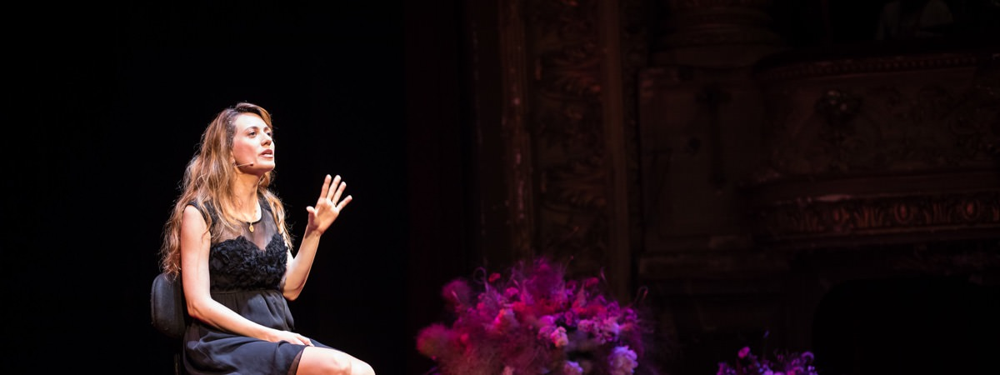

## ¿Por qué una guía para ponentes TED?
Nos hemos dado cuenta de que muchos ponentes se hacen las mismas preguntas, y por eso hemos decidido crear una guía práctica y sin rellenos innecesarios para ayudarte a preparar tu charla TED.

### Condiciones de uso de esta guía
Puedes utilizar esta guía libremente; a cambio sólo te pedimos que cites su origen y añadas un link bien visible a esta página en los siguientes casos:

* En el contexto de un evento TEDx: puedes distribuir la guía libremente a los ponentes, incluso en formato impreso (si quieres una copia en PDF de esta guía déjanos un mensaje al final de esta página).
* Si utilizas algún extracto con fines no comerciales (notas para estudiantes, blogs personales, etc...).
* Para fines educativos.

Si estás organizando un congreso: puedes contactar con nosotros en ricardo.bonis@ideasonstage.com y crearemos una versión a medida de la guía para que la distribuyas a los participantes, sin referencias a TED o TEDx, y con tu propio branding.

Cualquier uso comercial de este documento sin nuestro consentimiento, está totalmente prohibido.

### Agradecimientos
Esta guía definitiva del ponente TEDx no habría sido posible sin la ayuda de mis colegas, Phil, Marion, Michael y Ricardo, directores de presentaciones certificados todos ellos y mejores 'coaches de presentaciones' que yo. También nos gustaría dar las gracias a todos los organizadores que ya han confiado en nosotros, y siguen haciéndolo, para organizar sus eventos TEDx y otros eventos.

## El camino para construir tu charla TEDx
Una vez pasado el momento de euforia, y con los pies en la tierra, ¿cuál es el siguiente paso?, ¿por dónde empezar?

En primer lugar, asegúrate de que estás disponible en la fecha del evento y de que puedes participar. No hay nada peor para el organizador de un evento que un ponente que abandona el barco a mitad del proceso de preparación, especialmente si ya se ha anunciado el programa. Confirma tu participación a los organizadores cuando estés completamente seguro de que puedes y quieres participar.

### Responde a la invitación como un ponente profesional

¿Así que estás seguro de que quieres participar como ponente en el TEDx? ¡Estupendo! Comienza enviando un email a los organizadores incluyendo 3 informaciones clave y 4 preguntas:

* La confirmación de tu participación en el evento.
* El motivo por el que vas a participar: menciona cuál es el tema sobre el que quieres hablar, y pide a los organizadores que confirmen su aprobación.
* Tu biografía resumida: ¿quién eres?, ¿cuál es tu historia?, ¿qué te hace especial/original?, ¿por qué quieres exponer en un TED? No es necesario que escribas una novela; 10 líneas es más que suficiente. Especifíca claramente tu ocupación (CEO de..., inventor chiflado, Futurólogo, ...), porque esto es lo que aparecerá en el programa y el sitio web del evento.
* Pregunta cuánto tiempo tienes asignado para tu charla: una de las reglas de oro de una presentación TED es respetar el tiempo asignado y no excederse nunca. La duración de la charla la fijan los organizadores y es habitual que las duraciones sean de 5, 6, 10, 12, 15 y 18 minutos.
* Pregunta cuál es el formato para la presentación: ¿PowerPoint, Keynote, Prezi, otro?, ¿formato 4:3 o 16:9?, ¿fondo claro u oscuro?, ¿existe alguna plantilla de referencia?
* Pregunta por las fechas para el coaching de ponentes. Si los organizadores son competentes deberían contar en sus filas o en las de algún partner con varios directores de presentaciones o coaches de ponentes para ayudarte a preparar tu charla. Acuerda con ellos las fechas de ensayo tan pronto como te sea posible. Te recomendamos encarecidamente que aceptes su ayuda ya que conseguirán que tu charla tenga más impacto y sea más dinámica y memorable. Lo que aprendas no sólo te será útil para ese evento en concreto, sino para tu propia carrera profesional.
* Solicita el documento de autorización: es el "contrato" mediante el cual te comprometes a respetar las reglas del TEDx. Si los organizadores no te lo han enviado, pídeselo, tienen la obligación de hacerlo.

Si envías toda la información desde el primer momento empezarás con buen pie tu andadura en el TEDx y los organizadores quedarán gratamente sorprendidos de tu profesionalidad.

### Organiza tu preparación

Una vez hayas confirmado tu participación los organizadores deberían ponerse en contacto contigo con presteza para acordar los siguientes detalles contigo:

* Tus preparativos de viaje y alojamiento, en caso de que sean necesarios.
* Las fechas y lugar para la preparación de tu charla con el director o coach de ponentes. Los ensayos para congresos locales a menudo se organizan en espacios específicos como salas de reuniones o anfiteatros. Sin embargo, para congresos nacionales o internacionales es frecuente que las limitaciones geográficas sólo permitan las sesiones de coaching remotas mediante videoconferencia (con plataformas como Zoom, Skype, Facetime o Teams) e intercambios por email.
* A qué hora tienes que presentarte el día del evento y si tendrás la posibilidad de ensayar en el escenario o el espacio en el que vaya a tener lugar el evento (esto es muy recomendable; si el organizador no lo menciona, ¡hazlo tú!).

## Antes del primer ensayo

Si has acordado una fecha para tu primera sesión con tu director/coach, o al menos tienes una idea de cuándo la tendrás, hay varias cosas que tienes que hacer antes de este primer ensayo.

Si no estás familiarizado con TED o los eventos TEDx lo primero que tienes que hacer es ir a TED.com y echar un vistazo a algunos videos para comprender por qué este congreso tiene tan buena reputación. Aquí tienes algunos enlaces en inglés y español que te darán algunas pistas sobre el estilo y la calidad de las charlas.

	Inés Temple: ¿Cómo incluimos a más niñas en la educación?
	
	
	Eduardo Sáez de Cabezón: Las matemáticas son para siempre
	
	
	Phil Waknell: The 3 Magic Ingredients of Amazing Presentations
	
	
	Al Gore: New thinking on the climate crisis
	
	
	Elizabeth Gilbert: Your elusive creative genius
	
	
	Seth Godin: How to get your ideas to spread
	
	
	Hans Rosling: Asia’s rise how and when
	

Envía el título de tu charla: los organizadores necesitan esa información para incluirla en la web del evento y en el programa impreso. Busca un título original y evita títulos generalistas o poco específicos. Intenta buscar algo que atraiga la atención; quizá una pregunta, o un eslogan. Es bastante frecuente que este punto sea problemático en este momento ya que es posible que todavía estés dando forma a la charla.

Envía el guión o borrador de slides de tu charla. Compártelo con tu director o coach de presentaciones antes de tu primer ensayo. De este modo el coach podrá prepararse y darte mejores consejos durante la sesión. Al coach le resultará más difícil preparar la sesión si no tiene una idea clara de en qué momento  de la preparación de tu charla estás. Es posible que el coach organice una entrevista inicial para ayudarte a estructurar tus ideas y a visualizar las slides. Si no sabes cómo hacer esto, la siguiente sección te dará algunas pistas.

## Crea tu presentación
Una buena presentación se sustenta en tres pilares cuyo objetivo es amplificar el mensaje de la presentación:

* Un historia atractiva y bien estructurada.
* Elementos visuales impactantes.
* Un ponente que se expresa con pasión y con claridad.

Antes de meterte de lleno en los detalles de tu presentación, no olvides tener en cuenta las expectativas de los organizadores y de la audiencia, y el contexto:

* ¿Cuál es el contexto actual?¿Ha ocurrido algo recientemente que pueda alterar la percepción de tu presentación?
* Revisa las razones por las que los organizadores te han invitado. ¿Cuáles son sus expectativas respecto al tema del que vas a hablar?
* Pregúntate a ti mismo cuál es el cambio que te gustaría ver en el público. Una manera de acotar esto es completar la frase: "Al finalizar mi charla, quiero que el público..." ¿haga una donación a un crowd-funding?, ¿divulgue mi iniciativa?, ¿comprenda mejor la física cuántica?, ¿comprenda la importancia de la exploración espacial? Hay tantos objetivos como charlas, algunos más ambiciosos que otros. En general, cuánto más concreto y "accionable" sea tu objetivo, más impacto crearás con tu charla. Lo más importante es que tengas un objetivo claro y definido para tu charla.

Hay un buen puñado de libros en el mercado sobre cómo hacer presentaciones, y es imposible explicar todos los detalles en este documento sin convertirlo en un libro de 500 páginas (que nadie leería). En vez de eso he optado por lo siguiente: para cada tema mencionado a continuación he incluido algunos consejos para ayudarte a crear una presentación estilo TED.

### Tu historia

Visualiza tu historia dentro del tiempo que te han asignado los organizadores. Si escribes el texto de tu charla, una buena manera de estimar su duración es contar el número de palabras y dividirlo por 150. El resultado serán los minutos que necesitarás para dar tu charla cómodamente y con un ritmo razonable. Si intentas ir más rápido, perderás claridad y hablarás demasiado rápido para el público. 150 palabras por minuto es una media razonable para la mayoría de ponentes. Sin embargo tienes que tener en cuenta tu propio ritmo al hablar; puede ocurrir que tu ritmo natural sea más pausado y que tu media sean 120 palabras por minuto. Si quieres afinar, grábate exponiendo un tema durante medio minuto y después cuenta el número de palabras para calcular tu ritmo natural.

En la lista siguiente tienes 9 ingredientes que te ayudarán a contar una gran historia.

**Física**. Los ponentes TEDx más recordados hacen algo memorable y sorprendente en el escenario. Bill Gates liberó mosquitos durante su charla, Jamie Oliver volcó una carretilla con azúcar en el escenario, Phil Waknell lanzó docenas de globos sobre la audiencia, Isaac Getz lanzó monos de juguete al público, Peter Drucker utilizó un reloj despertador gigante que sonó durante su charla, Hans Rösling se ayudó de una enorme caña de bambú para capturar la atención del público... Estas acciones físicas causan un gran impacto ya que son originales e inesperadas. ¿Qué acción u objeto puedes utilizar en el escenario para reforzar tu charla TED?

¿Es **relevante** para lo que el público conoce sobre tu tema? Sólo podemos aprender y construir sobre lo que ya conocemos. El público no comprenderá algo sobre lo que no tiene ningún conocimiento. El público TEDx suele estar conectado con los sucesos recientes, aunque de forma muy genérica. Es probable que sepan algo sobre tu tema, pero no demasiado. Si eres un especialista en neurociencia o física cuántica, el público tendrá interés en lo que tienes que contar, pero puede que no conozca mucho sobre ello. Por eso es muy importancia utilizar analogías, metáforas e imágenes para conectar tu conocimiento con el suyo.

**Emocional**. No dejes de lado tus emociones, ¡compártelas con el público!. Comparte esos momentos tan poderosos que tú mismo has experimentado.

**Sorprendente**. La sorpresa es un elemento clave de cualquier charla TED o TEDx de éxito.

**Concreta**. Muy concreta. Evita ideas y términos que sean demasiado conceptuales.

**Visualizable**. Una de las características de una buena historia es que el público puede crear una imagen mental clara de lo que les estamos contando.

**Exacta**. Comprueba y verifica tus datos, hechos y estadísticas tres veces.

**Nueva**. Aunque los ingredientes anteriores te pueden ayudar a crear una gran charla TED, pregúntate qué novedad aporta tu charla a tu tema, qué punto de vista que no haya sido compartido aún.

**Twitter-ready**. El público de TED/TEDx suele ser muy activo en redes sociales como Twitter, Facebook, Instagram y otras. Tendrás más posibilidades de que la gente mencione tu charla y la comparta si ofreces frases sintetizadas sobre tus ideas clave, listas para compartir en Twitter. Esas frases ayudan a dar relevancia a tus ideas y le proporcionan al público frases pegadizas para compartir. 

Resumiendo los 9 ingredientes:

* Física
* Relevante
* Emocional
* Sorprendente
* Concreta
* Visualizable
* Exacta
* Nueva
* Twitter-ready

## Cuenta tu historia

Tus primeras palabras tendrán una gran influencia en el resto de tu charla. Pueden cautivar al público desde el primer momento, despertar su curiosidad y simpatía hacia ti, o invitarles a desconectar. Y esto también aplica al público que pueda ver tu charla online más tarde. La introducción de tu charla también puede servir de gancho para conseguir la atención del público. Puedes conseguirlo con una sorpresa, como pedir al público que haga algo, o con una demostración teatral, o con una pieza de música, con una anécdota, con una pregunta retórica...

No olvides decirle al público cuál es el destino al que quieres llevarlos. Es mucho más sencillo seguir una presentación si el ponente explica desde el principio a dónde pretende llevarnos. Por ejemplo:

* "Hoy voy a explicaros cómo Twitter se convirtió en una herramienta capaz de derrocar dictadores."
* "Voy a mostrar si la India y China van a adelantar a los países occidentales en salario medio, y en caso afirmativo, cuándo..."

Después, utiliza una estructura que sea simple y coherente para desarrollar tu historia. Por ejemplo, puedes utilizar una estructura cronológica, enumerando los sucesos en orden cronológico. También puedes seguir una estructura de pregunta y respuesta, o utilizar una historia.

Si utilizas cifras en tu presentación, dales significado y concreción. Por ejemplo:

* "La huella ecológica de un europeo es de x m2" es muy general. "La huella ecológica de un europeo equivale a dos campos de fútbol" es mucho más concreta.
* El hecho de que Apple vendiera x millones de iPhones el primer día es impresionante. El hecho de que Apple vendiera en su primer día suficientes iPhones como para llenar completamente el Nou Camp es algo extraordinario.
* Es imposible visualizar mil millones de seres humanos que pasan hambre. Es mucho más fácil visualizar que 1 de cada 7 seres humanos pasa hambre.

Evita "vender" tu producto, servicio, o empresa. Está prohibido en TEDx. Si te han invitado a presentar tu último invento, pon el foco en la historia detrás de la concepción del producto, los hallazgos y desafíos del desarrollo... En definitiva, cuenta tu historia pero no te conviertas en un vendedor de teletienda.

Pon atención en eliminar los términos técnicos y los acrónimos. 

Evita también el síndrome "Armageddon": todo es una catástrofe, estamos perdidos, ¡sálvese quien pueda! No sirve de nada y no se alinea con la mentalidad abierta y positiva que el público busca.

La conclusión de tu charla sirve de cierre o resumen de tu(s) mensaje(s) clave, y puede incluir también una llamada a la acción. ¿Qué quieres que haga el público al concluir tu presentación? Es el momento de recordárselo.

### Crear slides estilo TED

Si hay algo que le encanta criticar al público de un TEDx, son las malas slides. Si ves que el público se ríe y hace fotos de tus slides, no es una buena señal. Pero ¿qué se considera una mala slide en un TED? Estos son algunos ejemplos:

* Slides repletas de texto. Esta es una mala idea porque este tipo de slides están asociadas a ponencias largas y aburridas, lo opuesto a TED.

* Slides con imágenes pasadas de moda o archiconocidas. Olvídate de las imágenes clip art de Microsoft. Pasaron de moda a finales de los noventa; de 1890.
* Slides con imágenes con poca resolución o con marcas de agua. El mensaje que mandan al público es que no te has molestado en adquirirlas en un banco de imágenes.
* Slides que utilizan constantemente tipografías poco adecuadas como comic sans.

Crear buenos apoyos visuales para una charla TED no es tan difícil, y tu director o coach de presentaciones te podrá ayudar. Aquí tienes algunas ideas que pueden serte útiles:

* Respeta la regla de oro: utiliza únicamente slides que ayuden a aclarar o a reforzar tu mensaje.
* Elige fondos oscuros frente a fondos claros: la iluminación suele estar atenuada y los fondos brillantes son más agresivos visualmente y cansan la vista con más facilidad. Además, los fondos oscuros evitarán que el operador de cámara tenga que elegir entre dar visibilidad a tus slides o a ti.
* Incluye pocas palabras: una frase o una sola idea por slide. De vez en cuando puedes romper esta regla, pero no lo hagas demasiado. No olvides que, si se lo pones fácil al público, éste te lo pondrá fácil a ti.
* Utiliza tipografías sans serif en vez de serif: tipografías como Arial, Helvetica, Futura, Avenir o Gill sans... Estas tipografías son más fáciles de leer que las tipografías serif como Times o Palatino.
* Utiliza slides únicamente cuando las necesites: no hay ningún problema en utilizar slides sólo en una parte de tu presentación, cuando realmente sean necesarias.
* Intenta conseguir imágenes bellas y de buena calidad. Aportarán emoción y estética a tu charla. Asegúrate de que cuentas con los derechos de uso de estas imágenes, ya sea comprándolas en un banco de imágenes u obteniendo permiso del autor de la fotografía. Además de no ser ético, corres el riesgo de que TED no cuelgue tu charla online.
* Utiliza gráficos lo más simples posible.
* Si utilizas videos asegúrate de que funcionan.

## Ensaya
El ensayo es crucial. Algunas personas dicen que no les gusta ensayar, pero con frecuencia eso se debe a que no ensayan bien o no ensayan suficiente. Sin ensayo tu presentación podría ser buena, pero nunca será excelente. Si ensayas una vez, o dos, habrás ensayado pero no lo suficiente para asimilar verdaderamente tu contenido y sentirte más cómodo en el escenario. Es posible que en esta fase tengas la impresión de que estás peor preparado TRAS ensayar. ¡No lo dejes! Sigue ensayando. La repetición trae consigo el dominio del contenido y el destilado de tus ideas. Es en este punto cuando trabajar con un director o coach de presentaciones te puede llevar a otro nivel.

Estas son algunas ideas para ayudarte a ensayar mejor:

* No dediques mucho tiempo a presentarte. Si el evento está bien organizado será el maestro de ceremonias el que lo haga por ti, dejándote el escenario para que empieces con tu introducción. Si por alguna razón tienes que presentarte tu mismo, hazlo brevemente. Cíñete a lo que el público necesita saber para poder seguir tu charla. 
* Familiarízate con el "clicker". Seguro que no quieres ser ese ponente que avanza y retrocede las slides a destiempo, o que empieza a pulsar los botones desesperadamente y acaba solicitando ayuda técnica en medio de su presentación, o incluso decide continuar sin slides dejando una fija de fondo. Ensaya para aprender a avanzar tus slides mientras hablas; aunque parece sencillo, conseguir que parezca natural requiere práctica.
* Trabaja el contacto ocular fijando varios puntos de atención en frente tuyo e imaginando que son miembros del público.
* Asegúrate de no hablar demasiado rápido. Trabaja para hablar más despacio e inserta pausas cuando quieras dar tiempo al público para pensar sobre algo o para crear un cierto suspense.
* Grábate. Sí, lo sé, no te apetece nada hacerlo, y menos aún verte a ti mismo, pero es la mejor forma de mejorar.

Nunca se ensaya demasiado: ¡los mejores ponentes TEDx ensayan muchísimo!

## El día T
Ya has completado tus ensayos. Ya estás listo para dar tu charla TED y brillar como una estrella sobre el escenario. No queda nada por hacer, ¿verdad? Bueno, pues lo cierto es que... sí lo hay.

### Elige tu atuendo
Cuando participas en un TED(x) te recomendamos que vistas del mismo modo que cuando vas a trabajar. Por supuesto hay excepciones dependiendo de tu ámbito de trabajo. Si trabajas en un laboratorio de investigación no es necesario que aparezcas con tu bata de laboratorio. Pero es buena idea vestir de acuerdo con tu ocupación profesional.

Si eres un diseñador de moda, probablemente no uses traje y corbata. Si eres un reconocido CEO o político, probablemente no luzcas vaqueros y camiseta muy a menudo.

Aquí tienes algunos consejos sobre vestimenta que pueden serte útiles (adáptalos en función del contexto):

* No vayas demasiado bien vestido: no aparezcas vestido para una ceremonia de premios o para cruzar la alfombra roja; esto te separaría del resto de ponentes y transmitiría una imagen de arrogancia que probablemente causaría el rechazo del público.
* En el otro extremo, no vayas hecho un desastre. Principalmente por tu credibilidad. Unos vaqueros y una camiseta sólo funcionarán si encajan contigo y tu ocupación.
* Evita las prendas con cuadros o a rayas. Este tipo de prendas no suelen quedar bien en cámara.
* Viste con cinturón, o algo donde poder colgar el transmisor del micrófono. Este transmisor suele ser una pequeña caja del tamaño de una cajetilla de cigarrillos. Los hombres suelen tenerlo más fácil ya que los pantalones suelen tener bolsillos traseros, pero los vestidos pueden ser más problemáticos. No querrás ser la persona que tenga ceñirse el transmisor a la ropa interior, ¿verdad?. ¡Ah! olvídate de las mallas.
* Piensa en algún lugar en el que enganchar un micrófono de corbata si ese es el tipo de micrófono que se usará en el evento. Las solapas suelen funcionar bien, o incluso el cuello de una camisa si es holgado.
* Evita las prendas ajustadas o muy enrevesadas.
* No lleves pendientes muy grandes, pueden tintinear sobre el micrófono y provocar un ruido no deseado.

### El ensayo final en el escenario
Si no has podido hacerlo hasta ahora, es posible que tengas la oportunidad de ensayar en el escenario del evento. Te recomiendo encarecidamente que aproveches esta oportunidad ya que te proporcionará una información muy valiosa sobre el escenario y el auditorio que tienes en frente y que no podrás adquirir con los ensayos anteriores:

* Contacta con el equipo técnico a cargo de las slides y comprueba con ellos que todo tu material audiovisual funciona correctamente. Estas personas serán unos de tus mejores aliados el día del evento.

* Prueba el micrófono y presta atención al volumen. Se especialmente cuidadoso con la posición del micrófono respecto a tu boca ya que esto tendrá un gran impacto en cómo te escuchará el público. Si lo sitúas muy cerca de la boca o en posición vertical los sonidos "P","B" y "S" sonarán demasiado; si lo sitúas muy alejado será difícil escucharte. Ajusta la posición con la ayuda de los técnicos de sonido y recuérdala para tu charla.

* Sitúate y oriéntate: memoriza la posición de la pantalla detrás tuyo y la posición de los monitores de presentador (si los hay). Identifica la parte más iluminada del escenario. Con frecuencia los organizadores de TEDx sitúan un gran círculo rojo en el suelo para que se sitúen en él los ponentes. La iluminación del escenario estará centrada en este punto. Ten esto en cuenta sobre todo si el evento va a ser filmado.

* Ensaya imaginando que el público está ahí. No olvides mirar a todas las zonas de la sala mientras ensayas. Si el auditorio está oscurecido y el escenario muy iluminado es muy posible que no distingas a la gente. Esto no representa un problema al ensayar en una sala vacía, pero es muy diferente durante el evento en sí. A algunos ponentes no ver al público les reconforta, pero en general creemos que es preferible poder verlo. A fin de cuentas, no eres un actor representando una obra, sino un mensajero teniendo una conversación con cada una de las personas de la audiencia. Ver sus ojos es una gran ayuda para tener su feed-back en tiempo real.

### Antes de entrar en el escenario
Tras completar el ensayo definitivo llega el que es, posiblemente, el momento de mayor estrés: la espera (¿sabías que la mayoría de la gente prefiere hacer algo sin propósito antes que no hacer nada en absoluto?) Así que aquí tienes algunos trucos que te ayudarán a sobrellevar este difícil momento:

* Evita el café, el té, los zumos, y las bebidas frías. Estas bebidas aumentarán tus nervios, o te crearán sequedad en la boca, o afectarán a tus cuerdas vocales, y aumentarán tus ganas de ir al baño.
* Ubica la sala de maquillaje (sí, hay que pasar por esto y si no estás acostumbrado te sorprenderá). Averigua el horario exacto para tu presentación y quién te acompañará allí.
* Familiarízate tú mismo con la ruta desde la sala de espera hasta el escenario: a veces puede ser un trayecto largo y no serías el primer ponente que se pierde.
* Respira profunda y lentamente para asentarte si sufres algún tipo de miedo escénico.
* Si te ayuda, trata de averiguar en qué lugar del anfiteatro están sentados tus amigos y conocidos.
* No te quedes aislado. Preséntate y charla con otros ponentes, asistentes y organizadores.

### Ya está, ¡eres un ponente TED!
La espera ha terminado. Ve a la sala a maquillarte si no lo has hecho aún. El ponente anterior termina y el maestro de ceremonias entra en el escenario, da las gracias al ponente que acaba de terminar y comienza a presentarte. ¡Es tu momento! ¡Eres un ponente TED!

### ¿Y después?
A menudo ser un ponente TED abre nuevos horizontes. Algunas personas dicen que les ha cambiado la vida. Comparte e interactúa con el público. Disfruta.

## Para finalizar
En Ideas on Stage, creemos firmemente que una gran presentación puede cambiar el mundo. Esperamos que esta guía te resulte útil y te ayude a conseguir que tu charla TED sea un momento inolvidable.

### Sobre el Autor

El autor de esta guía es Pierre Morsa, y ha sido traducida por Ricardo Bonis. Su contenido se basa en varios años de experiencia en la preparación de los ponentes de una gran cantidad de eventos TEDx. Está dirigida a ponentes de eventos TEDx y de otros eventos en general, y su fin es ayudar a prepararse como un profesional. Si tienes algún comentario, consejo para añadir, o preguntas, envíanoslas a ricardo.bonis@ideasonstage.com

### Historial de versiones
* 17 Mayo 2020: primera versión en español.