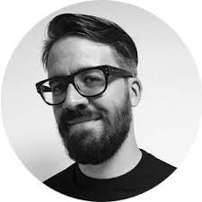
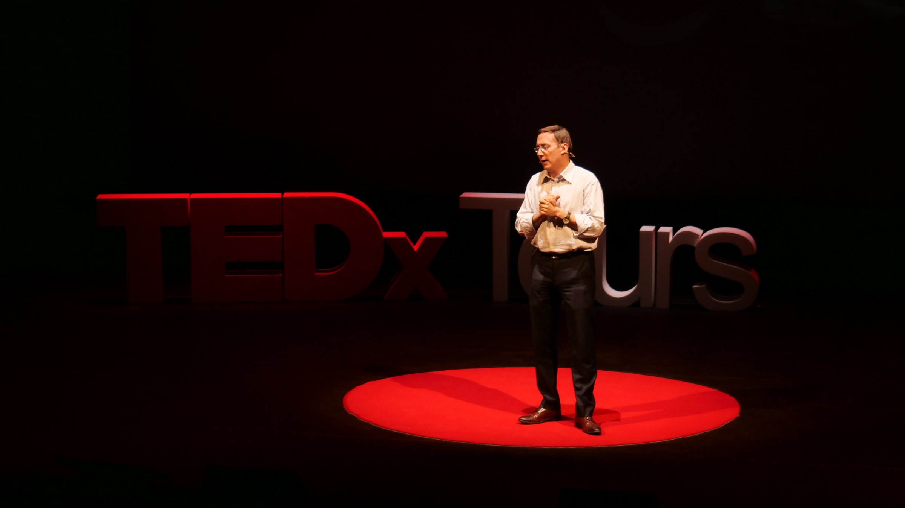

## Comment créer un événement TEDx inoubliable, avec Fabien Boutard, curateur de TEDx Tours

Cet été, nous avons coaché les intervenants duTEDx Tours 2019 qui s'est déroulé le 25 juin dans la région historique de la Touraine, en France. Le lieu de l’événement n’était autre que le Grand Théâtre de Tours, un haut lieu d’architecture à l’italienne. Cette région abrite également des sites de renommée mondiale tels que le Clos Lucé, où Léonard de Vinci a passé ses dernières années en France, les charmants châteaux d'Amboise, Blois, Chenonceau, Chambord et bien d'autres.

TEDx Tours connaît un tel succès qu'il est complet chaque année. Pour en savoir plus sur la manière d’organiser un événement aussi réussi, Pierre Morsa a rencontré Fabien Boutard, l’organisateur et fondateur, pour discuter des défis à relever afin d’organiser un TEDx et pour trouver de bons orateurs. Que vous souhaitiez créer un événement d’affaires inspiré TEDx ou TED, nous espérons que cela suscitera de nouvelles idées pour vous !

**Pierre** : Fabien, c'est la cinquième année consécutive que tu organises TEDx Tours. Qu'est-ce qui te pousse à organiser ces événements ?

**Fabien** : L'histoire a commencé il y a cinq ans à Tours sur mon canapé une nuit d'été. Je regardais une vidéo de TEDx et je me suis dit : « Il est incroyable de constater que dans une ville qui compte tant de chercheurs en médecine, d'universités et un potentiel intellectuel immense, il est impossible de communiquer les résultats au grand public de manière claire et simple. » J'ai alors réalisé que le format TEDx était parfait pour présenter les idées lumineuses de notre région et de ses habitants. C'était aussi un moyen pour moi de satisfaire ma curiosité et de trouver plus d'inspiration.

**Pierre** : Nous savons que cela peut être stressant. Quel conseil donnerais-tu aux autres organisateurs pour faciliter les choses ?

**Fabien** : Les événements TEDx sont gérés par des organisations à but non lucratif, par des équipes entièrement composées de bénévoles. La qualité de l'équipe est ce qui fait vraiment la différence. Tu vas souvent travailler pendant un an sans savoir quel sera le résultat final. Pour rester sur la bonne voie, chaque membre doit savoir pourquoi il participe à cette aventure, quel est son rôle et pourquoi il est important. Ensuite, tout se passe en quatre heures. Des mois de travail sont récompensés et c’est vraiment un moment magique ! L'autre élément critique est la qualité des intervenants.

**Pierre** : Au cours des dernières années, tu as trouvé d'excellents conférenciers que personne ne connaissait. Quel est ton secret ?

**Fabien** : Ce que nous faisons est probablement différent des autres événements. Nous énumérons d’abord les idées que nous aimerions voir sur scène, puis nous cherchons les meilleurs orateurs que nous pouvons trouver pour chaque sujet. Nous essayons de prévoir ce qui sera intéressant dans un an, et non ce qui est intéressant aujourd'hui. Avec les réseaux sociaux, tout va et vient de manière incroyablement rapide de nos jours. Il se peut que quelque chose qui préoccupe tout le monde soit devenu vieux trois mois plus tard. Cela nous est déjà arrivé.

**Pierre** : Quelle est l'importance de la préparation ?

**Fabien** : Quelle que soit la renommée de votre orateur, la phase de préparation est cruciale. Vous ne devez jamais compromettre la qualité de la préparation. Les meilleurs orateurs consacrent entre 30 et 50 heures à l’écriture, à l’illustration et à la pratique de leur discours. Cela peut sembler beaucoup, mais c'est ce qu'il faut. La première étape consiste à s'assurer que le discours sera structuré autour d'une idée majeure et claire. Ensuite, il y a une phase d'écriture assez longue. Certains préfèrent tout écrire, d'autres préfèrent écrire uniquement le récit. C’est un juste équilibre entre respecter ce que l’orateur veut dire et s’assurer que le message sera clair et aura un impact sur le public. La dernière étape consiste à répéter, répéter, répéter jusqu'à se perfectionner.

**Pierre** : Quel conseil donnerais-tu aux personnes qui souhaitent être oratrices lors d’une conférence TEDx ?

**Fabien** : Pourquoi votre sujet serait-il intéressant pour le public TEDx ? Nous ne sélectionnons jamais une personnalité ou une capacité de parler en public : nous accordons toujours plus d’importance au message que vous souhaitez communiquer. Il n’est pas nécessaire de nous envoyer un CV ; ce qui compte, c'est d'avoir un message à diffuser.

**Pierre** : Selon vous, quelle est la chose la plus importante le jour J ?

**Fabien** : Ce que nous avons réalisé depuis la première édition, qui a parfois fonctionné et parfois non, c’est lorsque le public ressent quelque chose de plus grand que la somme des discours. Cela devient alors une aventure unique pour le public, pour les intervenants et pour nous. C’est notre responsabilité de veiller à ce que tout le monde passe une soirée agréable et que la subtile alchimie entre les divers éléments crée quelque chose d’unique et d’inoubliable.

*Merci beaucoup Fabien pour tes conseils inspirants pour organiser un grand événement TEDx.*
