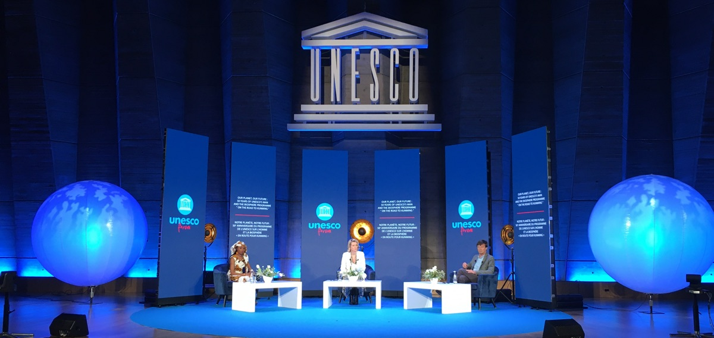
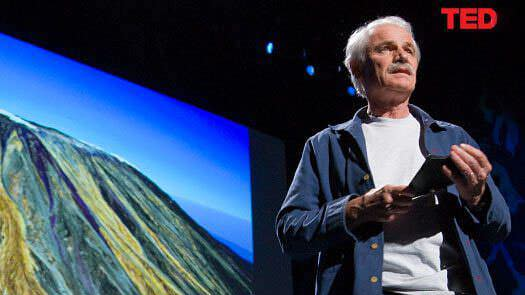
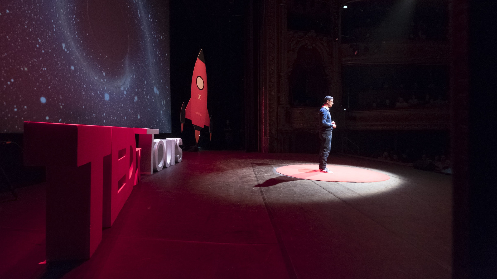

+++
draft			= false
name			= "Pierre Morsa"
picture			= "pierre-morsa.jpg"
position 		= "Co-founder"
translationKey	= "team/pierre-morsa"
weight			= 100
sameas			= ["https://www.pierremorsa.com","https://www.linkedin.com/in/pierremorsa/"]
+++
Pierre Morsa est créateur original de la marque et du concept d'Ideas on Stage en 2009. Il met toute son énergie dans la création de présentations avec quelque chose de spécial. Il essaie de toujours trouver de nouvelles astuces pour surprendre et émerveiller votre public.

Il a réalisé des missions pour Yann Arthus-Bertrand, l'UNESCO, le Positive Economy Forum, Havas, McCann, SNCF, Fresenius, Boston Scientific, EDF, RTE, Société Générale, Murex, l’Agence Française de Développement, Google, Microsoft, Vade Secure, Stormshield, plusieurs grands groupes de luxe et bien d’autres clients. Il a également travaillé avec les startups de nombreux incubateurs, dont Le Camping, l’accélérateur de Microsoft, INCO et Euratechnologies.

Pierre Morsa a été interviewé dans le documentaire « Le pouvoir des mots » pour la télévision canadienne, et par plusieurs magazines, y compris Le Monde, Le Parisien et Management.

Il enseigne le storytelling de marque et le storytelling politique à l’EFAP et l'EGE. Il a un diplôme d’ingénieur commercial de HEC Liège.

Pierre tient un [blog personnel](https://www.pierremorsa.com/), en français.

## Missions remarquables

**UNESCO : écriture du script du forum sur la biodiversité**. Préparation des sessions avec des intervenants prestigieux dont Nicolas Hulot, Président d’honneur de la Fondation Nicolas Hulot pour la Nature et l’Homme, Peter Thomson, Envoyé du Secrétaire général des Nations Unies pour l'océan, Wasfia Nazreen, Alpiniste et militante écologique, Basile Van Havre, Coprésident du Groupe de travail à composition non limitée responsable de l’élaboration du prochain Cadre mondial de la biodiversité pour l'après 2020 de la Convention sur la diversité biologique, Hindou Oumarou Ibrahim, Représentante des peuples autochtones du Lac Tchad, Avocate des Objectifs de développement durable du Secrétaire général des Nations Unies, Arnaud Lallement, Chef cuisinier Chiefs4thePlanet, Jesse H. Ausubel, Directeur du Programme de l'environnement humain, Université Rockefeller, Maya Gabeira, Surfeuse de grandes vagues, détentrice de deux records du monde, ambassadrice Oceana, Romain Troublé, Directeur général, Fondation Tara Océan, Ana Maria Hernandez Salgar, Présidente de la Plateforme intergouvernementale science-politique sur la biodiversité et les services écosystémiques (IPBES). Collaboration avec les journalistes Dominique Laresche, TV5 Monde, David Eades, BBC et Hala Gorani, CNN.

**Collaboration avec Yann Arthus Bertrand pour TED 2009**. Écriture du script de la présentation, répétition, création des visuels. Par la suite, collaboration pour plusieurs événements importants.

**TEDx : Coaching des intervenants de nombreux événements TEDx** dont TEDxParisUniversités, TEDxTours, TEDxLille, TEDxLaDéfense, TEDxIÉSEGLille, TEDxLannion, TEDxSaintGilles... Parmi les intervenants connus, coaching de Gaël Giraud, ancien chief economist de l'AFD, Maïa Mazaurette, sexologue et chroniqueuse à la télévision, à la radio et dans les journaux, Isaac Getz, professeur à l'ESCP conférencier et écrivain, ... Certaines de ces interventions ont plus d'un million de vues sur YouTube.

