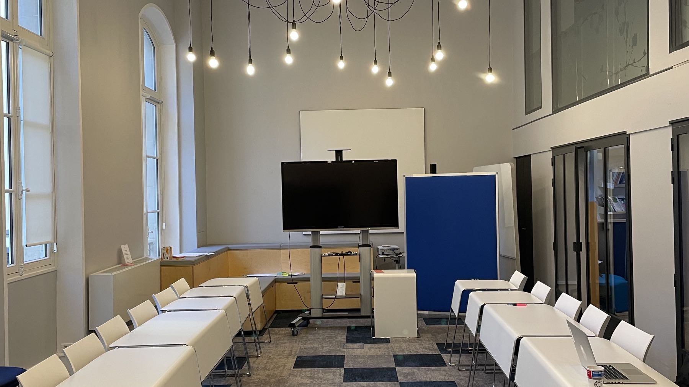
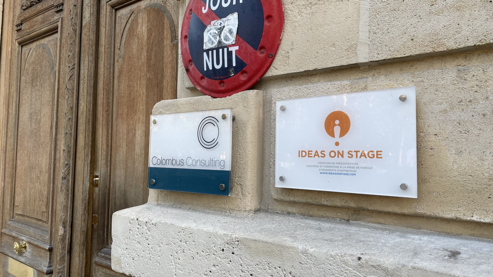

Nous sommes ravis de vous compter parmi les participants à l'une de nos formations. Vous trouverez sur cette page les informations pratiques pour vous aider à préparer au mieux votre formation.

## Avoir un sujet à présenter
Nos formations mettent l'accent sur la mise en pratique via des exercices et des études de cas. Pour que cette formation soit la plus utile pour vous, nous vous conseillons d'avoir un ou deux sujets concrets à présenter, un sujet en lien avec votre travail et un sujet libre. Plus le sujet sera riche et complexe, plus vous aurez de matière à travailler pendant la formation. Voici quelques exemples typiques de cas concrets :

- Lancement d'un nouveau produit
- Lancement d'un projet face au comité exécutif
- Présentation d'une analyse et des conclusions
- Motivation d'une équipe
- Réunion commerciale

## Télécharger le cahier d'exercices

> Note : ce cahier est valable pour les formations prise de parole, storytelling, présentations PowerPoint et art oratoire. Les autres formations, comme l'Art du Pitch, Business Presentation Revolution ou Women on Stage, font appel à des supports spécifiques qui vous seront distribués lors de la formation.


Vous pouvez télécharger le cahier général d'exercices utilisé pendant nos formations avec le bouton ci-dessous. Ce cahier est utilisé pour les formations prise de parole, storytelling, présentations PowerPoint et art oratoire.


## Informations pour les formations dans nos locaux

> Attention: les formations ont généralement lieu dans les locaux de votre entreprise. Ces informations ne sont valables que pour les formations données dans nos locaux. Vérifiez bien le lieu de formation auprès de votre contact RH.

Si la formation a lieu dans nos locaux, nous nous occuperons de la logistique, y compris le repas de midi. Vous trouverez ci-dessous les informations nécessaires pour vous y rendre ainsi que pour le repas de midi.

### Comment vous rendre dans nos locaux
Voici les instructions pour vous rendre dans nos locaux :

> Notre adresse est : 
> Ideas on Stage 
> 138 avenue des Champs Élysées 
> 75008 Paris France

L’entrée est située à droite du McDonald’s sur les Champs Elysées, côté droit de l’avenue lorsqu’on regarde vers l’arc de triomphe.

- Sonner à Colombus Consulting - IoS.
- Sonner de nouveau à la porte intérieure à droite (Colombus Consulting ou Ideas on Stage).
- Monter jusqu’au deuxième étage.

Métro ou RER :

- Station Charles de Gaulle Étoile (lignes 1, 2, 6, RER A) - Prendre la sortie 1 (Av. des Champs Elysées), cela vous évitera de vous retrouver du mauvais côté de l'Arc de Triomphe.
- Station George V (ligne 1) - Sortie 1 (Av. des Champs Elysées)

### Horaires d'ouverture

Nos formations se déroulent typiquement entre 9h et 17h. L'accès aux locaux n'est garanti qu'à partir de 9h.

### Pour le repas de midi

Le repas a lieu sur place, dans nos locaux. Nous commandons une variété de menus auprès de notre traiteur, y compris des menus vegan et sans gluten. Cependant, si vous avez des besoins alimentaires spécifiques, vous pouvez nous en faire part directement en nous contactant avec le formulaire en bas de page. Merci de nous contacter au moins 5 jours ouvrés avant la formation, au-delà de ce délai nous ne pouvons pas garantir la prise en compte de votre demande. Du café et de l'eau sont disponibles à volonté pendant la formation.

Pour les formations sur plusieurs jours, nous ne nous occupons pas du repas du soir ou de l'hébergement.

## Questions fréquentes

Voici les réponses aux questions qui nous sont le plus souvent posées. Si vous avez d'autres questions, n'hésitez pas à nous contacter directement avec le formulaire en bas de page.

**Q : faut-il prendre un ordinateur ?** R: l'utilisation d'un ordinateur est facultative pour nos formations, excepté pour la formation PowerPoint pour laquelle il est indispensable.

**Q: y a-t-il des contraintes d'accès aux locaux ?** R : l'accès au deuxième étage peut se faire par ascenseur, cependant en raison de l'architecture historique de l'immeuble, une dizaine de marches sont inévitables pour y accéder. Si vous avez une impossibilité de monter ces marches, merci de nous en avertir le plus rapidement possible.

**Q: que faire si j'ai un régime alimentaire spécifique ?** R : contactez-nous directement avec le formulaire ci-dessous (voir instructions détaillées plus haut).

**Q: puis-je suivre vos formations à titre individuel ?** R : nos formations sont à destination des entreprises, pour des groupes de 4 à 8 personnes. Si vous voulez suivre une formation individuelle, nous pouvons vous proposer un programme personnalisé. Contactez-nous pour en savoir plus.
