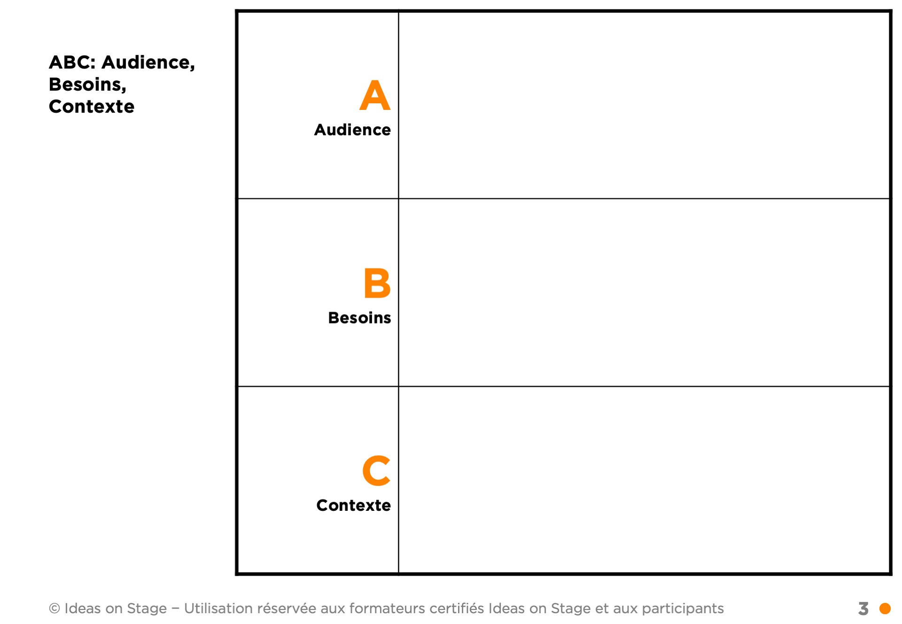
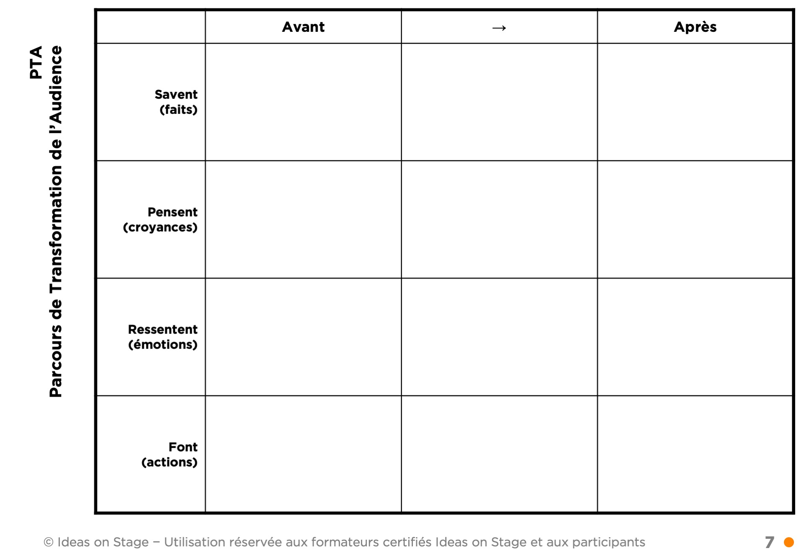

Ce module est dédié à l’art oratoire. Il comprend une courte introduction au storytelling et aux visuels, afin que les participants aient une vue d’ensemble des ingrédients d’une bonne présentation. Pendant la journée, les participants mettront en pratique les techniques apprises sur base d’une présentation de leur choix.



## 1 Introduction

**Durée** : 7 h.

**Objectif pédagogique :**

- Apprendre les techniques de l’art oratoire pour présenter avec aisance et présence sur scène.
- Apprendre à convaincre son auditoire lors d’une prise de parole.

**Méthodes et moyens :**

- Page web avec les différents supports et exercices
- Support visuel PowerPoint
- Exercices pratiques
- Livret d’exercices du participant

**Méthode d’évaluation :**

- Évaluation continue au cours de la formation
- Exercice final de mise en pratique des acquis

**Prérequis :**

- Avoir déjà fait une présentation en public.
- Avoir un cas concret de présentation à donner, qui servira d’étude de cas lors de certains exercices pratiques.
- Il n’est pas nécessaire d’avoir un ordinateur.

### 1.1 Les trois piliers d’une bonne présentation

Une présentation réussie est une présentation qui atteint notre objectif de transformation. L'objectif de transformation est le changement que nous voulons voir se produire dans notre audience.

Pour que ce changement se produise, nous avons besoin de nous appuyer sur un **message** clair et persuasif. Sa communication s'appuie sur trois piliers :

- **l'histoire**
- **les visuels**
- **l'orateur**

L'histoire communique notre message de manière claire et convaincante. Les visuels sont optionnels et servent à clarifier et renforcer l'histoire. L'orateur porte et incarne le message.

### 1.2 À propos d’Ideas on Stage

Ideas on Stage accompagne les dirigeants dans la réalisation de leurs présentations, la création d’événements inspirants et la formation et le coaching de leurs organisations à la prise de parole en public.

Nous avons créé Ideas on Stage en 2010, convaincus que l’art de présenter est un avantage compétitif essentiel. Nous avons proposé un mélange révolutionnaire de storytelling, de design visuel et de coaching à la prise de parole. Notre intuition était correcte : nos clients ont pris conscience de la valeur des présentations à fort impact, sont devenus fidèles et nous ont recommandés à leurs amis.

Aujourd’hui, les experts en communication d’Ideas on Stage vous proposent un éventail complet de services en présentation dans le monde en anglais, français, espagnol, italien et allemand.

### 1.3 À propos de vous

> Je prends une minute pour me présenter.

### 1.4 Agenda et objectifs

Présenter l’agenda et les objectifs de la journée.

### 1.5 Vos attentes

> Quelles sont vos attentes pour cette formation ? Y a-t-il des points spécifiques que vous voulez aborder ?

## 2 Message

Le module message est tellement important qu'il est inclus dans nos formations storytelling, visuels et art oratoire ; en effet, sans message clair, pas de présentation.

Il est constitué de trois outils extrêmement efficaces pour identifier ce que vous devez dire dans votre présentation : l'ABC, l'Objectif de Transformation et le Parcours de Transformation de l'Audience.

### 0.1 ABC : ce n’est pas votre présentation, c’est la leur

Lorsque nous avons une présentation à donner, la première chose à faire est d’en savoir plus sur notre audience. Qui est-elle ? Quels sont ses besoins ? Quel est le contexte dans lequel nous allons donner la présentation ? C’est pour cela que nous démarrons par l’ABC.

- A : Audience. L’**audience** est constituée des personnes à qui nous allons faire notre présentation et que nous devons convaincre de créer le changement que nous voulons réaliser. Nous devons connaître le mieux possible notre audience, qui ils sont, leur histoire, ce qu’ils aiment, ce qu’ils détestent, les jeux politiques au sein de leur entreprise.

- B : Besoins. Cette audience a des **besoins**. Qu’est-ce qui l’empêche de dormir la nuit ? À propos de quoi ont-elles envie d’en savoir plus et d’être rassurées ? Mieux nous connaissons leurs envies, plus il devient facile de les convaincre.

- C : Contexte. Le **contexte** est l’ensemble des éléments externes qui peuvent influencer votre présentation. Imaginez par exemple une société pétrolière qui communique sur la responsabilité environnementale. Le mot « responsabilité » aura une signification complètement différente si la société a causé une marée noire récente. Si nous parlons de cryptomonnaie, le contexte peut être positif (le prix du Bitcoin atteint des sommets) ou négatif (un scandale vient d’éclater). Des éléments typiques de contexte à analyser sont le marché, les prévisions économiques, le climat géopolitique, la compétition, la culture locale…

> Exercice : prenez cinq minutes pour définir votre ABC. Ensuite nous partageons et nous analysons les ABC en groupe.

### 0.2 Objectif de transformation

L’objectif de transformation est l’action que nous voulons voir notre audience faire. Pour identifier cet objectif de transformation, le plus simple est de répondre à cette question : après ma présentation, que va **faire** mon audience ?

- Après ma présentation, mon audience va… *(que va-t-elle faire ?)*

Voici quelques exemples d’objectifs de transformation concrets :

- « ils vont signer le contrat »
- « ils vont valider mon budget »
- « ils vont dédier 1 jour par mois à mon projet »

> Prenez 5 minutes pour identifier votre objectif de transformation. Ensuite nous partageons et nous analysons les objectifs en groupe.

Conseils :

- L’objectif de transformation doit prendre l’ABC en compte.
- Informer n’est pas suffisant. « J’ai communiqué mon information clairement » n’est pas suffisant.
- L’objectif de transformation est un résultat concret.
- Il vaut mieux définir un objectif de transformation réaliste plutôt qu’un objectif trop ambitieux ou insuffisant pour atteindre notre objectif. Par exemple :
	- Si nous vendons un produit complexe, il est probablement irréaliste de vouloir conclure la vente lors de premier rendez-vous.
	- Si notre objectif est de valider le budget d’un projet, simplement expliquer la répartition des dépenses est insuffisant. Nous devons viser la validation formelle du budget par le comité de direction.

### 0.3 Information + Émotion = Action

Il est nécessaire d’utiliser l'information (les faits) et les émotions pour faire passer l'audience à l'action et ainsi atteindre notre objectif de transformation.

Un objectif de transformation ne peut pas être atteint en ne communiquant que de l'information. Il peut être atteint en communiquant uniquement des émotions pour des décisions irrationnelles, mais en entreprise cela n’est en général pas suffisant.

Pourquoi ? Parce que c’est lié au fonctionnement de notre cerveau : c’est en mélangeant faits et émotions que nous apprenons et que nous prenons des décisions. Sans émotion, nous ne serions pas capables de prendre des décisions. Par exemple, nous ne pourrions pas choisir entre une voiture bleue ou rouge, car il n’y a pas de fait rationnel pour nous permettre de faire un choix. Sans faits, il nous est impossible de rationaliser notre décision, et nous ne prenons pas de décision.

Les émotions peuvent supplanter notre processus de décision rationnel. Lorsque cela se passe, il se produit deux phénomènes :

- **Biais de confirmation** : nous devenons « aveugles » aux faits, ou nous ne choisissons que les faits qui correspondent à notre choix inconscient. Nous sommes tous sensibles aux biais de confirmation, même si nous pensons être purement rationnels.
- **Instinct de préservation** : nous rejetons les faits qui contredisent notre vision du monde. Notre cerveau interprète ces faits contradictoires comme étant une véritable agression physique et nous nous mettons en mode d’autodéfense.

Par exemple, il ne sert à rien d’essayer de convaincre un « platiste » que la terre est ronde. Il a mis en place tout un système de pensée qui valide sa vision du monde et tout fait contradictoire est vécu comme une agression. Il est facile de rire de cet exemple extrême, mais nous avons tous, à notre niveau, des croyances que nous ne voulons pas remettre en question.

Pour notre histoire, notre objectif est d’identifier les faits et les émotions nécessaires pour créer l’action dans l’esprit de notre audience, et ainsi réaliser le changement voulu.

### 0.4 Idéation : Parcours de Transformation de l'Audience

Le parcours de transformation de l'audience ou « PTA » (ATR en anglais) est un outil créé pour nous aider à identifier les faits et les émotions sur lesquels nous devons agir dans notre présentation.

Dans la colonne de gauche, le PTA reprend quatre catégories. Ce que notre audience (pas nous)…

- …Sait (faits démontrés)
- …Pense (croyances, faits non démontrés)
- …Ressent (émotions)
- …Fait (actions)

Il y a trois colonnes en plus :

- Avant
- →
- Après

Nous commençons par remplir la colonne « avant » : nous listons ce que notre audience sait, croit, ressent et fait **avant** notre présentation. Il est important de bien distinguer faits et croyances. Par exemple, si nous avions rempli le PTA lorsque la tour Eiffel a été construite, pour une audience constitué de Parisiens, nous aurions obtenu quelque chose qui ressemble à ceci :

- Sait : la tour Eiffel est faite d’acier, elle fait 300 mètres et est située près du champ de Mars.
- Pense : c’est très cher pour ce que c’est (« cher » est un jugement, une croyance, pas un fait), ça va bien mal vieillir, mais heureusement cela sera démoli à la fin de l’exposition.
- Ressent : c’est laid et c’est une verrue dans le paysage parisien.
- Fait : on critique la tour Eiffel, mais on va quand même la visiter.

Une fois que nous avons complété la colonne « avant », nous remplissons la colonne « après » dans l’ordre opposé, de bas en haut : nous commençons par « fait » et terminons par « sait ». Si nous listions ce que les Parisiens pensaient de la tour Eiffel après quelques décades, cela pourrait ressembler à ceci :

- Sait : la tour Eiffel est faite d’acier, fait 300 mètres de haut et est située près du champ de Mars. C’est un symbole universellement reconnu. (tous ces éléments peuvent être prouvés, démontrés, vérifiés, mesurés)
- Pense : la tour Eiffel va rester, elle est avant-gardiste (qu’est-ce qui est vraiment avant-gardiste ou qui ne l’est pas ? Cela reste en partie subjectif).
- Ressent : fier de vivre dans une ville avec un tel monument.
- Fait : Parisians talk about it proudly to foreigners to prove that they are better than the rest, but they never go to see it.

Maintenant la question est : comment fait-on pour passer de « avant » à « après » ? Pour répondre a cette question, nous allons remplir la colonne du milieu, de haut en bas, avec les **éléments de langage** nécessaires pour passer de l’avant à l’après.

- Sait : quels faits devons-nous inclure dans la présentation pour combler le « fossé » de connaissance ?
- Pense : que devons-nous dire pour changer les croyances ?
- Ressent : que devons-nous dire pour changer les émotions ?
- Do : quel appel à l’action devons-nous faire ?

Dans l’exemple de la tour Eiffel, passer de « avant » à « après » a pris du temps, des décennies, avant que le point de vue des Parisiens ne change :

- Sait : la plupart des faits sont restés vrais, mais de nouveaux faits sont apparus, comme le fait que ce soit une attraction pour les touristes.
- Pense : parce que les faits ont changé, parce qu’ils s’y sont habitués, et parce que la communication autour de la tour a changé, les Parisiens ont commencé à la percevoir de manière positive.
- Ressent : les Parisiens ont commencé à ressentir un sentiment de fierté par rapport à la tour Eiffel. Ce changement a été causé par l’évolution des faits, mais surtout des croyances.
- Fait : comme ils ont commencé à percevoir la tour Eiffel de manière positive, ils ont commencé à en parler de manière positive. Par contre tout le monde sait que la plupart des Parisiens ne vont jamais sur la tour Eiffel !

Il est important de noter que chaque changement se construit à partir de la couche précédente : ce que les gens pensent est influencé par les faits, ce qu’ils ressentent est influencé par ce qu’ils pensent, et ce qu’ils font est influencé par ce qu’ils ressentent. C’est pourquoi il est si difficile de faire changer les personnes qui refusent de faire évoluer leur compréhension des faits. 

Voici un autre exemple. Imaginons que vous présentiez un projet pour faire installer un nouveau système de gestion de la relation client (CRM). Votre audience est le Comité Exécutif, en particulier le PDG qui doit valider le projet. Son besoin est d'être rassuré sur la faisabilité du projet et de comprendre les bénéfices qu'il apportera. Le contexte est une réduction du budget global pour les projets. Voici comment pourrait s'articuler le PTA :

Avant :

- Sait : ne connaît pas le projet. Ne maîtrise pas le sujet présenté, en particulier les aspects techniques.
- Pense : le projet n'est pas une priorité.
- Ressent : de l'agacement car il voudrait traiter d'autres sujets.
- Fait : rien.

Après :

- Sait : connaît les bénéfices du projet. Connaît les mécanismes mis en place pour assurer le succès du projet.
- Pense : le projet est une priorité et le risque est maîtrisé.
- Ressent : l'envie de lancer le projet, est rassuré par rapport à la faisabilité.
- Fait : valide les travaux sur le projet.

→ (messages clés) :

- Nous avons un problème urgent aujourd'hui : nos concurrents nous prennent des parts de marché.
- Notre analyse montre que cela est dû à notre méconnaissance de nos clients.
- Le projet va nous donner une meilleure connaissance de nos clients.
- Cela va nous permettre de gagner des parts de marché et de renforcer la fidélité de notre clientèle.
- Les risques sont identifiés et maîtrisés.
- La prochaine étape du projet est de valider le choix de la solution.

> Exercice : prendre 10/20 minutes pour créer votre Parcours de Transformation de l'Audience.

### 0.5 Objectif : convaincre

Sur base des éléments de langage que nous avons identifiés avec le Parcours de Transformation de l’Audience, nous allons construire une première histoire courte qui nous servira de base pour les exercices du reste de la journée.

Notre objectif, avec cette histoire, est de convaincre notre audience. Pour cela, nous devons résoudre trois problèmes.

- Problème 1 : les distractions. Nous sommes constamment sollicités par nos smartphones, les publicités, etc.
  Solution 1 : nous allons accrocher l’attention de l’audience, avec un fait surprenant, une anecdote ou une question rhétorique.
- Problème 2 : pourquoi ? Nous avons accroché l’attention de l’audience, mais pourquoi est-ce qu’il devrait continuer à nous écouter ?
  Solution 2 : expliquer le problème auquel vous répondez, et pourquoi ce problème concerne l’audience.
- Problème 3 : trop d’information. Lors d’une présentation orale, nous n’avons qu’une capacité limitée pour retenir les messages communiqués.
  Solution 3 : convaincre en 3 phrases, solution, bénéfice clé, pourquoi elle est la meilleure.
- Problème bonus : inertie. Sans bonne raison, une audience au repos restera au repos.
  Solution : faire l’appel à l’action.

> Sur base de ces éléments, créez une première version de votre présentation. Cette présentation doit durer entre 1 minute et 3 minutes maximum.
> Chaque participant présente son pitch sur scène une première fois, avec feedback des autres participants et du formateur.

## 3 Art oratoire

Maintenant que nous avons couvert les bases du storytelling, nous pouvons travailler sur notre prise de parole. Les techniques de prise de parole peuvent être classées en deux grandes catégories :

- Compétences physiques : posture, respiration, contact visuel, etc.
- Compétences de parole : vitesse, diction, rythme, ton, etc.

### 3.1 Vrai ou faux : démasquer les mythes

Il y a beaucoup de mythes autour de la prise de parole et de l’art oratoire. Voici quelques affirmations. Sont-elles vraies ou fausses ?

- Q : Nous avons plus peur de prendre la parole en public que de la mort.
   R : Faux. Cela peut faire peur, mais soyons réalistes, pas autant que la mort. Cependant, le ressenti peut être similaire.
- Q : Les Américains sont des présentateurs nés.
   R : Faux. Ils n’ont pas de gènes spéciaux. Peut-être qu’ils en ont, mais pas pour la prise de parole.
- Q : Il y a des différences selon les pays.
   R : Vrai. Mais elles sont plus superficielles que ce que l’on pense.
- Q : 90 % de ce que nous disons est communiqué à travers le langage corporel.
   R : Faux. C’est le mythe de Mehrabian (qui n’y est pour rien).
- Q : Il y a un style idéal de présentateur.
   R : Faux. Nous ne devons pas essayer d’être quelqu’un d’autre.
- Q : Il est impossible pour certaines personnes de devenir de bons présentateurs.
   R : Faux, sauf dans le cas de déficiences spécifiques. Mais Stephen Hawking parvenait à captiver des milliers de personnes alors qu’il était en fauteuil roulant et incapable de parler.
- Q : Vous devez suivre des cours de théâtre.
   R : Pas nécessairement. Cela peut être utile, mais les présentations en entreprise sont bien différentes du métier de comédien. Il vous suffit de voir à quel point de nombreux acteurs sont mauvais lors de leurs prises de parole lors de cérémonies.

### 3.2 Ancrer son corps

L’ancrage corporel repose sur le travail de la posture. Un bon ancrage offre plus de stabilité et projette une meilleure confiance en soi.

Les trois éléments essentiels de l’ancrage sont : posture, respiration et contact visuel.

#### 3.2.1 Posture de base

Une bonne posture projette une image de confiance et de présence sur scène. Elle facilite également le flux d’air entre nos poumons et notre bouche. Nous allons voir la posture théorique « idéale ». Cette posture de base est assez contraignante, mais nous verrons qu’en réalité nous avons plus de liberté.

- Pieds : à plat sur le sol, séparés de la largeur de nos hanches.
- Jambes : toniques, droites, mais pas rigides. 
- Hanches : face à l’auditoire, alignées avec le reste de notre corps.
- Torse, cou et tête : droit, comme si un fil invisible nous tirait par le sommet de notre tête, mais en restant détendu.

Éviter de prendre une posture exagérée, comme la posture du « cow-boy ».

Pour créer un peu plus de présence, nous pouvons nous pencher très légèrement en avant (très, très légèrement, un ou deux degrés maximum). C’est très subtil, mais cela sera interprété comme une volonté d’établir une connexion avec l’auditoire.

Quoi que nous fassions, la posture doit nous sembler naturelle et non forcée. 

> Exercice : tout le monde se lève et pratique la posture de base.

#### 3.2.2 Respiration

Une respiration calme, profonde, nous aidera à rester détendus et naturels sur scène. Il y a deux types de respirations :

- Thoracique : cette respiration donne l’impression de venir du haut des poumons.
- Abdominale : cette respiration donne l’impression de venir du bas du ventre.
  

Pour comprendre la différence, le mieux est de faire un exercice.

> Exercice : fermez les yeux. Placez une main sur votre poitrine et inspirez lentement, puis expirez. Puis placez une main sur votre ventre et faites le même exercice.

Une fois ce premier exercice fait, prenons le temps de prendre conscience de la capacité réelle de nos poumons, en particulier si nous avons tendance à avoir une respiration courte lorsque nous sommes stressés.

> Exercice : gardez les yeux fermés. Maintenant, inspirez lentement pour remplir vos poumons à fond. Puis expirez lentement, jusqu’à ce que vos poumons soient complètement vides. Répétez pendant une minute.

Lors d’une présentation, personne n’a le temps de penser à sa respiration. Pour les personnes qui risquent d’avoir une respiration trop courte ou trop rapide, nous conseillons de pratiquer la respiration discrètement avant la présentation en tant qu’échauffement. Heureusement, nous verrons plus loin qu’il existe d’autres moyens pour se détendre et se préparer à monter sur scène.

#### 3.2.3 L’arme secrète : le contact visuel

Nous avons vu la posture, la respiration et la voix. Il y a un élément qui lie tous ces éléments ensemble : le contact visuel. Avec le contact visuel, nous pouvons :

- Éliminer les mouvements parasites sans devoir y penser,
- Respirer plus naturellement sans avoir besoin d’y penser,
- Parler avec une voix plus naturelle sans avoir besoin d’y penser.

Cela peut sembler trop beau pour être vrai, mais c’est la réalité. Il existe une raison pour laquelle le contact visuel résout tous ces problèmes :

- Lorsque nous établissons un contact visuel avec quelqu’un, notre cerveau nous donne instinctivement l’ordre d’arrêter de bouger.
- Lorsque nous nous focalisons sur quelqu’un, notre cerveau arrête de se focaliser sur nous-mêmes et sur la façon dont nous respirons. Autrement dit, nous arrêtons d’être centrés sur nous-mêmes et sur nos propres pensées. Cela nous aide à être plus naturels et à être moins stressés.
- Lorsque nous parlons avec quelqu’un en établissant un contact visuel, cela crée une connexion. La personne face à nous n’est plus un étranger, mais quelqu’un avec qui nous avons une conversation. Et cela change **tout**.

> Par deux, nous établissons un contact visuel. En gardant ce contact visuel, nous nous déplaçons. Nous observons ce qu’il se passe.

Entre la posture, la respiration et la voix, le contact visuel est l’élément clé que nous recommandons de pratiquer en priorité.

**Un contact visuel efficace** est quelque chose qui demande de l’entraînement. Par défaut, nous avons tous tendance à regarder dans la même direction. Nous devons apprendre comment établir un contact visuel avec un auditoire de 10 000 personnes. Bien sûr, il est impossible de regarder individuellement 10 000 personnes. Mais nous pouvons regarder dans la direction de chaque personne.

Pour apprendre à faire cela, nous pouvons utiliser l’exercice des Post-its. Nous plaçons 6 post-its : deux à gauche à des hauteurs différentes, deux au milieu et deux à droite. Nous établissons un contact visuel avec un des Post-its, et nous lui adressons au moins une phrase complète. Une fois ce message adressé, nous regardons un autre post-it et nous lui adressons au moins une phrase complète. Nous continuons jusqu’à avoir regardé les 6 post-its.

Nous veillons à ne pas rompre le contact visuel au milieu d’une phrase, ou cela créera l’impression que nous ne parlons par vraiment à cette personne. Nous devons terminer au moins une ou deux phrases complètes.

Si nous continuons à avoir des mouvements parasites lorsque nous établissons un contact visuel, cela signifie que nous n’établissons pas un **véritable** contact visuel. Nous regardons dans toutes les directions, mais, sans établir de contact. Nous devons réellement nous « ancrer » dans le regard de la personne.
 
> Exercice : Utilisez le contact visuel pour adresser une partie de votre message.

### 3.3 Convaincre avec le langage verbal

Nous venons de voir les bases : posture, respiration, voir et contact visuel. Nous sommes maintenant prêts à travailler sur la prise de parole.

#### 3.3.1 Voix

Le son que nous émettons, notre tessiture vocale, est en partie dicté par nos gènes (notre ADN, par exemple la taille de nos cordes vocales) et en partie dicté par notre cerveau (nous avons la capacité de parler fort, mais nous avons peut-être développé l’habitude de parler avec une voix faible et douce, et cela est gravé dans notre cerveau). Nous pouvons nous entraîner à accroître notre registre vocal. Cependant, cela prend beaucoup de temps, parfois des années et des milliers d’heures pour les bons chanteurs. Nous avons pris conscience que les présentateurs en entreprise n’ont pas le temps de réellement travailler sur leur registre vocal. La vérité est que ce travail n’a pas autant d’importance qu’il n’y paraît au premier abord. Ce qui est important, c’est de parler suffisamment fort, clairement, et surtout avec « authenticité ».

Pour l’instant, nous allons simplement apprendre à « ressentir » le son que nous produisons, et nous allons mieux comprendre comment il est généré. Pour commencer, nous allons faire un exercice pour identifier notre « voix de poitrine ».

> Placez une main sur votre poitrine. Faites « hmmm » et essayez de produire un son venant de votre poitrine. Le son devrait être plutôt dans le registre grave de votre voix.

Une fois ce premier exercice terminé, nous passons à la « voix de tête ».

> Placez maintenant une main sur le sommet de votre tête. Faites « hmmm » et essayez de faire résonner les os de votre crâne. Le son devrait être plus aigu que lorsque vous générez le son depuis votre poitrine.

Nous pouvons maintenant travailler les deux types de voix, et identifier celle qui nous permet de parler naturellement et avec le moins d'effort possible.

> Maintenant, placez une main sur votre poitrine et une autre sur le sommet de votre tête. Faites « hmmm » en alternant le grave et l’aigu. Sentez les différentes parts de votre corps qui résonnent selon la tonalité de votre voix.

Ce travail de la voix se fait normalement sur le long terme. Les chanteurs professionnels travaillent pendant des années pour perfectionner leur voix. 
 
> Continuez d’explorer les résonateurs de votre corps : poitrine, cordes vocales, crâne, pommettes, etc.

Chacun se focalise sur « sa » voix, celle qui permet à chacun d'exprimer au mieux son registre naturel ; en prise de parole, c'est cette voix qui est la plus efficace.

#### 3.3.2 Vitesse

À partir de quelle vitesse parle-t-on trop vite ? Cela dépend, mais au-dessus de 170 mots par minute, il devient difficile de tout suivre. Idéalement, nous ne devrions pas parler plus rapidement que 150 mots par minute.

À partir de quelle vitesse parle-t-on trop lentement ? Nous ne parlons pratiquement jamais trop lentement (sauf lorsque nous « faisons le mort » face au stress). Au fil du temps, la vitesse moyenne d’une prise de parole a augmenté. Si nous écoutons aujourd’hui des orateurs comme Martin Luther King ou Jacques Chirac, ils semblent parler plus lentement que tous les orateurs actuels.

Puisque notre vitesse maximum est autour de 150 mots par minute, nous pouvons utiliser cette astuce pour déterminer facilement la durée de notre prise de parole : nous prenons le nombre total de mots de notre texte et nous le divisons par 150.

> Exercice : prenez la parole en binômes, et veillez à ne pas parler trop vite.

#### 3.3.3 Ton

Nous sommes tous différents. Nous avons tous un timbre de voix naturel qu’il est impossible de changer fondamentalement ; la meilleure chose que nous pouvons faire est de développer une voix naturelle qui soit clairement audible. Mais nous devons éviter de tomber dans les travers suivants :

- Essayer de rendre notre voix artificiellement plus basse pour lui donner plus de poids (syndrome Elizabeth Holmes, appelé par les Américains « vocal fry »). Au fil du temps, la voix utilisée par Hollywood pour les bandes-annonces est devenue de plus en plus grave. Ils ont probablement sélectionné la seule personne dans le monde avec la capacité à avoir cette voix. N’essayons pas de l’imiter.
- Une voix trop aiguë, car cela entraîne une fatigue auditive pour l’auditoire, et est probablement un signe de stress. Entre une voix trop grave et une voix trop aiguë, il est possible de trouver un juste milieu qui nous correspond.
- Augmenter le volume et le côté aigu de notre voix à la fin des phrases. Cela donne l’impression que nous ne sommes pas certains de ce que nous sommes en train de dire et que cela diminue notre présence.

Si vous êtes une personne joyeuse, utilisez cela à votre avantage. Si vous êtes calme et réfléchi, utilisez cela à votre avantage. Mais n’essayez pas de devenir quelqu’un d’autre sur scène.

> Exercice : pratiquez l’exercice de tonalité. Sur base du travail de résonance effectué plus tôt, trouvez un timbre de voix qui soit « naturel » et « sans effort » pour vous. Utilisez la résonance naturelle de votre corps plutôt que de forcer.

#### 3.3.4 Le pouvoir de la pause

Ajouter des pauses aux moments stratégiques peut grandement augmenter l’impact de nos mots. Apprenez à insérer des pauses aux bons endroits. La pause a plusieurs effets : elle montre que ce qui vient d’être dit est important. Elle laisse le temps à l’auditoire d’absorber vos mots. Et elle attire l’attention.

> Exercice : utilisez une pause pour augmenter l’effet dramatique de vos mots.

### 3.4 Langage corporel

Outre la posture, le langage corporel est constitué des gestes et des mouvements que nous allons faire, même s'ils sont parfois imperceptibles.

#### 3.4.1 Gestes

Les bons gestes mettent en valeur nos mots et sont cohérents avec l’intention de notre discours. Tout comme les mouvements, il ne faut pas les surinterpréter ni trop y penser lorsque nous sommes sur scène. Les gestes naturels sont les meilleurs. Nous devrions simplement nous entraîner à éviter les gestes inappropriés.

#### 3.4.2 Exemples de gestes inappropriés

Les gestes inappropriés doivent être évités, en partie parce qu’ils peuvent trahir le stress, l’anxiété et l’insécurité, mais surtout parce qu’ils sont socialement inappropriés. Par exemple, saviez-vous que croiser vos bras n’est pas nécessairement un signe de blocage de la communication ? C’est en réalité un geste de confort : nous croisons les bras parce que c’est confortable. Beaucoup de personnes croisent les bras parce que cela leur permet de **mieux** écouter ! Cependant, nous ne devons pas le faire, car la *perception culturelle* de ce geste est négative.

Voici quelques exemples de gestes à éviter :
 
- Ne pas se frotter les mains (comme M. Burns dans les Simpson lorsqu’il prépare un mauvais coup)
- Ne pas mettre les mains dans les poches
- Ne pas mettre les mains derrière le dos
- Ne pas croiser les bras
- Ne pas se gratter ou toucher son visage
- Ne pas montrer la semelle de ses chaussures, cela peut être considéré comme une insulte dans certaines cultures.
- Ne pas pointer du doigt.
- De manière générale, ne pas utiliser de gestes avec les doigts.

Il est particulièrement important d’éviter les gestes avec les doigts lors de conférences multiculturelles. Il y a une image de George W. Bush (le père, pas le fils) qui fait le signe V de la victoire aux Australiens. Malheureusement, sa main est dans le mauvais sens, et ce geste ne signifie pas du tout la victoire en Australie… Nous ne connaîtrons jamais la signification locale de tous les gestes, aussi li vaut mieux les éviter.

#### 3.4.3 Comment utiliser les gestes

D’après Jerry Weissman, un coach américain en prise de parole avec le plus d’expérience, l’importance des gestes est surestimée, et nous partageons le même point de vue. Les gestes naturels sont les meilleurs, tant que nous évitons les gestes listés ci-dessus.

Nous pouvons démarrer notre prise de parole avec nos bras détendus, le long de notre corps. le *ressenti* de cette position est désagréable, bizarre, mais elle n’a pas *l’air* bizarre, tant que nous ne restons pas dans cette posture trop longtemps.

Nous pouvons alors ajouter des gestes en bougeant nos bras et nos mains naturellement, en synchronisation avec notre prise de parole. Certains d’entre nous utilisent beaucoup de gestes, d’autres beaucoup moins, cela n’a pas vraiment d’importance. 

Si nous avons besoin de montrer quelque chose, nous n’utilisons pas l’index. À la place, nous utilisons toute la main, étendue, comme Spiderman.

Nous pouvons utiliser des gestes spécifiques pour renforcer certains de nos mots, mais si nous prenons quelques minutes pour y penser, nous allons nous rendre compte qu’il n’y a finalement pas beaucoup de gestes utiles lors d’une présentation. Voici quelques exemples :

- Nous pouvons utiliser nos mains rapprochées pour montrer que quelque chose est petit (nos mains, pas nos doigts).
- Nous pouvons écarter les bras pour montrer à quel point quelque chose est grand ou important.
- Nous pouvons montrer le ciel pour illustrer notre ambition ou nous pouvons montrer le sol pour illustrer le côté réaliste de nos propos.
- Nous pouvons frapper du poing sur la table pour montrer le poids de nos mots (cela n’est pas toujours approprié).
- Nous pouvons bouger nos mains en rythme avec nos mots.
- Nous pouvons utiliser nos mains en signe d’apaisement ou pour ralentir.
- Nous pouvons utiliser nos mains pour montrer une ligne du temps imaginaire ou un déplacement dans l’espace.
- Nous pouvons utiliser nos mains en un mouvement circulaire, par exemple pour illustrer le concept de recyclage.
- Nous pouvons utiliser nos mains pour illustrer un blocage puis retirer notre main pour montrer que le blocage a été résolu.

Ces gestes spécifiques peuvent être utilisés de manière spontanée ou planifiés lors de la préparation jusqu’à ce qu’ils deviennent automatiques.

#### 3.4.4 Utiliser les gestes en miroir

C’est une technique avancée. Lorsque vous faites des gestes, pour tout semble inversé pour votre auditoire. Cela n’a pas d’importance pour les gestes symétriques, mais si vous faites un mouvement de votre gauche à votre droite pour illustrer le passage du temps, votre auditoire aura l’impression que vous faites ce mouvement à l’envers. Nous devons inverser le sens de tous nous mouvements ; dans cet exemple, nous devons bouger nos mains de la droite vers la gauche.

> Exercice : en binôme. Une personne pratique la gestuelle, en commençant les bras le long du corps. Elle effectue les gestes en miroir pour illustrer une ligne du temps, l’autre personne observe. Ensuite les rôles sont inversés.

#### 3.4.5 Mouvements

Avoir une bonne posture ne signifie pas que nous devions rester tout le temps sur place sans bouger. Nous pouvons nous déplacer, mais nos mouvements doivent avoir **du sens** par rapport à notre discours. Nous devons cependant éviter les mouvements inutiles ou parasites.

#### 3.4.6 Donner du sens à ses mouvements

Nous ne devons pas passer beaucoup de temps à penser à comment nous nous déplaçons pendant notre présentation ; ce n’est pas la priorité. Mais nous pouvons nous entraîner à nous déplacer avec du sens.

Par exemple, nous pouvons nous déplacer sur la gauche lorsque nous voulons nous adresser aux personnes sur la gauche de l’auditoire. Ensuite nous reculons pour nous approcher de l’écran pour montrer quelque chose sur une diapositive. Puis nous pouvons avancer pour nous rapprocher de l’auditoire pour créer une sensation de proximité.

#### 3.4.7 Éviter les mouvements parasites

Des exemples de mouvements parasites sont :

- Se balancer d’avant en arrière ou de gauche à droite.
- Trépigner au même endroit, sans jamais aller nulle part.
- Marcher très rapidement d’un côté de la scène à l’autre (syndrome de l’animal en cage)

La bonne nouvelle, c’est que si nous utilisons correctement le contact visuel, alors nos mouvements parasites disparaissent automatiquement, comme par magie. C’est ce que nous recommandons : lorsque vous vous adressez à un auditoire, concentrez-vous sur le contact visuel.

> Je me déplace avec du sens et j’évite les mouvements parasites.

### 3.5 Langage émotionnel

Nous appelons « langage émotionnel » les réactions instinctives que nous avons lors d’une présentation. Nos réactions peuvent être positives (lorsque nous avons un retour qui nous semble positif de la part de l’audience), mais elles peuvent également être négatives, lorsqu’on ressent une situation de conflit, de l’agressivité ou de la négativité.

Tout comme lorsque les sportifs de haut niveau, nous sommes moins performants lorsque nous laissons notre instinct décider de notre langage émotionnel. Par exemple, accepter de réagir instinctivement avec colère contre une attaque verbale peut causer une réaction en chaîne incontrôlable. Un bon orateur va donc apprendre à maîtriser son langage émotionnel pour en faire un outil qu'il utilisera en fonction de l'effet qu'il souhaite créer.

#### 3.5.1 Rester naturel : découvrir son style

Nous sommes tous différents. C’est vrai pour la prise de parole en public. Certains peuvent raconter des blagues, d’autres ne doivent même pas y penser. Certains d’entre nous sont calmes, d’autres sont animés. Cela n’a pas d’importance. Si nous restons authentiques, que nous ne trahissons pas qui nous sommes, nous pouvons tous être de bons présentateurs, chacun avec notre propre style.

Si vous êtes extraverti, utilisez votre capacité à établir une connexion. Si vous êtes plutôt introverti, utilisez votre capacité à faire preuve de sagesse. Mais si vous essayez de devenir quelqu’un d’autre, vous perdrez toute crédibilité.

> Exercice : prenez le temps de réfléchir à ce qui fonctionne pour vous et ce qui ne fonctionne pas. Prenez le temps de définir votre style.

#### 3.5.2 Faire face à une audience négative

Il existe de nombreuses raisons pour lesquelles une personne ou une audience peut avoir une attitude négative :

- Intérêt personnel divergent : la personne a un ami qui travaille pour un concurrent et ne veut pas vous voir gagner un appel d’offres.
- Problèmes personnels : la personne a des problèmes personnels qui l’empêchent de voir les choses positivement.
- Peur de perdre la face : peur du changement et d’être responsable d’un échec si le nouveau choix n’est pas le bon. Peur du ridicule.
- Peur de pensée divergente : un dicton dit que les investisseurs préfèrent avoir tort ensemble que raison seuls. Il est beaucoup plus simple de se conformer à l’avis du groupe que d’aller contre lui.
- Jeu : la personne joue un jeu, un personnage pour déstabiliser le présentateur. C’est un cas fréquent lors de négociations.
- Pure méchanceté : malheureusement, cela existe.
  
Heureusement, il existe des techniques pour atténuer, contourner, voire éliminer ces blocages.

La stratégie globale consiste à :

- Renforcer nos alliés : leur donner les arguments nécessaires pour les rassurer et les faire briller.
- Rallier les indécis : ceux-ci se rallieront à vos alliés s’ils sentent la balance pencher en leur faveur. Au pire, ils resteront neutres.
- Désarmer les opposants : faire en sorte que les arguments des opposants n’aient pas de valeur. Éviter le conflit direct.

La posture mentale de départ à adopter est de comprendre ce sur quoi nous pouvons réellement agir et ce sur quoi nous n’avons pas de contrôle direct. Nous allons nous focaliser uniquement sur ce que nous pouvons réellement agir directement.

Par exemple, si une personne a une attitude agressive, le langage émotionnel que nous allons utiliser instinctivement est de fuir, se battre ou « faire le mort ». Nous allons réagir de manière spontanée, soit en :

- Essayant de nous justifier, ce qui va donner plus de poids à l’argument de l’adversaire.
- Contre-attaquant, ce qui va créer la situation de conflit voulue par votre opposant.
- Renonçant, ce qui va créer une impression négative.

Si par contre nous utilisons le langage émotionnel à notre avantage, en nous focalisons sur ce que nous pouvons faire, nous allons rester constructif et de bonne volonté face à l’attaque, et notre opposant n’aura pas de prise. Au lieu de prendre l’avantage, il passera pour la personne qui veut « saboter » la présentation.

Par exemple une personne de l’audience nous invective : « Votre campagne n’est vraiment pas aboutie, je ne pense pas que cela corresponde à ce que nous recherchons. »

En nous focalisant sur ce que nous pouvons faire, nous restons rationnels et nous empêchons notre instinct (peur, agressivité) de prendre le dessus.

Nous pouvons commencer par rechercher le pourquoi de l’intervention négative. Est-ce une simple question que nous interprétons comme étant agressive ? Est-ce une tentative de nous mettre en difficulté ? Cela nous permet déjà de choisir *consciemment* dans notre catalogue de langage émotionnel le type de réponse appropriée. Par exemple :

- Si l'objectif est de nous faire perdre notre calme, nous choisissons de rester calme.
- Si l'objectif est de nous faire peur, nous montrons que nous n'avons pas peur.
- Si l'objectif est de nous faire tomber dans un piège, nous choisissons de faire un pas de côté.
- Et dans bien des cas, il n'y a en réalité pas de piège, c'est notre cerveau instinctif qui, face au stress, va sur-interpréter les intentions de d'audience.

Ensuite, nous essayons de comprendre quel est le « point central » de la question. Dans notre exemple, il n’y a aucun élément factuel, uniquement des jugements de valeur. 

Enfin, nous faisons notre réponse constructive. Si nous nous rendons compte qu’il s’agit d’une tentative de déstabilisation, mais sans réel argument :

- Nous pouvons demander plus de précisions sur ce que la personne aimerait changer ; nous n’hésitons pas à creuser jusqu’à ce que la personne s’arrête, car elle n’a pas de réel argument. La personne finira par avoir peur de perdre la face et s’arrêtera avec une formule du type « oui, enfin, je dis ça comme ça, mais sinon c’est bien ».
- Rappeler les points forts de ce que nous proposons. « Nous sommes convaincus que cette campagne répond exactement à votre besoin. Nos analyses montrent en effet qu’elle améliore de 3 points l’image de marque, ce qui est l’élément le plus important pour vous. » Nous renforçons la position de nos alliés pour désarmer l’adversaire.

Dans tous les cas, n’ayez pas l’objectif final en tête (par exemple « nous devons gagner cet appel d’offres » est un objectif non immédiat, sans possibilité d’agir directement dessus, donc générateur de stress et d’anxiété), mais plutôt sur le mouvement suivant qui vous permettra d’avancer (par exemple « j’ai les arguments pour contrecarrer mon opposant, je les déploie pour pouvoir avancer au point suivant »).

> Préparer une liste de questions difficiles, les poser à l'orateur qui va s'entraîner à jouer avec les questions.

#### 3.5.3 Stress : comment vaincre la peur

La peur de la prise de parole en public vient d’une réponse physiologique instinctive : la perception du danger. Nos sens déclenchent les signaux d’alerte, et notre cerveau perçoit les mêmes signaux que si nous allions être mangés par un prédateur : il appuie sur le bouton « panique » et notre stress explose. Tout le monde ressent du stress lors d’une présentation en public, mais certains d’entre nous savent comment le gérer. Nous allons voir maintenant comment gérer ce stress.

Nous sommes programmés pour protéger deux choses : notre intégrité physique (corps) et notre intégrité mentale (ego). Face au danger, nous avons trois stratégies primaires :

- Nous battre : le présentateur devient trop agressif et assertif.
- Fuir : le présentateur parle très vite, et marche nerveusement d’un bout à l’autre de la scène.
- Faire le mort : le présentateur qui parle très lentement et qui est à peine audible.

Le premier pas pour vaincre notre peur est de réaliser que ces peurs sont en grande partie purement imaginaires. Il n’y a pas de tigre prêt à nous dévorer. Personne ne va nous exécuter si nous échouons. Sauf si nous faisons face à une foule en colère, notre intégrité physique ne risque rien ; cela retire déjà la moitié du danger.

Lorsque nous prenons la parole en public, nos peurs viennent de notre désir de protéger notre ego. Ces peurs sont principalement la peur de l’échec et la peur du jugement. Un échec ou un jugement négatif va menacer notre ego, l’image que nous avons construite de nous-mêmes au fil du temps.

Cela nous donne la solution pour gérer notre stress : nous devons apprendre non pas à nous focaliser sur la préservation de notre ego et sur ce qui pourrait se passer si nous échouons, mais plutôt à nous concentrer sur notre auditoire et à être présents, ici et maintenant. Il existe différentes techniques pour y parvenir. Elles peuvent fonctionner ou non, en fonction de la nature de vos peurs et de votre personnalité :

- Utiliser des techniques de respiration et de méditation, pour rester concentrer sur notre auditoire et sur le présent. Cependant, certaines personnes trouvent cela plus stressant que relaxant.
- Garder son esprit dans l’instant présent : parler avec d’autres personnes, trouver quelque chose pour garder nos pensées dans l’instant présent.
- Se focaliser sur ce que l’on peut faire maintenant, sur ce sur quoi on a un contrôle et une influence directe. L’objectif est de ne jamais laisser notre esprit vagabonder, aller dans le « terrier du lapin », là où notre esprit est libre d’imaginer des scénarios catastrophes imaginaires.
- Établir une connexion avec l’auditoire *avant* notre présentation, pour nous faire des alliés dans l’auditoire. Si possible, nous pouvons amener des personnes en qui nous avons confiance dans l’auditoire. Cela aide à réduire la peur du jugement.
- La préparation est essentielle. La prise de parole en public est le seul sport où on pense pouvoir gagner sans s’entraîner.

Nous ne pouvons pas nous débarrasser du vertige en allant grimper l’Everest, parce que nous nous arrêterons à la première difficulté. Si notre peur de la prise de parole est particulièrement forte, nous recommandons de s’entraîner progressivement et régulièrement. Au fil du temps, vous allez acquérir la confiance nécessaire et trouver les mécanismes pour gérer votre peur de la prise de parole en public.

### 3.6 Bien répéter pour éviter le « creux des répétitions »

Certaines personnes nous disent que le fait de répéter leur font perdre leur naturel. C’est vrai uniquement si nous ne répétons pas *suffisamment*, à cause du « creux des répétitions ».

Si nous réalisons une présentation sans préparation, cela sera OK, mais pas excellent. Lorsque nous commençons à répéter, nous demandons à notre cerveau de faire deux choses à la fois : apprendre notre présentation et avoir l’air naturel. Ce n’est pas possible. Ce n’est qu’une fois que nous avons répété suffisamment et que notre histoire devient parfaitement intégrée dans notre cerveau au point de ne plus avoir à y penser que nous pouvons nous améliorer.

Lors de toutes nos années de coaching, nous n’avons jamais vu un intervenant devenir moins bon parce qu’il s’était préparé. Nous avons par contre vu beaucoup d’intervenants échouer parce qu’ils ne s’étaient pas préparés suffisamment (ou, malheureusement, pas du tout).

### 3.7 Quelques conseils supplémentaires

Dans cette section, nous avons regroupé plusieurs conseils sur base notre expérience :

- Éviter les boissons acides et la caféine : éviter le café, le thé, le jus d’orange… Cela altère les cordes vocales. La caféine augmente l’anxiété.
- Ne pas être agressif sur scène : être agressif construit une perception négative.
- S’habiller bien, mais également confortablement.
- Utiliser du maquillage si possible. La peau a tendance à avoir l’air grasse et brillante sous les spots. La télévision utilise beaucoup de maquillage pour les hommes.
- Ne pas porter de grandes boucles d’oreille, garder sa barbe courte. Ces éléments peuvent causer des bruits de frottement contre les micros.
- Porter quelque chose pour attacher le transmetteur sans fil : une ceinture, un pantalon, etc.
- Éviter si possible les fiches et les téléprompteurs. Utiliser des diapositives à la place, pour se souvenir de la structure de la présentation.

## 4 Notre présentation finale

Nous sommes maintenant prêts à donner une présentation de cinq minutes maximum en utilisant les techniques de prise de parole vues pendant la journée. 

> Exercice : créez une présentation de cinq minutes en utilisant les techniques de storytelling vues aujourd’hui, et donnez-la en utilisant les techniques de prise de parole.

## 5 Conclusion

Cela conclut notre formation sur la prise de parole, mais ce n’est que le début du voyage. Certaines personnes disent qu’il faut 10 000 heures pour maîtriser une compétence. Bien que le nombre d’heures exact soit discutable, devenir un bon orateur demande de la pratique régulière. Saviez-vous que certains des meilleurs orateurs TEDx prennent jusqu’à 40 heures de préparation pour une présentation de 15 minutes ? Sans entraînement, ce que vous avez appris aujourd’hui sera oublié dans un mois.

### 5.1 Ressources supplémentaires

Voici une liste de ressources pour compléter votre formation :

- [Web : le guide ultime de la prise de parole](https://www.ideasonstage.com/ultimate-public-speaking-guide/)
- [Web : le guide ultime du TEDx Speaker](https://www.ideasonstage.com/tedx-speaker-guide/)
- [Web : Présentation Zen, le blog de Garr Reynolds](https://www.presentationzen.com)
- [Livre : Ces idées qui collent, Dan et Chip Heath](https://www.amazon.com/Made-Stick-Ideas-Survive-Others/dp/1400064287/ref=sr_1_1?crid=QLFKSSGZD3D1&keywords=made+to+stick&qid=1672826815&sprefix=made+to+stick%2Caps%2C159&sr=8-1)
- [Livre: Jerry Weissman's Presenting to Win, anglais](https://www.amazon.fr/Presenting-Win-Telling-Updated-Expanded/dp/0137144172?__mk_fr_FR=ÅMÅŽÕÑ&crid=1COI010TLR193&keywords=jerry+weissman&qid=1678119781&sprefix=jerry+weissman%2Caps%2C90&sr=8-3)
- [Livre : Business Presentation Revolution Book, Phil Waknell](https://www.amazon.com/Business-Presentation-Revolution-Inspire-Action/dp/1781336091/ref=sr_1_1?crid=32Z7VQISN3G25&keywords=business+presentation+revolution&qid=1672817543&sprefix=business+presentation+revolution%2Caps%2C135&sr=8-1)

### 5.2 Récapitulatif

> Discussion : partagez ce que vous avez appris aujourd’hui avec le groupe, et comment vous pouvez continuer à vous entraîner à la prise de parole.

## 6 Révisions

- 2025-07-11 Refonte de la partie publication web/pdf
- 2024-04-18 Amélioration de la partie sur le langage émotionnel
- 2024-04-04 Adaptation à la mise en ligne et corrections de coquilles
- 2023-09-27 Mise à jour en concordance avec le support PPT
- 2023-03-06 Première version française
