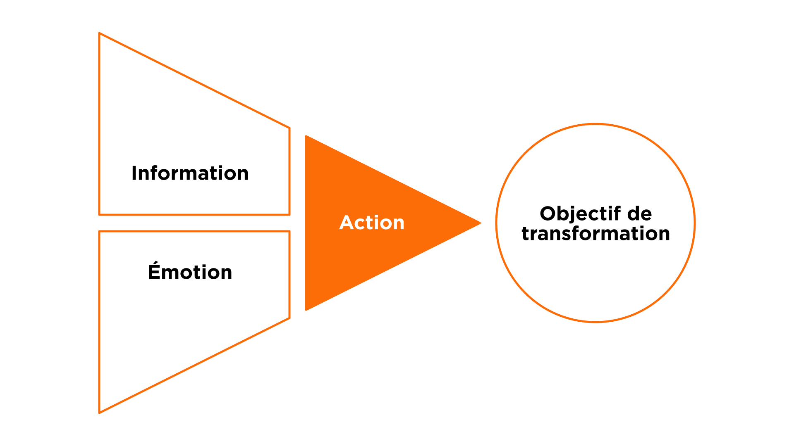

Le module message est tellement important qu'il est inclus dans nos formations storytelling, visuels et art oratoire ; en effet, sans message clair, pas de présentation.

Il est constitué de trois outils extrêmement efficaces pour identifier ce que vous devez dire dans votre présentation : l'ABC, l'Objectif de Transformation et le Parcours de Transformation de l'Audience.



## 1 ABC : ce n’est pas votre présentation, c’est la leur

Lorsque nous avons une présentation à donner, la première chose à faire est d’en savoir plus sur notre audience. Qui est-elle ? Quels sont ses besoins ? Quel est le contexte dans lequel nous allons donner la présentation ? C’est pour cela que nous démarrons par l’ABC.

- **A : Audience**. L’audience est constituée des personnes à qui nous allons faire notre présentation et que nous devons convaincre de créer le changement que nous voulons réaliser. Nous devons connaître le mieux possible notre audience, qui ils sont, leur histoire, ce qu’ils aiment, ce qu’ils détestent, les jeux politiques au sein de leur entreprise.
- **B : Besoins**. Cette audience a des besoins. Qu’est-ce qui l’empêche de dormir la nuit ? À propos de quoi ont-elles envie d’en savoir plus et d’être rassurées ? Mieux nous connaissons leurs envies, plus il devient facile de les convaincre.
- **C : Contexte**. Le contexte est l’ensemble des éléments externes qui peuvent influencer votre présentation. Imaginez par exemple une société pétrolière qui communique sur la responsabilité environnementale. Le mot « responsabilité » aura une signification complètement différente si la société a causé une marée noire récente. Si nous parlons de cryptomonnaie, le contexte peut être positif (le prix du Bitcoin atteint des sommets) ou négatif (un scandale vient d’éclater). Des éléments typiques de contexte à analyser sont le marché, les prévisions économiques, le climat géopolitique, la compétition, la culture locale…

> Exercice : prenez cinq minutes pour définir votre ABC. Ensuite nous partageons et nous analysons les ABC en groupe.

## 2 Objectif de transformation

L’objectif de transformation est l’action que nous voulons voir notre audience faire. Pour identifier cet objectif de transformation, le plus simple est de répondre à cette question : après ma présentation, que va **faire** mon audience ?

- Après ma présentation, mon audience va… *(que va-t-elle faire ?)*

Voici quelques exemples d’objectifs de transformation concrets :

- « ils vont signer le contrat »
- « ils vont valider mon budget »
- « ils vont dédier 1 jour par mois à mon projet »

> Prenez 5 minutes pour identifier votre objectif de transformation. Ensuite nous partageons et nous analysons les objectifs en groupe.

Conseils :

- L’objectif de transformation doit prendre l’ABC en compte.
- Informer n’est pas suffisant. « J’ai communiqué mon information clairement » n’est pas suffisant.
- L’objectif de transformation est un résultat concret.
- Il vaut mieux définir un objectif de transformation réaliste plutôt qu’un objectif trop ambitieux ou insuffisant pour atteindre notre objectif. Par exemple :
	- Si nous vendons un produit complexe, il est probablement irréaliste de vouloir conclure la vente lors de premier rendez-vous.
	- Si notre objectif est de valider le budget d’un projet, simplement expliquer la répartition des dépenses est insuffisant. Nous devons viser la validation formelle du budget par le comité de direction.

## 3 Information + Émotion = Action

Il est nécessaire d’utiliser l'information (les faits) et les émotions pour faire passer l'audience à l'action et ainsi atteindre notre objectif de transformation.

Un objectif de transformation ne peut pas être atteint en ne communiquant que de l'information. Il peut être atteint en communiquant uniquement des émotions pour des décisions irrationnelles, mais en entreprise cela n’est en général pas suffisant.

Pourquoi ? Parce que c’est lié au fonctionnement de notre cerveau : c’est en mélangeant faits et émotions que nous apprenons et que nous prenons des décisions. Sans émotion, nous ne serions pas capables de prendre des décisions. Par exemple, nous ne pourrions pas choisir entre une voiture bleue ou rouge, car il n’y a pas de fait rationnel pour nous permettre de faire un choix. Sans faits, il nous est impossible de rationaliser notre décision, et nous ne prenons pas de décision.

Les émotions peuvent supplanter notre processus de décision rationnel. Lorsque cela se passe, il se produit deux phénomènes :

- **Biais de confirmation** : nous devenons « aveugles » aux faits, ou nous ne choisissons que les faits qui correspondent à notre choix inconscient. Nous sommes tous sensibles aux biais de confirmation, même si nous pensons être purement rationnels.
- **Instinct de préservation** : nous rejetons les faits qui contredisent notre vision du monde. Notre cerveau interprète ces faits contradictoires comme étant une véritable agression physique et nous nous mettons en mode d’autodéfense.

Par exemple, il ne sert à rien d’essayer de convaincre un « platiste » que la terre est ronde. Il a mis en place tout un système de pensée qui valide sa vision du monde et tout fait contradictoire est vécu comme une agression. Il est facile de rire de cet exemple extrême, mais nous avons tous, à notre niveau, des croyances que nous ne voulons pas remettre en question.

Pour notre histoire, notre objectif est d’identifier les faits et les émotions nécessaires pour créer l’action dans l’esprit de notre audience, et ainsi réaliser le changement voulu.

## 4 Identifier les messages clés avec le Parcours de Transformation de l'Audience

Le parcours de transformation de l'audience ou « PTA » (ATR en anglais) est un outil créé pour nous aider à identifier les faits et les émotions sur lesquels nous devons agir dans notre présentation.

Dans la colonne de gauche, le PTA reprend quatre catégories. Ce que notre audience (pas nous)…

- …Sait (faits démontrés)
- …Pense (croyances, faits non démontrés)
- …Ressent (émotions)
- …Fait (actions)

Il y a trois colonnes en plus :

- Avant
- →
- Après

Nous commençons par remplir la colonne « avant » : nous listons ce que notre audience sait, croit, ressent et fait **avant** notre présentation. Il est important de bien distinguer faits et croyances. Par exemple, si nous avions rempli le PTA lorsque la tour Eiffel a été construite, pour une audience constitué de Parisiens, nous aurions obtenu quelque chose qui ressemble à ceci :

- Sait : la tour Eiffel est faite d’acier, elle fait 300 mètres et est située près du champ de Mars.
- Pense : c’est très cher pour ce que c’est (« cher » est un jugement, une croyance, pas un fait), ça va bien mal vieillir, mais heureusement cela sera démoli à la fin de l’exposition.
- Ressent : c’est laid et c’est une verrue dans le paysage parisien.
- Fait : on critique la tour Eiffel, mais on va quand même la visiter.

Une fois que nous avons complété la colonne « avant », nous remplissons la colonne « après » dans l’ordre opposé, de bas en haut : nous commençons par « fait » et terminons par « sait ». Si nous listions ce que les Parisiens pensaient de la tour Eiffel après quelques décades, cela pourrait ressembler à ceci :

- Sait : la tour Eiffel est faite d’acier, fait 300 mètres de haut et est située près du champ de Mars. C’est un symbole universellement reconnu. (tous ces éléments peuvent être prouvés, démontrés, vérifiés, mesurés)
- Pense : la tour Eiffel va rester, elle est avant-gardiste (qu’est-ce qui est vraiment avant-gardiste ou qui ne l’est pas ? Cela reste en partie subjectif).
- Ressent : fier de vivre dans une ville avec un tel monument.
- Fait : Parisians talk about it proudly to foreigners to prove that they are better than the rest, but they never go to see it.

Maintenant la question est : comment fait-on pour passer de « avant » à « après » ? Pour répondre a cette question, nous allons remplir la colonne du milieu, de haut en bas, avec les **éléments de langage** nécessaires pour passer de l’avant à l’après.

- Sait : quels faits devons-nous inclure dans la présentation pour combler le « fossé » de connaissance ?
- Pense : que devons-nous dire pour changer les croyances ?
- Ressent : que devons-nous dire pour changer les émotions ?
- Do : quel appel à l’action devons-nous faire ?

Dans l’exemple de la tour Eiffel, passer de « avant » à « après » a pris du temps, des décennies, avant que le point de vue des Parisiens ne change :

- Sait : la plupart des faits sont restés vrais, mais de nouveaux faits sont apparus, comme le fait que ce soit une attraction pour les touristes.
- Pense : parce que les faits ont changé, parce qu’ils s’y sont habitués, et parce que la communication autour de la tour a changé, les Parisiens ont commencé à la percevoir de manière positive.
- Ressent : les Parisiens ont commencé à ressentir un sentiment de fierté par rapport à la tour Eiffel. Ce changement a été causé par l’évolution des faits, mais surtout des croyances.
- Fait : comme ils ont commencé à percevoir la tour Eiffel de manière positive, ils ont commencé à en parler de manière positive. Par contre tout le monde sait que la plupart des Parisiens ne vont jamais sur la tour Eiffel !

Il est important de noter que chaque changement se construit à partir de la couche précédente : ce que les gens pensent est influencé par les faits, ce qu’ils ressentent est influencé par ce qu’ils pensent, et ce qu’ils font est influencé par ce qu’ils ressentent. C’est pourquoi il est si difficile de faire changer les personnes qui refusent de faire évoluer leur compréhension des faits. 

Voici un autre exemple. Imaginons que vous présentiez un projet pour faire installer un nouveau système de gestion de la relation client (CRM). Votre audience est le Comité Exécutif, en particulier le PDG qui doit valider le projet. Son besoin est d'être rassuré sur la faisabilité du projet et de comprendre les bénéfices qu'il apportera. Le contexte est une réduction du budget global pour les projets. Voici comment pourrait s'articuler le PTA :

Avant :

- Sait : ne connaît pas le projet. Ne maîtrise pas le sujet présenté, en particulier les aspects techniques.
- Pense : le projet n'est pas une priorité.
- Ressent : de l'agacement car il voudrait traiter d'autres sujets.
- Fait : rien.

Après :

- Sait : connaît les bénéfices du projet. Connaît les mécanismes mis en place pour assurer le succès du projet.
- Pense : le projet est une priorité et le risque est maîtrisé.
- Ressent : l'envie de lancer le projet, est rassuré par rapport à la faisabilité.
- Fait : valide les travaux sur le projet.

→ (messages clés) :

- Nous avons un problème urgent aujourd'hui : nos concurrents nous prennent des parts de marché.
- Notre analyse montre que cela est dû à notre méconnaissance de nos clients.
- Le projet va nous donner une meilleure connaissance de nos clients.
- Cela va nous permettre de gagner des parts de marché et de renforcer la fidélité de notre clientèle.
- Les risques sont identifiés et maîtrisés.
- La prochaine étape du projet est de valider le choix de la solution.

> Exercice : prendre 10/20 minutes pour créer votre Parcours de Transformation de l'Audience.

## 5 Premier pitch

Sur base des éléments de langage que nous avons identifiés avec le Parcours de Transformation de l’Audience, nous allons construire une première histoire courte qui nous servira de base pour les exercices du reste de la journée.

Notre objectif, avec cette histoire, est de convaincre notre audience. Pour cela, nous devons résoudre trois problèmes.

- Problème 1 : les distractions. Nous sommes constamment sollicités par nos smartphones, les publicités, etc.
  Solution 1 : nous allons **accrocher l’attention de l’audience**, avec un fait surprenant, une anecdote ou une question rhétorique.
- Problème 2 : pourquoi ? Nous avons accroché l’attention de l’audience, mais pourquoi est-ce qu’il devrait continuer à nous écouter ?
  Solution 2 : **expliquer le problème auquel vous répondez**, et pourquoi ce problème concerne l’audience.
- Problème 3 : inertie. Sans bonne raison, une audience au repos restera au repos.
  Solution : conclure par un **appel à l’action**.

> Sur base de ces éléments, créez une première version de votre présentation. Cette présentation doit durer entre 1 minute et 3 minutes maximum.
> Chaque participant présente son pitch sur scène une première fois, avec feedback des autres participants et du formateur.

