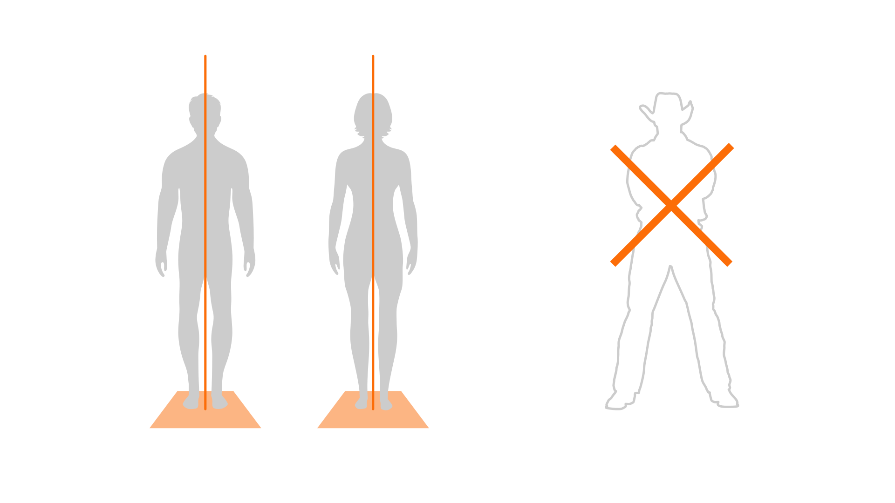

L’ancrage corporel repose sur le travail de la posture. Un bon ancrage offre plus de stabilité et projette une meilleure confiance en soi.

Les trois éléments essentiels de l’ancrage sont : posture, respiration et contact visuel.

## 1. Posture de base

Une bonne posture projette une image de confiance et de présence sur scène. Elle facilite également le flux d’air entre nos poumons et notre bouche. Nous allons voir la posture théorique « idéale ». Cette posture de base est assez contraignante, mais nous verrons qu’en réalité nous avons plus de liberté.

- Pieds : à plat sur le sol, séparés de la largeur de nos hanches.
- Jambes : toniques, droites, mais pas rigides. 
- Hanches : face à l’auditoire, alignées avec le reste de notre corps.
- Torse, cou et tête : droit, comme si un fil invisible nous tirait par le sommet de notre tête, mais en restant détendu.

Éviter de prendre une posture exagérée, comme la posture du « cow-boy ».

Pour créer un peu plus de présence, nous pouvons nous pencher très légèrement en avant (très, très légèrement, un ou deux degrés maximum). C’est très subtil, mais cela sera interprété comme une volonté d’établir une connexion avec l’auditoire.

Quoi que nous fassions, la posture doit nous sembler naturelle et non forcée. 

> Exercice : tout le monde se lève et pratique la posture de base.

## 2. Respiration

Une respiration calme, profonde, nous aidera à rester détendus et naturels sur scène. Il y a deux types de respirations :

- Thoracique : cette respiration donne l’impression de venir du haut des poumons.
- Abdominale : cette respiration donne l’impression de venir du bas du ventre.
  

Pour comprendre la différence, le mieux est de faire un exercice.

> Exercice : fermez les yeux. Placez une main sur votre poitrine et inspirez lentement, puis expirez. Puis placez une main sur votre ventre et faites le même exercice.

Une fois ce premier exercice fait, prenons le temps de prendre conscience de la capacité réelle de nos poumons, en particulier si nous avons tendance à avoir une respiration courte lorsque nous sommes stressés.

> Exercice : gardez les yeux fermés. Maintenant, inspirez lentement pour remplir vos poumons à fond. Puis expirez lentement, jusqu’à ce que vos poumons soient complètement vides. Répétez pendant une minute.

Lors d’une présentation, personne n’a le temps de penser à sa respiration. Pour les personnes qui risquent d’avoir une respiration trop courte ou trop rapide, nous conseillons de pratiquer la respiration discrètement avant la présentation en tant qu’échauffement. Heureusement, nous verrons plus loin qu’il existe d’autres moyens pour se détendre et se préparer à monter sur scène.

## 3. L’arme secrète : le contact visuel

Nous avons vu la posture, la respiration et la voix. Il y a un élément qui lie tous ces éléments ensemble : le contact visuel. Avec le contact visuel, nous pouvons :

- Éliminer les mouvements parasites sans devoir y penser,
- Respirer plus naturellement sans avoir besoin d’y penser,
- Parler avec une voix plus naturelle sans avoir besoin d’y penser.

Cela peut sembler trop beau pour être vrai, mais c’est la réalité. Il existe une raison pour laquelle le contact visuel résout tous ces problèmes :

- Lorsque nous établissons un contact visuel avec quelqu’un, notre cerveau nous donne instinctivement l’ordre d’arrêter de bouger.
- Lorsque nous nous focalisons sur quelqu’un, notre cerveau arrête de se focaliser sur nous-mêmes et sur la façon dont nous respirons. Autrement dit, nous arrêtons d’être centrés sur nous-mêmes et sur nos propres pensées. Cela nous aide à être plus naturels et à être moins stressés.
- Lorsque nous parlons avec quelqu’un en établissant un contact visuel, cela crée une connexion. La personne face à nous n’est plus un étranger, mais quelqu’un avec qui nous avons une conversation. Et cela change **tout**.

> Par deux, nous établissons un contact visuel. En gardant ce contact visuel, nous nous déplaçons. Nous observons ce qu’il se passe.

Entre la posture, la respiration et la voix, le contact visuel est l’élément clé que nous recommandons de pratiquer en priorité.

**Un contact visuel efficace** est quelque chose qui demande de l’entraînement. Par défaut, nous avons tous tendance à regarder dans la même direction. Nous devons apprendre comment établir un contact visuel avec un auditoire de 10 000 personnes. Bien sûr, il est impossible de regarder individuellement 10 000 personnes. Mais nous pouvons regarder dans la direction de chaque personne.

Pour apprendre à faire cela, nous pouvons utiliser l’exercice des Post-its. Nous plaçons 6 post-its : deux à gauche à des hauteurs différentes, deux au milieu et deux à droite. Nous établissons un contact visuel avec un des Post-its, et nous lui adressons au moins une phrase complète. Une fois ce message adressé, nous regardons un autre post-it et nous lui adressons au moins une phrase complète. Nous continuons jusqu’à avoir regardé les 6 post-its.

Nous veillons à ne pas rompre le contact visuel au milieu d’une phrase, ou cela créera l’impression que nous ne parlons par vraiment à cette personne. Nous devons terminer au moins une ou deux phrases complètes.

Si nous continuons à avoir des mouvements parasites lorsque nous établissons un contact visuel, cela signifie que nous n’établissons pas un **véritable** contact visuel. Nous regardons dans toutes les directions, mais, sans établir de contact. Nous devons réellement nous « ancrer » dans le regard de la personne.
 
> Exercice : Utilisez le contact visuel pour adresser une partie de votre message.
