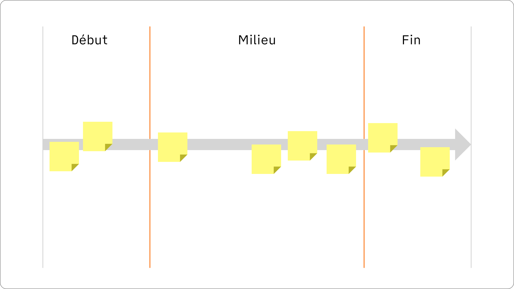
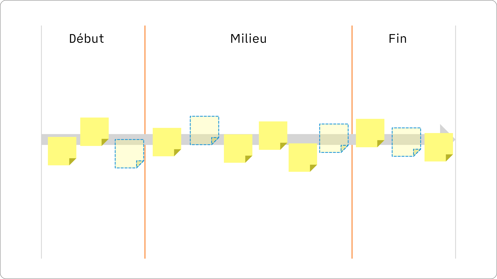

Une histoire a toujours au minimum trois parties : un début, un milieu et une fin. Une bonne structure accroche l’attention et rend la présentation simple à suivre et à comprendre.

Dans cette section, nous allons expliquer comment créer une bonne structure, puis nous utiliserons notre ABC et notre PTA pour ajouter du contenu à notre histoire.



## 1 Choisir une structure

Il existe un nombre infini de structures possibles. Nous allons donc proposer ici quelques formules éprouvées, souvent utilisées pour créer des présentations.

| Structure                 | Début                        | Milieu                                                        | Fin                                   |
| ------------------------- | ---------------------------- | ------------------------------------------------------------- | ------------------------------------- |
| Les 3 actes               | Introduction                 | Développement des idées (changement)                          | Conclusion                            |
| Changer le monde          | Idéal contre réalité         | Problème, puis solution                                       | Conclusion avec les prochaines étapes |
| Le pitch de vente         | Problème ou besoin du client | Deux mauvaises solutions, la bonne solution (votre solution ) | Conclusion avec appel à l'action      |
| La présentation de Comité | Recommandation               | Problème ou besoin, solution                                  | Appel à l'action                      |
| Présentation de projet    | Contexte & analyse           | Actions et résultats                                          | Conclusion                            |

D'autres structures simples que vous pouvez utiliser sont par exemple :

- Recommendation, explication/démonstration, appel à l'action
- Ligne du temps
- Questions/réponses ou Objections/réponses

Si possible, évitez les structures « composées », par exemple une structure qui mélange une ligne du temps avec des questions/réponses. Si vous devez mélanger plusieurs types de structures, découpez votre présentation en plus petites sections, chacune avec son propre début - milieu - fin.

> Exercice : sur base de votre ABC et de votre PTA, choisissez une des structures types pour votre présentation.

## 2 Placez les éléments de langage

Une fois notre structure choisie, nous prenons nos éléments de langage dans la PTA et nous les ajoutons à la structure choisie.

Nous organisons ces éléments sur notre structure. Si possible, nous les organisons par ordre importance :

- Ce que nous devons absolument dire,
- Ce qui est utile, mais non prioritaire,
- Ce qui est intéressant, mais peu utile.

 
> Exercice : prenez les éléments de langage de votre PTA et placez-les sur votre structure.

## 3 Complétez votre structure

Nous avons identifié des éléments de langage importants avec la PTA, mais il y a probablement des trous à combler.

Voici une liste des éléments que vous pouvez inclure dans votre présentation :

Début :

- Qui est le présentateur ?
- Pourquoi êtes-vous crédible ? (diplômes, expérience, références)
- Pourquoi vous êtes là : quels sont l’objectif et l’agenda de la présentation ?

Milieu :

- Éléments de contexte importants (chiffres clés, évolution globale du marché, etc.) Par exemple, un recul des ventes n’a pas la même signification si le marché est en décroissance ou s’il est en croissance.
- Démonstration ou histoire inspirante pour créer le changement voulu.

Fin :

- Résumé
- Appel à l’action

## 4 Reliez les éléments 

Une fois la structure de base complétée, nous pouvons écrire un premier brouillon de notre histoire. L’objectif de ce premier jet est de vérifier que l’histoire choisie « fonctionne ». En particulier, nous vérifions que :

- L’enchaînement des idées est logique et facile à suivre
- Les transitions d’une idée à l’autre sont faciles (elles devraient l’être si la structure est adaptée)
- Tous les éléments inclus dans l’histoire sont nécessaires pour atteindre notre objectif (sinon nous les retirons)
- Il n’y a pas de manquements dans notre histoire (sinon nous les remplissons)

> Exercice : j’écris un premier brouillon de mon histoire pour valider la structure et les éléments de langage choisis.

Partie suivante : [histoire](04-histoire)
