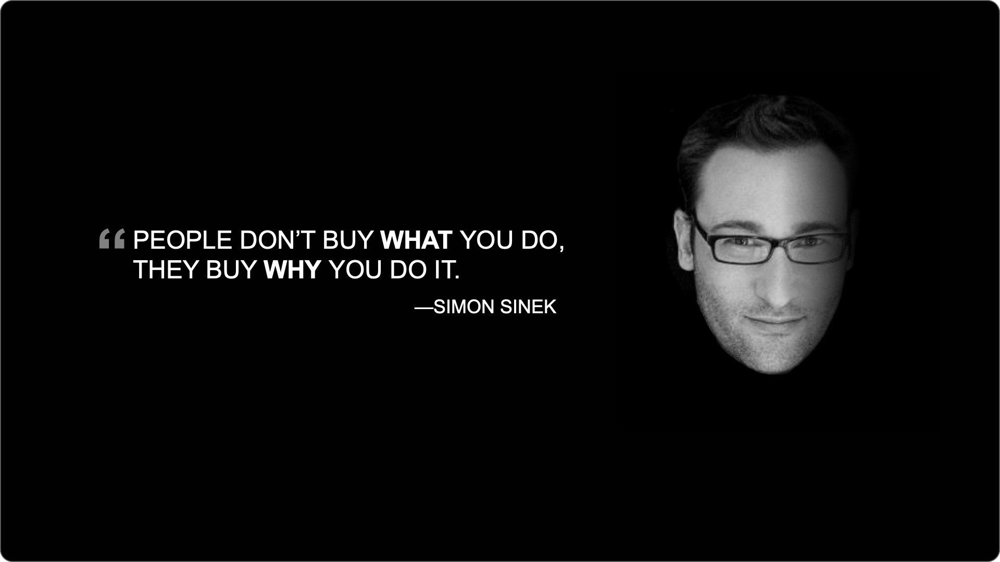
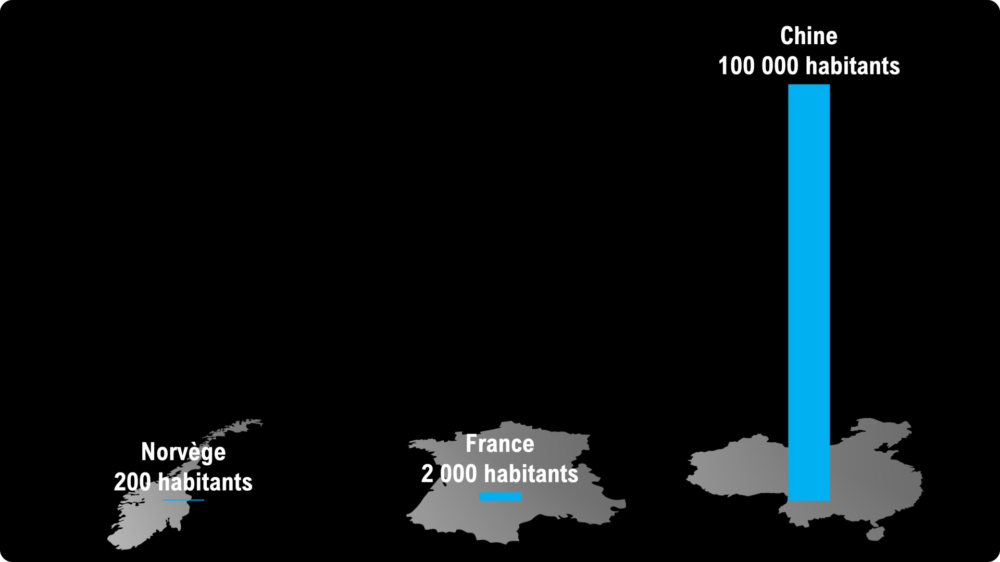
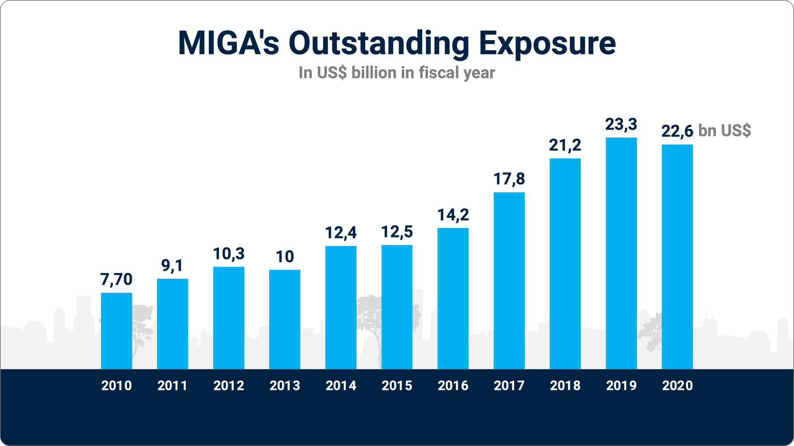

La plupart des présentations PowerPoint ne sont pas réellement des présentations ; ce sont des hybrides entre document et présentation. Malheureusement, ce n'est ni un bon document, ni un bon support visuel. Ce module explique comment créer une bonne présentation PowerPoint visuelle, qui va renforcer et clarifier l'histoire portée par l'orateur.



## 1 Introduction

PowerPoint est devenu tellement utilisé qu'il est devenu synonyme de présentation en entreprise. Mais notre conception d'une bonne présentation va bien plus loin.

**Durée** : 7h.

**Objectif pédagogique :**

- Apprendre comment construire une présentation PowerPoint qui applique les bons principes de communication : structure, contenu, style.
- Ce n'est pas une formation pour apprendre à utiliser PowerPoint, mais plutôt à communiquer efficacement avec PowerPoint.

**Méthodes et moyens :**

- Page web avec les différents supports et exercices
- Support visuel PowerPoint
- Exercices pratiques
- Livret d'exercices du participant (format papier)

**Méthode d'évaluation :**

- Évaluation continue au cours de la formation
- Exercice final de mise en pratique des acquis

**Prérequis :**

- Avoir déjà utilisé PowerPoint pour faire une présentation.
- Savoir utiliser PowerPoint pour créer une présentation simple.
- Avoir un ordinateur portable avec PowerPoint installé.
- Avoir un cas concret de présentation à donner, qui servira d'étude de cas lors de certains exercices pratiques.

### 1.1 Les trois piliers d'une bonne présentation

Une présentation réussie est une présentation qui atteint notre objectif de transformation. L'objectif de transformation est le changement que nous voulons voir se produire dans notre audience.

Pour que ce changement se produise, nous avons besoin de nous appuyer sur un **message** clair et persuasif. Sa communication s'appuie sur trois piliers :

- **l'histoire**
- **les visuels**
- **l'orateur**

L'histoire communique notre message de manière claire et convaincante. Les visuels sont optionnels et servent à clarifier et renforcer l'histoire. L'orateur porte et incarne le message.

Cette formation est dédiée au pilier « visuels ». Nous ne verrons pas comment utiliser PowerPoint ; savoir utiliser ce logiciel est un prérequis, même si le formateur pourra éventuellement vous donner des conseils pour réaliser certaines diapositives.

Mais avant de découvrir les bons principes de communication, nous allons redéfinir la notion même de présentation PowerPoint.

### 1.2 À propos d’Ideas on Stage

Ideas on Stage accompagne les dirigeants dans la réalisation de leurs présentations, la création d’événements inspirants et la formation et le coaching de leurs organisations à la prise de parole en public.

Nous avons créé Ideas on Stage en 2010, convaincus que l’art de présenter est un avantage compétitif essentiel. Nous avons proposé un mélange révolutionnaire de storytelling, de design visuel et de coaching à la prise de parole. Notre intuition était correcte : nos clients ont pris conscience de la valeur des présentations à fort impact, sont devenus fidèles et nous ont recommandés à leurs amis.

Aujourd’hui, les experts en communication d’Ideas on Stage vous proposent un éventail complet de services en présentation dans le monde en anglais, français, espagnol, italien et allemand.

### 1.3 Pourquoi parle-t-on de diapositives ?

Il y a bien longtemps, PowerPoint n'existait pas. Les ordinateurs étaient des objets rares, réservés à certains employés.

Pour les évènements importants, les entreprises avaient l'habitude d'utiliser des diapositives pour illustrer les discours. Ces diapositives devaient être confectionnées une à une, montées dans un chariot avant d'être projetées. 

La technologie a été abandonnée depuis longtemps, mais le terme le terme « diapositive » a été repris par PowerPoint et est resté dans le langage courant (slide en anglais).

Au début, la méthode classique de présentation consistait à imprimer la présentation PowerPoint sur des feuilles transparentes, qui étaient alors affichées à l'aide d'un rétroprojecteur.

Au fil du temps, les projecteurs et les écrans se sont généralisés dans les salles de réunion, et de nos jours les méthodes les plus courantes consistent à utiliser un câble HDMI ou ClicShare pour projeter sa présentation.

### 1.4 Présentation PowerPoint ou DocuPoint ?

SLD docupoint vs visuel

> Exercice : comparez ces deux types de diapositives. Commentez sur les avantages et inconvénients.

Il existe non pas un type de présentation PowerPoint, mais plusieurs :

- **La présentation document** : cette présentation est destinée à être communiquée par email ou sous forme de pdf. Elle n'est pas présentée par un orateur, elle est lue par son audience. Elle doit donc se suffire à elle-même. On parle de présentation « auto-porteuse ».
- **La présentation visuelle** : cette présentation est destinée à être utilisée comme support par un orateur, face à un auditoire. L'orateur va raconter l'histoire oralement, les visuels n'ont donc besoin de comporter que les éléments complémentaires, qui vont clarifier ou renforcer l'histoire.
- **le DocuPoint** : c'est une présentation à mi-chemin entre la présentation document et la présentation visuelle. Malheureusement, au lieu de combiner le meilleur des deux mondes, ce type de présentation rassemble souvent le pire. Elle a trop d'informations pour renforcer ou clarifier le discours, et elle en a trop peu pour être auto-porteuse.

Voici un exemple typique de DocuPoint :

La question à se poser, avant même d'ouvrir son ordinateur et de lancer PowerPoint, est donc « à quoi va servir ma présentation ? » Est-ce que je vais l'envoyer par email ? Est-ce que je vais la présenter face à un auditoire ?

Nous avons vu qu'il y avait trois piliers. Avant de créer une présentation PowerPoint, encore faut-il savoir quoi raconter, pourquoi et comment. C'est le rôle de l'histoire. Cette formation n'est pas une formation de storytelling, mais nous allons prendre un peu de temps pour en voir la base.

## 2 Message

Voir le [module message](message/index.md).

Maintenant que nous connaissons les principes de base d'une bonne histoire, nous pouvons revenir à la création de la présentation PowerPoint.

## 3 Lier histoire et présentation

Objectif : sur base de l'histoire, identifier les diapositives réellement indispensables.

Les diapositives peuvent aider à clarifier ou renforcer les faits et les émotions de notre histoire. Il existe d’autres médias possibles, mais nous n’allons pas les couvrir dans cette formation.

**En général, les diapositives doivent compléter les paroles de l’orateur et non les dupliquer. Elles ne devraient contenir que les éléments qui clarifient ou renforcent l’histoire.**

### 3.1 Utiliser un « storyboard »

Typiquement, lorsque un présentateur doit créer une nouvelle présentation, il lance PowerPoint, crée des diapositives au fur-et-à-mesure des idées qui lui viennent en tête, puis il passe énormément de temps à changer des détails.

L'avantage du storyboard est qu'il force le présentateur à se poser la bonne question : **de quelles diapositives ai-je réellement besoin pour ma présentation ?**

Le storyboard peut se faire en deux temps : 

- Premièrement, en parcourant l'histoire et en identifiant les passages qui bénéficieraient d'éléments visuels : graphique, citation, message clé, photo, etc.
- Deuxièmement, en imaginant ces éléments sous formes de petits dessins miniature sur papier. C'est l'enchaînement de ces petits dessins qui va constituer le storyboard. Celui-ci va servir de squelette pour le contenu de la présentation.

Inutile, au niveau du storyboard, de dessiner tous les détails. Il s'agit plutôt d'une phase de brainstorming et d'idéation. Il est normal que la présentation finale évolue et soit différente du storyboard initial. Vous n'avez pas besoin non plus de faire une diapositive pour chaque passage de l'histoire. Identifiez seulement les éléments de l'histoire qui bénéficieraient d'un visuel, par exemple :

- Un chiffre
- Un graphique
- Une citation
- Un schéma
- Une photo

> Exercice : lisez l'histoire suivante par groupes de 2 à 3 personnes. Identifiez les passages de l'histoire qui bénéficieraient d'un visuel. Enfin, dessinez le storyboard. Une fois que tous les groupes sont prêts, ils partagent leur storyboard avec les autres participants.

## 4 La méthode pSCORE

Objectif : découvrir les 5 caractéristiques d'une diapositive efficace.

La méthode pSCORE, pour « presentation SCORE », reprend les 5 grandes caractéristiques d'une bonne diapositive :

- Simple
- Clair
- Original
- Relié
- Entraînant

Cependant, les présentations PowerPoint créées en entreprise satisfont rarement à l'ensemble de ces critères. Voici un aperçu des problèmes typiquement rencontrés.

|                | Problèmes typiques anti-SCORE                                                                                                                                                                                                                                                    |
| -------------- | -------------------------------------------------------------------------------------------------------------------------------------------------------------------------------------------------------------------------------------------------------------------------------- |
| **Simple**     | Trop de contenu ou trop de détails.                                                                                                                                                                                                                                              |
| **Clair**      | Les éléments clés ne ressortent pas car ils ne sont pas mis en valeur.  La structure de l'information sur la diapositive ne correspond pas à notre façon naturelle d'absorber l'information.  Le fil narratif de l'enchaînement des diapositives n'est pas cohérent. |
| **Original**   | Aucune surprise, aucune originalité, aucune émotion et donc ennuyeux.                                                                                                                                                                                                            |
| **Relié**      | Jargon, acronymes, concepts non connus de l'audience.                                                                                                                                                                                                                            |
| **Entraînant** | Mise en forme laide ou terne et peu attractive visuellement.                                                                                                                                                                                                                     |

Vous pourrez conserver pSCORE à l'esprit pour évaluer les exemples de diapositives montrés et évaluer vos propres diapositives.

Finalement, ces problèmes sont assez faciles à éviter. En réalité, la plupart d'entre eux viennent d'un manque de clarté au niveau du message à communiquer, car le présentateur démarre directement sur PowerPoint au lieu de commencer par l'histoire, d'où l'importance de l'étape « storytelling ».

## 5 Diapositives de structure

Il existe deux types de diapositives : les diapositives de structure, qui comme leur nom l'indique servent à structurer la présentation, et les diapositives de contenu. Nous allons commencer par voir les différents types de diapositives de structure.

Les diapositives de structure ne font pas partie du « contenu » principal de l'histoire. Néanmoins, elles facilitent le suivi du déroulé pour l'audience.

### 5.1 Couverture et dernière page

Les éléments typiques de la couverture sont :

- Titre : pourquoi sommes-nous là aujourd'hui ? Quel est le sujet de la présentation ?
- Nom du présentateur ou nom de l'équipe
- Date de la présentation
- Logo de l'entreprise

La dernière diapositive est celle qui reste affichée à la fin de la présentation. Vous pouvez donc y inclure des informations pour faciliter le passage à l'action de l'audience :

- Merci
- Coordonnées du présentateur
- Appel à l'action
- Lien vers un site
- QR code

### 5.2 Section

Nous recommandons parfois à certains intervenants qui ont peur de se perdre dans leur présentation d'utiliser les diapositives de section comme pense-bête. Il est donc tout à fait possible d'avoir une présentation avec principalement des diapositives de section et pratiquement aucune diapositive de contenu.

### 5.3 Agenda

La diapositive d'agenda, présentée au début, facilitera le suivi du déroulé de la présentation.

L'agenda peut être repris au fur-et-à-mesure de l'avancement de la présentation avec un moyen visuel montrant la progression. Dans ce cas, les diapositives agenda peuvent se substituer aux diapositives de section. 

### 5.4 Exercice

> Ajoutez les slides de section nécessaires à votre storyboard.

## 6 Diapositives de contenu

Les diapositives de contenu présentent les éléments nécessaires pour raconter l'histoire de manière impactante.

Les éléments typiques de contenu que l'on retrouve sur les diapositives de contenu sont :

- Titre
- Texte de contenu
- Graphiques
- Tableaux
- Schémas et pictogrammes
- Photos
- Vidéos

Pour chacun de ces éléments, la règle de base est : **un et un seul élément de contenu de chaque type par diapositive**. Par exemple, on ne mettra qu'un seul graphique par diapositive, une seule photo ou une seule vidéo. Cette règle est souple, mais nous déconseillons par exemple de créer des diapositives avec quatre graphiques, sauf si chacun de ces graphiques correspond parfaitement au fil narratif. En général, il vaut mieux soit :

- retirer les graphiques qui ne sont pas indispensables au fil narratif ou
- découper la diapositive en plusieurs diapositives avec chacune un graphique et un message clé fort.

### 6.1 Titre

Il existe plusieurs façons d'utiliser le titre :

- Un mot clé descriptif, par exemple introduction, contexte, tarif, etc.
- Un message clé, par exemple « Notre objectif est de doubler notre chiffre d'affaires en 5 ans. »
- Une question rhétorique, par exemple « Quel est le goulet d'étranglement qui limite notre croissance ? » ou « Comment notre solution peut-elle vous aider à réduire vos coûts de 20% ? »
- Il est également possible de ne pas avoir de titre du tout.

Le tableau suivant reprend les avantages et les inconvénients des différents types de titres.

| Type de titre       | Avantages                                                                      | Inconvénients                                                                                                       | Astuce                                                                                                                                                                              |
| ------------------- | ------------------------------------------------------------------------------ | ------------------------------------------------------------------------------------------------------------------- | ----------------------------------------------------------------------------------------------------------------------------------------------------------------------------------- |
| Mot clé             | Clair et succint, ne prend pas beaucoup de place                               | Ne véhicule aucune intention, aucun véritable message                                                               | Réserver les mots clés aux présentations suivant une structure bien connue. Ne pas mélanger titres « mot clé » et titres « messages clé »                                           |
| Message clé         | Renforce le fil conducteur et établit clairement l'intention de la diapositive | Peut prendre de la place et ne pas convenir à un style plus épuré                                                   | Préférer un message clé aux mots clés lorsque c'est possible. L'enchaînement des messages clés doit former une mini-histoire reprenant l'essentiel des messages de la présentation. |
| Question rhétorique | Une bonne question rhétorique attise la curiosité de l'audience                | Il n'est pas toujours possible d'utiliser une question rhétorique                                                   | Il est possible d'alterner message clé et question rhétorique                                                                                                                       |
| Pas de titre        | Laisse toute la place au visuel                                                | Incompréhensible sans narration par un présentateur. Ne peut donc pas être utilisé pour un document « autoporteur » | Réserver les diapositives sans titres aux présentations faites par un présentateur                                                                                                  |

Par défaut, nous vous recommandons plutôt d'utiliser le titre « message clé » lorsque c'est possible.

Nous verrons dans la partie design où placer le titre. Nous verrons également qu'il est possible de l'afficher sous forme d'élément graphique. 

### 6.2 Texte de contenu

Nous distinguons le titre et le texte de contenu. Nous catégorisons le texte de contenu en quatre catégories :

- La liste a puces (bulletpoints) : les points clés sont résumés sous forme de points courts.
- Un court paragraphe de texte.
- Un texte complet qui prend la majorité de l'espace de la diapositive.
- Il est également possible de ne pas avoir de texte du tout. C'est même souvent la meilleure solution lors d'une présentation orale.

Le tableau suivant reprend les avantages et les inconvénients des différents types de texte détaillé.

| Type de texte | Avantages                                                                    | Inconvénients                                                                                                       | Astuce                                                                                                                         |
| ------------- | ---------------------------------------------------------------------------- | ------------------------------------------------------------------------------------------------------------------- | ------------------------------------------------------------------------------------------------------------------------------ |
| Liste à puces | Bien adapté aux listes, succinct.                                            | Le texte peut être difficile à comprendre, car à mi-chemin entre un mot clé et une vraie phrase.                    | Réserver les listes à puce aux vraies « listes » : liste de caractéristiques d'un produit, liste d'avantages, etc.             |
| Paragraphe    | S'il est bien écrit et succinct, il aura plus d'impact que la liste à puces. | Peut être insuffisant pour véhiculer tout le message.  Peut être redondant lors d'une présentation orale.     | Le paragraphe de texte est en général préférable aux listes à puces, surtout lorsqu'il s'agit de communiquer un message clair. |
| Texte complet | Permet de développer complètement l'argumentaire.                            | Aspect rébarbatif, peut être ennuyeux à lire.  Inadapté aux présentations orales.                             | Minimiser ce type de texte aux diapositives où cela est réellement indispensable.                                              |
| Pas de texte  | Laisse toute la place au visuel.  Impact émotionnel fort.              | Incompréhensible sans narration par un présentateur. Ne peut donc pas être utilisé pour un document « autoporteur » | Réserver les diapositives sans texte aux présentations orales.                                                                 |
Par défaut, nous vous recommandons de plutôt choisir le texte de type « paragraphe » qui est un bon équilibre entre longueur et clarté.

### 6.3 Tableaux

Les tableaux sont utilisés pour faire un résumé, comparer différentes solutions, présenter des chiffres, etc.

Notre recommandation générale est d'essayer de limiter le nombre de tableaux dans une présentation. Les chiffres seront souvent mieux présentés sous forme de graphique, et avec un peu d'imagination on peut présenter les autres éléments de manière plus créative.

### 6.4 Graphiques

Les graphiques servent à afficher les chiffres de manière plus visuelle.

- Le camembert (ou sa variante le donut)
- Les barres verticales
- Les barres horizontales
- Les courbes (ou points reliés)

Il existe d'autres types de graphiques, mais ces types sont relativement peu utilisés dans les présentations.

| Type de graphique   | Utilisation principale                                                                                                                                                   | Inconvénients                                                                                                            | Astuce                                                                                                                                      |
| ------------------- | ------------------------------------------------------------------------------------------------------------------------------------------------------------------------ | ------------------------------------------------------------------------------------------------------------------------ | ------------------------------------------------------------------------------------------------------------------------------------------- |
| Camembert ou Donut  | À utiliser pour montrer les proportions entre différentes catégories.                                                                                                    | Les parts peuvent parfois être trop petites pour être correctement affichées.                                            | Lorsque les parts sont vraiment trop petites (par exemple 0,1%) elles peuvent être regroupées dans une catégorie « autres »                 |
| Barres verticales   | Montrer l'évolution d'un chiffre en fonction d'une variable, typiqument le temps. Les barres sont typiquement utilisées pour des chiffres agrégés par an, par mois, etc. | L'échelle peut rendre certains chiffres invisibles. Lorsqu'il y a peu de variations, le graphique peut sembler « plat ». | Nous déconseillons la pratique qui consiste à faire démarrer l'axe Y à un autre endroit que 0. Cela donne une image trompeuse des chiffres. |
| Barres horizontales | Comparer deux ou plusieurs chiffres, par exemple la performance de deux modèles de microprocesseurs.                                                                     | Même inconvénients que les barres verticales.                                                                            | Même recommandation que pour les barres verticales.                                                                                         |
| Courbes             | Pour montrer l'évolution d'un chiffre à partir de mesures ponctuelles (et non agrégées dans le temps comme pour les barres verticales)                                   | Les chiffres peuvent être plus difficiles à distinguer que sur des barres.                                               | Afficher uniquement les chiffres importants.                                                                                                |

De manière générale, essayez d'appliquer les conseils suivants à vos graphiques :

- Ne présenter qu'une seule série de données à la fois.
- Limiter le nombre d'axes à 2 : X et Y (éviter les graphiques en 3D et les graphiques avec un axe secondaire à droite).
- Ne pas avoir trop de points : Un graphique de 10 barres sera facilement lisible, mais un graphique de 50 barres aura l'air « lourd ».

Évidemment, la précision dépendra du type de chiffre présenté et de l'audience. Une étude scientifique ne pourra pas autant simplifier l'affichage des données qu'un bilan financier.

Nous verrons dans la partie style comment simplifier l'aspect visuel des graphiques pour les rendre plus lisibles.

### 6.5 Schémas et pictogrammes

Les **schémas** peuvent grandement renforcer et clarifier le message, à condition d'être compréhensibles. En effet, certains schémas sont tellement détaillés qu'ils renforcent l'impression de complexité au lieu de simplifier la compréhension.

- L'audience est-elle familière avec les éléments présentés ?
- Le principe général du schéma peut-il être compris en quelques secondes ?
- Le schéma peut-il être expliqué en deux minutes maximum ?
- Si non, est-il possible de décomposer le schéma en plusieurs morceaux pour en simplifier la compréhension ?
- Une fois le schéma simplifié, est-on sûr qu'il ne peut pas être encore plus simplifié ?

Les **pictogrammes** sont un moyen simple d'agrémenter un slide et de le rendre plus visuel. Ils peuvent servir, par exemple, à découper une liste à puces en quelques éléments plus digestes.

### 6.6 Photos

Les photos sont un excellent moyen d'augmenter l'impact visuel d'une présentation. Il ne faut pas hésiter à afficher la photo sur toute la surface de la diapositive, en mode « pleine page », pour en maximiser l'impact.

Les photos sont probablement le meilleur moyen de rendre concret certains concepts et certaines descriptions dans la présentation.

Les photos peuvent également être utilisées avec une phrase de style « citation » pour créer une combinaison émotionnelle puissante. C'est une technique très utilisée dans la publicité.

### 6.7 Vidéos

Les vidéos peuvent également être utilisées dans PowerPoint. Si possible, couvrir tout le slide avec la vidéo.

### 6.8 Autres éléments

- **Le sous-titre** : peut être utile, par exemple pour afficher la section dans laquelle on se trouve. Lorsque c'est possible, nous recommandons d'utiliser seulement un titre.
- **Le fil d'ariane** : utilisé pour savoir à quel endroit on se trouve dans la présentation. À réserver aux présentations très longues. Si une présentation de 20 minutes a besoin d'un fil d'ariane, c'est qu'elle n'est pas suffisamment claire et structurée.
- **Le « takeaway »** : il est possible, en « conclusion » de la diapositive, d'afficher en bas de la diapositive un résumé des messages clés de celle-ci. Cependant, lorsque c'est possible, nous recommandons plutôt d'utiliser un titre message clé. Cela simplifie la lecture de la présentation.
- **Le pied de page** : avec typiquement le numéro de page, la date, un texte générique (souvent le copyright ou le titre de la présentation). À réserver aux présentations « document ».
- **Le logo** : à éviter si possible. Il est possible de n'afficher le logo que sur la couverture et les diapositives de section.
- **Les décorations** : à minimiser.

## 7 Styles de diapositives

Maintenant que nous avons passé en revue les principaux types de contenus utilisés dans les diapositives, nous allons voir comment ils peuvent être combinés en fonction de l'objectif poursuivi.

Pour respecter la méthode pSCORE (Simple, Clair, Original, Relié, Entraînant), vous pouvez suivre les principes de base présentés dans le tableau ci-dessous.

| Conseil                      | Règle                                                                                                         | Astuces                                                                                                                                                                                                          |
| ---------------------------- | ------------------------------------------------------------------------------------------------------------- | ---------------------------------------------------------------------------------------------------------------------------------------------------------------------------------------------------------------- |
| Nombre d'éléments de contenu | Essayer de limiter à 3 le nombre d'éléments de contenus différents, par exemple titre, paragraphe, graphique. | Si la diapositive contient trop d'éléments de contenu différents, il faut se poser la question si il ne vaudrait pas mieux (a) supprimer certains de ces éléments ou (b) les séparer sur plusieurs diapositives. |
| Ordre                        | Toujours commencer par le titre, puis présenter les éléments dans l'ordre du fil narratif.                    | Il y a trois zones importantes : le dessus, où on place généralement le titre, le milieu avec le contenu principal, et le bas avec éventuellement le « message de fin » de la diapositive.                       |
| Éléments décoratifs          | Éviter les éléments décoratifs inutiles.                                                                      | Il est inutile d'inclure le logo de l'entreprise, le numéro de page, etc. sur toutes les diapositives.                                                                                                           |

### 7.1 Titre et texte

C'est le type de diapositive le plus courant. En plus du titre et du texte, il y a souvent un troisième élément sur la diapositive, par exemple une photo ou un graphique.

Une diapositive contenant uniquement titre et texte sera peu agréable à l'œil et ne donnera pas envie à l'audience de la lire, car il manque le E (Entraînant) de pSCORE.

C'est pourquoi nous recommandons plutôt d'utiliser un des autres types de diapositives décrites ci-dessous.

### 7.2 Diapositive avec graphique

Avant de créer ou d'utiliser un graphique, posez-vous plutôt la question « quel est le message que je souhaite communiquer avec ce graphique ? » :

- « Chiffre d'affaires » n'est pas un message, c'est un mot-clé.
- « Le chiffre d'affaires a doublé en 5 ans » est un message. Dans ce cas, le graphique doit au moins reprendre le chiffre d'affaires d'il y a 5 ans et le chiffre d'affaires de l'année écoulée.

> Exercice : comment rendre cette diapositive auto-porteuse ?

| Conseil                        | Règle                                                                              | Astuces                                                                                                         |
| ------------------------------ | ---------------------------------------------------------------------------------- | --------------------------------------------------------------------------------------------------------------- |
| 2 séries maximum par graphique | Ne pas afficher plus de 2 séries de données maximum par graphique.                 | Utiliser une animation pour simplifier la compréhension des graphiques complexes.                               |
| 1 série c'est mieux            | Si c'est possible, n'afficher qu'une seule série de données sur un même graphique. |                                                                                                                 |
| 2D                             | Ne pas utiliser les graphiques 3D                                                  | Il est possible de changer le type de graphique sans devoir tout refaire.                                       |
| Simplifier                     | Retirer les éléments inutiles du graphique.                                        | Il est possible de sélectionner les éléments du graphique dans PowerPoint et de les supprimer individuellement. |

Problèmes courants et leurs solutions :

| Problème                 | Description                                                                                      | Solution                                                                                                                                                                                                                                               |
| ------------------------ | ------------------------------------------------------------------------------------------------ | ------------------------------------------------------------------------------------------------------------------------------------------------------------------------------------------------------------------------------------------------------ |
| Double titre             | Le titre est dupliqué : il y a un titre pour la diapositive et un titre pour le graphique        | Choisir le titre à garder et supprimer l'autre. En général, nous préférons garder le titre de la diapositive pour conserver une cohérence entre les diapositives.                                                                                      |
| Légende                  | La légende du graphique est placée en bas, en tout petit.                                        | Mentionner la donnée affichée directement dans le titre. Par exemple « chiffre d'affaires en € » ou « ventes annuelles du produit X en € ».  Pour les camemberts, afficher directement les catégories sur les parts plutôt que dans une légende. |
| Message                  | Il n'y a pas de message clé à retenir du graphique.                                              | Utiliser un titre message qui reprend également la légende (voir ci-dessus) : « Le chiffre d'affaires a progressé de 15% en moyenne sur les 3 dernières années ».                                                                                      |
| Lien message - graphique | Le lien entre message et graphique n'est pas clair                                               | Mettre en valeur l'élément du graphique qui supporte le message. Par exemple, ne pas hésiter à ajouter un élément mettant en valeur le doublement du chiffre d'affaires ou son évolution en %.                                                         |
| Axe Y                    | Il est difficile de lire la valeur des données car il faut constamment se référer à l'axe des Y. | Afficher les valeurs directement sur les barres, les points ou les parts de camembert. Si c'est possible, supprimer l'axe Y.                                                                                                                           |
| Lignes d'axe Y           | Les lignes horizontales servant de point de repère pour l'axe des Y alourdissent le graphique.   | Supprimer.                                                                                                                                                                                                                                             |
| Trop de données          | Il y a trop de données pour pouvoir afficher clairement les chiffres.                            | Agréger les données sur l'axe X, par exemple utiliser « par an » plutôt que « par mois » ou utiliser une catégorie « autres » plutôt que d'avoir 5 parts de camembert minuscules.                                                                      |

> Exercice : comment pourrait-on améliorer la diapositive suivante ?

### 7.3 Diapositive avec schéma

Tout comme les graphiques, les schémas sont souvent trop complexes.

Il suffit en général d'afficher une donnée et un élément clé pour que le schéma soit suffisant. Apple est maître dans l'utilisation de schémas simples (parfois trop simples).

### 7.4 Photo + titre

L'utilisation de photos est un excellent moyen pour apporter une touche concrète à votre présentation. Il existe de nombreuses banques d'images, mais c'est encore mieux si ces photos sont personnelles. Par exemple, afficher une photo d'une banque d'image pour symboliser la cohésion, c'est bien, mais afficher une vraie photo de votre équipe en train de faire une activité de team building, c'est bien mieux.

| Problème                                        | Description                                                                                                                           | Solution                                                                                                                                                                                                                  |
| ----------------------------------------------- | ------------------------------------------------------------------------------------------------------------------------------------- | ------------------------------------------------------------------------------------------------------------------------------------------------------------------------------------------------------------------------- |
| Taille                                          | La photo est affiché en tout petit sur la diapositive.                                                                                | Agrandir la photo, voire l'utiliser en fond pleine page pour en augmenter l'impact.                                                                                                                                       |
| Résolution                                      | La résolution de la photo est insuffisante pour être affichée en grand sur la diapositive.                                            | Utiliser un outil en ligne d'IA d'augmentation de la résolution. Certains outils peuvent même supprimer certaines imperfections ou améliorer la qualité générale de la photo.                                             |
| Lisibilité du titre ou texte placé sur la photo | Le titre ne ressort pas assez lorsqu'il est placé sur la photo car soit la photo est trop chargée, soit le contraste est insuffisant. | Ajouter un rectangle couvrant la photo avec soit (a) un dégradé semi-transparent, soit une couleur unie semi-transparente pour augmenter le contraste. Placez le texte au-dessus de ce rectangle pour le faire ressortir. |

## 8 Design

Le design des diapositives, c'est comme les enfants : on croit toujours que ce sont les nôtres les plus beaux.

### 8.1 Police de caractères

Pour schématiser, il existe deux grandes familles de polices de caractères :

- **À empattements** (serif en anglais) : elles ont des petits « pieds » et fioritures aux extrémités des lettres. Ces polices sont bien adaptées au texte écrit, mais sont moins lisibles sur une diapositive affichée sur écran. 
- **Sans empattements** (sans-serif en anglais) : elles conviennent moins aux longs textes, mais sont plus faciles à lire sur un écran (cette remarque étant un peu moins vraie depuis l'apparition des écrans haute résolution).

Par défaut, nous vous recommandons d'utiliser des polices sans empattements dans vos présentations.

### 8.2 Couleurs

Votre entreprise possède probablement une charte graphique à respecter. Dans ce cas, le plus simple est d'utiliser les couleurs de celle-ci.

Voici quelques catégories de couleurs utiles pour créer des présentations :

- **Le noir et le blanc** devraient toujours être inclus dans les couleurs de base d'une présentation.
- **Couleur d'aplat** : pour couvrir de grandes surfaces, par exemple un rectangle derrière le texte. On peut avoir 2 couleurs d'aplat : une claire et une foncée. Le gris, les tons bleus, le jaune très pâle sont des couleurs d'aplat fréquemment utilisées.
- **Couleur de mise en valeur** : pour mettre en valeur les éléments importants. On préférera une couleur vive, qui se distingue des couleurs d'aplat mais sans connotation négative. On peut également avoir 3 couleurs de mise en valeur : positive (par exemple vert ou bleu), intermédiaire (par exemple orange) et négative (par exemple rouge).

Les couleurs ont-elles une signification particulière ? Par exemple, le rouge a-t-il une signification systématiquement négative ou de danger ? Pas nécessairement, cela dépend du contexte et de la culture. Pour une entreprise financière, l'utilisation du rouge peut être compliquée (mais pas impossible, voir le logo de la Société Générale) alors que pour une entreprise de sport elle peut symboliser l'audace et la victoire (par exemple Ferrari).

Il existe cependant des grandes tendances. En entreprise, la couleur la plus utilisées est le bleu, car c'est une couleur appréciée, plutôt neutre en termes de signification. Si nous utilisons une combinaison vert - orange - rouge, ces couleurs seront probablement interprétée comme bien - attention - mauvais.

## 9 Mise en pratique finale

Il est maintenant temps de préparer votre présentation finale.

Créez une présentation de maximum 7 diapositives et présentez-là devant les autres participants.

## 10 Checklist finale : votre présentation est-elle pSCORE ?

- Simple : peut-on encore simplifier le contenu sans perdre de sens ?
- Clair : peut-on encore clarifier certains éléments ?
- Original : y a-t-il des surprises ? Suscite-t-elle la curiosité et l'intérêt de l'audience ?
- Relié : le contenu est-il adapté à l'audience ?
- Entraînant : la présentation donne-t-elle envie ?

## 11 Conclusion

- Récapitulatif des points clés
- Questionnaire de satisfaction

## 12 Ressources supplémentaires

Voici une liste de ressources pour compléter votre formation :

- [Web : le guide ultime de la prise de parole](https://www.ideasonstage.com/ultimate-public-speaking-guide/)
- [Web : le guide ultime du TEDx Speaker](https://www.ideasonstage.com/tedx-speaker-guide/)
- [Web : Présentation Zen, le blog de Garr Reynolds](https://www.presentationzen.com)
- [Livre : Ces idées qui collent, Dan et Chip Heath](https://www.amazon.com/Made-Stick-Ideas-Survive-Others/dp/1400064287/ref=sr_1_1?crid=QLFKSSGZD3D1&keywords=made+to+stick&qid=1672826815&sprefix=made+to+stick%2Caps%2C159&sr=8-1)
- [Livre: Jerry Weissman's Presenting to Win, anglais](https://www.amazon.fr/Presenting-Win-Telling-Updated-Expanded/dp/0137144172?__mk_fr_FR=ÅMÅŽÕÑ&crid=1COI010TLR193&keywords=jerry+weissman&qid=1678119781&sprefix=jerry+weissman%2Caps%2C90&sr=8-3)
- [Livre : Business Presentation Revolution Book, Phil Waknell](https://www.amazon.com/Business-Presentation-Revolution-Inspire-Action/dp/1781336091/ref=sr_1_1?crid=32Z7VQISN3G25&keywords=business+presentation+revolution&qid=1672817543&sprefix=business+presentation+revolution%2Caps%2C135&sr=8-1)

## 13 Révisions

- 2025-07-11 Refonte de la partie publication web/pdf
- 2024-04-04 Adaptation à la mise en ligne
- 2024-02-21 Deuxième version significativement enrichie
- 2023-03-07 Première version française
