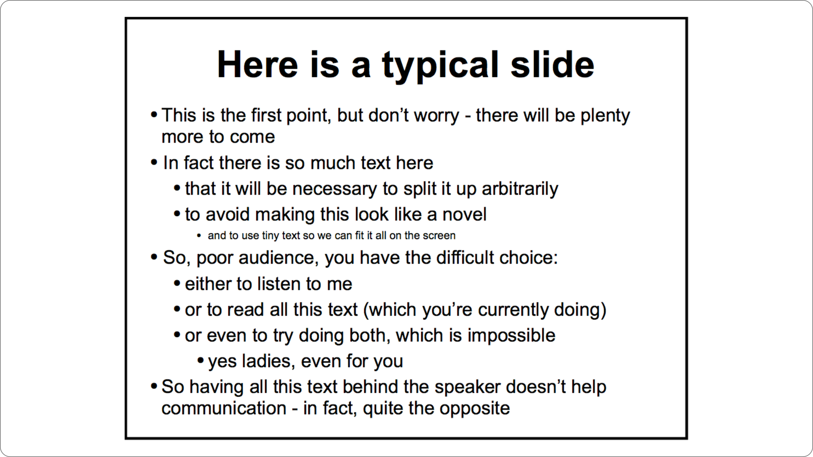

PowerPoint est devenu tellement utilisé qu'il est devenu synonyme de présentation en entreprise. Mais notre conception d'une bonne présentation va bien plus loin.

## 1. Les trois piliers d'une bonne présentation

Une présentation réussie est une présentation qui atteint notre objectif de transformation. L'objectif de transformation est le changement que nous voulons voir se produire dans notre audience.

Pour que ce changement se produise, nous avons besoin de nous appuyer sur un **message** clair et persuasif. Sa communication s'appuie sur trois piliers :

- **l'histoire**
- **les visuels**
- **l'orateur**

L'histoire communique notre message de manière claire et convaincante. Les visuels sont optionnels et servent à clarifier et renforcer l'histoire. L'orateur porte et incarne le message.

Cette formation est dédiée au pilier « visuels ». Nous ne verrons pas comment utiliser PowerPoint ; savoir utiliser ce logiciel est un prérequis, même si le formateur pourra éventuellement vous donner des conseils pour réaliser certaines diapositives.

Mais avant de découvrir les bons principes de communication, nous allons redéfinir la notion même de présentation PowerPoint.

## 2. À propos d’Ideas on Stage

Ideas on Stage accompagne les dirigeants dans la réalisation de leurs présentations, la création d’événements inspirants et la formation et le coaching de leurs organisations à la prise de parole en public.

Nous avons créé Ideas on Stage en 2010, convaincus que l’art de présenter est un avantage compétitif essentiel. Nous avons proposé un mélange révolutionnaire de storytelling, de design visuel et de coaching à la prise de parole. Notre intuition était correcte : nos clients ont pris conscience de la valeur des présentations à fort impact, sont devenus fidèles et nous ont recommandés à leurs amis.

Aujourd’hui, les experts en communication d’Ideas on Stage vous proposent un éventail complet de services en présentation dans le monde en anglais, français, espagnol, italien et allemand.

## 3. Pourquoi parle-t-on de diapositives ?

Il y a bien longtemps, PowerPoint n'existait pas. Les ordinateurs étaient des objets rares, réservés à certains employés.

Pour les évènements importants, les entreprises avaient l'habitude d'utiliser des diapositives pour illustrer les discours. Ces diapositives devaient être confectionnées une à une, montées dans un chariot avant d'être projetées. 

La technologie a été abandonnée depuis longtemps, mais le terme le terme « diapositive » a été repris par PowerPoint et est resté dans le langage courant (slide en anglais).

Au début, la méthode classique de présentation consistait à imprimer la présentation PowerPoint sur des feuilles transparentes, qui étaient alors affichées à l'aide d'un rétroprojecteur.

Au fil du temps, les projecteurs et les écrans se sont généralisés dans les salles de réunion, et de nos jours les méthodes les plus courantes consistent à utiliser un câble HDMI ou ClicShare pour projeter sa présentation.

## 4. Présentation PowerPoint ou DocuPoint ?

> Exercice : comparez ces deux types de diapositives. Commentez sur les avantages et inconvénients.

Il existe non pas un type de présentation PowerPoint, mais plusieurs :

- **La présentation document** : cette présentation est destinée à être communiquée par email ou sous forme de pdf. Elle n'est pas présentée par un orateur, elle est lue par son audience. Elle doit donc se suffire à elle-même. On parle de présentation « auto-porteuse ».
- **La présentation visuelle** : cette présentation est destinée à être utilisée comme support par un orateur, face à un auditoire. L'orateur va raconter l'histoire oralement, les visuels n'ont donc besoin de comporter que les éléments complémentaires, qui vont clarifier ou renforcer l'histoire.
- **le DocuPoint** : c'est une présentation à mi-chemin entre la présentation document et la présentation visuelle. Malheureusement, au lieu de combiner le meilleur des deux mondes, ce type de présentation rassemble souvent le pire. Elle a trop d'informations pour renforcer ou clarifier le discours, et elle en a trop peu pour être auto-porteuse.

Voici un exemple typique de DocuPoint :

La question à se poser, avant même d'ouvrir son ordinateur et de lancer PowerPoint, est donc « à quoi va servir ma présentation ? » Est-ce que je vais l'envoyer par email ? Est-ce que je vais la présenter face à un auditoire ?

Nous avons vu qu'il y avait trois piliers. Avant de créer une présentation PowerPoint, encore faut-il savoir quoi raconter, pourquoi et comment. C'est le rôle de l'histoire. Cette formation n'est pas une formation de storytelling, mais nous allons prendre un peu de temps pour en voir la base.
