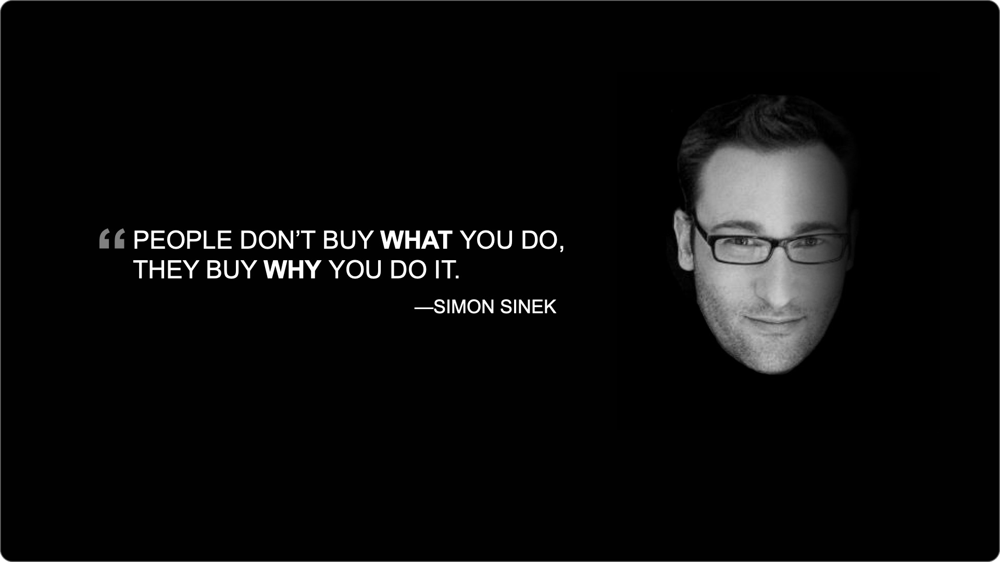

## 1. Diapositives de contenu

Les diapositives de contenu présentent les éléments nécessaires pour raconter l'histoire de manière impactante.

Les éléments typiques de contenu que l'on retrouve sur les diapositives de contenu sont :

- Titre
- Texte de contenu
- Graphiques
- Tableaux
- Schémas et pictogrammes
- Photos
- Vidéos

Pour chacun de ces éléments, la règle de base est : **un et un seul élément de contenu de chaque type par diapositive**. Par exemple, on ne mettra qu'un seul graphique par diapositive, une seule photo ou une seule vidéo. Cette règle est souple, mais nous déconseillons par exemple de créer des diapositives avec quatre graphiques, sauf si chacun de ces graphiques correspond parfaitement au fil narratif. En général, il vaut mieux soit :

- retirer les graphiques qui ne sont pas indispensables au fil narratif ou
- découper la diapositive en plusieurs diapositives avec chacune un graphique et un message clé fort.

### 1.1. Titre

Il existe plusieurs façons d'utiliser le titre :

- Un mot clé descriptif, par exemple introduction, contexte, tarif, etc.
- Un message clé, par exemple « Notre objectif est de doubler notre chiffre d'affaires en 5 ans. »
- Une question rhétorique, par exemple « Quel est le goulet d'étranglement qui limite notre croissance ? » ou « Comment notre solution peut-elle vous aider à réduire vos coûts de 20% ? »
- Il est également possible de ne pas avoir de titre du tout.

Le tableau suivant reprend les avantages et les inconvénients des différents types de titres.

| Type de titre       | Avantages                                                                      | Inconvénients                                                                                                       | Astuce                                                                                                                                                                              |
| ------------------- | ------------------------------------------------------------------------------ | ------------------------------------------------------------------------------------------------------------------- | ----------------------------------------------------------------------------------------------------------------------------------------------------------------------------------- |
| Mot clé             | Clair et succint, ne prend pas beaucoup de place                               | Ne véhicule aucune intention, aucun véritable message                                                               | Réserver les mots clés aux présentations suivant une structure bien connue. Ne pas mélanger titres « mot clé » et titres « messages clé »                                           |
| Message clé         | Renforce le fil conducteur et établit clairement l'intention de la diapositive | Peut prendre de la place et ne pas convenir à un style plus épuré                                                   | Préférer un message clé aux mots clés lorsque c'est possible. L'enchaînement des messages clés doit former une mini-histoire reprenant l'essentiel des messages de la présentation. |
| Question rhétorique | Une bonne question rhétorique attise la curiosité de l'audience                | Il n'est pas toujours possible d'utiliser une question rhétorique                                                   | Il est possible d'alterner message clé et question rhétorique                                                                                                                       |
| Pas de titre        | Laisse toute la place au visuel                                                | Incompréhensible sans narration par un présentateur. Ne peut donc pas être utilisé pour un document « autoporteur » | Réserver les diapositives sans titres aux présentations faites par un présentateur                                                                                                  |

Par défaut, nous vous recommandons plutôt d'utiliser le titre « message clé » lorsque c'est possible.

Nous verrons dans la partie design où placer le titre. Nous verrons également qu'il est possible de l'afficher sous forme d'élément graphique. 

### 1.2. Texte de contenu

Nous distinguons le titre et le texte de contenu. Nous catégorisons le texte de contenu en quatre catégories :

- La liste a puces (bulletpoints) : les points clés sont résumés sous forme de points courts.
- Un court paragraphe de texte.
- Un texte complet qui prend la majorité de l'espace de la diapositive.
- Il est également possible de ne pas avoir de texte du tout. C'est même souvent la meilleure solution lors d'une présentation orale.

Le tableau suivant reprend les avantages et les inconvénients des différents types de texte détaillé.

| Type de texte | Avantages                                                                    | Inconvénients                                                                                                       | Astuce                                                                                                                         |
| ------------- | ---------------------------------------------------------------------------- | ------------------------------------------------------------------------------------------------------------------- | ------------------------------------------------------------------------------------------------------------------------------ |
| Liste à puces | Bien adapté aux listes, succinct.                                            | Le texte peut être difficile à comprendre, car à mi-chemin entre un mot clé et une vraie phrase.                    | Réserver les listes à puce aux vraies « listes » : liste de caractéristiques d'un produit, liste d'avantages, etc.             |
| Paragraphe    | S'il est bien écrit et succinct, il aura plus d'impact que la liste à puces. | Peut être insuffisant pour véhiculer tout le message.  Peut être redondant lors d'une présentation orale.     | Le paragraphe de texte est en général préférable aux listes à puces, surtout lorsqu'il s'agit de communiquer un message clair. |
| Texte complet | Permet de développer complètement l'argumentaire.                            | Aspect rébarbatif, peut être ennuyeux à lire.  Inadapté aux présentations orales.                             | Minimiser ce type de texte aux diapositives où cela est réellement indispensable.                                              |
| Pas de texte  | Laisse toute la place au visuel.  Impact émotionnel fort.              | Incompréhensible sans narration par un présentateur. Ne peut donc pas être utilisé pour un document « autoporteur » | Réserver les diapositives sans texte aux présentations orales.                                                                 |
Par défaut, nous vous recommandons de plutôt choisir le texte de type « paragraphe » qui est un bon équilibre entre longueur et clarté.

### 1.3. Tableaux

Les tableaux sont utilisés pour faire un résumé, comparer différentes solutions, présenter des chiffres, etc.

Notre recommandation générale est d'essayer de limiter le nombre de tableaux dans une présentation. Les chiffres seront souvent mieux présentés sous forme de graphique, et avec un peu d'imagination on peut présenter les autres éléments de manière plus créative.

### 1.4. Graphiques

Les graphiques servent à afficher les chiffres de manière plus visuelle.

- Le camembert (ou sa variante le donut)
- Les barres verticales
- Les barres horizontales
- Les courbes (ou points reliés)

Il existe d'autres types de graphiques, mais ces types sont relativement peu utilisés dans les présentations.

| Type de graphique   | Utilisation principale                                                                                                                                                   | Inconvénients                                                                                                            | Astuce                                                                                                                                      |
| ------------------- | ------------------------------------------------------------------------------------------------------------------------------------------------------------------------ | ------------------------------------------------------------------------------------------------------------------------ | ------------------------------------------------------------------------------------------------------------------------------------------- |
| Camembert ou Donut  | À utiliser pour montrer les proportions entre différentes catégories.                                                                                                    | Les parts peuvent parfois être trop petites pour être correctement affichées.                                            | Lorsque les parts sont vraiment trop petites (par exemple 0,1%) elles peuvent être regroupées dans une catégorie « autres »                 |
| Barres verticales   | Montrer l'évolution d'un chiffre en fonction d'une variable, typiqument le temps. Les barres sont typiquement utilisées pour des chiffres agrégés par an, par mois, etc. | L'échelle peut rendre certains chiffres invisibles. Lorsqu'il y a peu de variations, le graphique peut sembler « plat ». | Nous déconseillons la pratique qui consiste à faire démarrer l'axe Y à un autre endroit que 0. Cela donne une image trompeuse des chiffres. |
| Barres horizontales | Comparer deux ou plusieurs chiffres, par exemple la performance de deux modèles de microprocesseurs.                                                                     | Même inconvénients que les barres verticales.                                                                            | Même recommandation que pour les barres verticales.                                                                                         |
| Courbes             | Pour montrer l'évolution d'un chiffre à partir de mesures ponctuelles (et non agrégées dans le temps comme pour les barres verticales)                                   | Les chiffres peuvent être plus difficiles à distinguer que sur des barres.                                               | Afficher uniquement les chiffres importants.                                                                                                |

De manière générale, essayez d'appliquer les conseils suivants à vos graphiques :

- Ne présenter qu'une seule série de données à la fois.
- Limiter le nombre d'axes à 2 : X et Y (éviter les graphiques en 3D et les graphiques avec un axe secondaire à droite).
- Ne pas avoir trop de points : Un graphique de 10 barres sera facilement lisible, mais un graphique de 50 barres aura l'air « lourd ».

Évidemment, la précision dépendra du type de chiffre présenté et de l'audience. Une étude scientifique ne pourra pas autant simplifier l'affichage des données qu'un bilan financier.

Nous verrons dans la partie style comment simplifier l'aspect visuel des graphiques pour les rendre plus lisibles.

### 1.5. Schémas et pictogrammes

Les **schémas** peuvent grandement renforcer et clarifier le message, à condition d'être compréhensibles. En effet, certains schémas sont tellement détaillés qu'ils renforcent l'impression de complexité au lieu de simplifier la compréhension.

- L'audience est-elle familière avec les éléments présentés ?
- Le principe général du schéma peut-il être compris en quelques secondes ?
- Le schéma peut-il être expliqué en deux minutes maximum ?
- Si non, est-il possible de décomposer le schéma en plusieurs morceaux pour en simplifier la compréhension ?
- Une fois le schéma simplifié, est-on sûr qu'il ne peut pas être encore plus simplifié ?

Les **pictogrammes** sont un moyen simple d'agrémenter un slide et de le rendre plus visuel. Ils peuvent servir, par exemple, à découper une liste à puces en quelques éléments plus digestes.

### 1.6. Photos

Les photos sont un excellent moyen d'augmenter l'impact visuel d'une présentation. Il ne faut pas hésiter à afficher la photo sur toute la surface de la diapositive, en mode « pleine page », pour en maximiser l'impact.

Les photos sont probablement le meilleur moyen de rendre concret certains concepts et certaines descriptions dans la présentation.

Les photos peuvent également être utilisées avec une phrase de style « citation » pour créer une combinaison émotionnelle puissante. C'est une technique très utilisée dans la publicité.

### 1.7. Vidéos

Les vidéos peuvent également être utilisées dans PowerPoint. Si possible, couvrir tout le slide avec la vidéo.

### 1.8. Autres éléments

- **Le sous-titre** : peut être utile, par exemple pour afficher la section dans laquelle on se trouve. Lorsque c'est possible, nous recommandons d'utiliser seulement un titre.
- **Le fil d'ariane** : utilisé pour savoir à quel endroit on se trouve dans la présentation. À réserver aux présentations très longues. Si une présentation de 20 minutes a besoin d'un fil d'ariane, c'est qu'elle n'est pas suffisamment claire et structurée.
- **Le « takeaway »** : il est possible, en « conclusion » de la diapositive, d'afficher en bas de la diapositive un résumé des messages clés de celle-ci. Cependant, lorsque c'est possible, nous recommandons plutôt d'utiliser un titre message clé. Cela simplifie la lecture de la présentation.
- **Le pied de page** : avec typiquement le numéro de page, la date, un texte générique (souvent le copyright ou le titre de la présentation). À réserver aux présentations « document ».
- **Le logo** : à éviter si possible. Il est possible de n'afficher le logo que sur la couverture et les diapositives de section.
- **Les décorations** : à minimiser.

