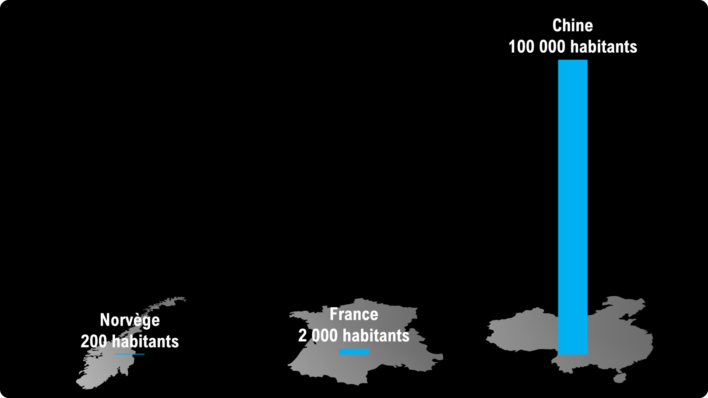
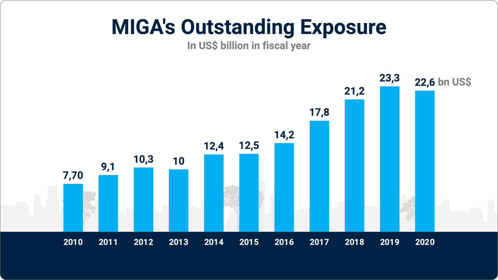

## 1. Styles de diapositives

Maintenant que nous avons passé en revue les principaux types de contenus utilisés dans les diapositives, nous allons voir comment ils peuvent être combinés en fonction de l'objectif poursuivi.

Pour respecter la méthode pSCORE (Simple, Clair, Original, Relié, Entraînant), vous pouvez suivre les principes de base présentés dans le tableau ci-dessous.

| Conseil                      | Règle                                                                                                         | Astuces                                                                                                                                                                                                          |
| ---------------------------- | ------------------------------------------------------------------------------------------------------------- | ---------------------------------------------------------------------------------------------------------------------------------------------------------------------------------------------------------------- |
| Nombre d'éléments de contenu | Essayer de limiter à 3 le nombre d'éléments de contenus différents, par exemple titre, paragraphe, graphique. | Si la diapositive contient trop d'éléments de contenu différents, il faut se poser la question si il ne vaudrait pas mieux (a) supprimer certains de ces éléments ou (b) les séparer sur plusieurs diapositives. |
| Ordre                        | Toujours commencer par le titre, puis présenter les éléments dans l'ordre du fil narratif.                    | Il y a trois zones importantes : le dessus, où on place généralement le titre, le milieu avec le contenu principal, et le bas avec éventuellement le « message de fin » de la diapositive.                       |
| Éléments décoratifs          | Éviter les éléments décoratifs inutiles.                                                                      | Il est inutile d'inclure le logo de l'entreprise, le numéro de page, etc. sur toutes les diapositives.                                                                                                           |

### 1.1. Titre et texte

C'est le type de diapositive le plus courant. En plus du titre et du texte, il y a souvent un troisième élément sur la diapositive, par exemple une photo ou un graphique.

Une diapositive contenant uniquement titre et texte sera peu agréable à l'œil et ne donnera pas envie à l'audience de la lire, car il manque le E (Entraînant) de pSCORE.

C'est pourquoi nous recommandons plutôt d'utiliser un des autres types de diapositives décrites ci-dessous.

### 1.2. Diapositive avec graphique

Avant de créer ou d'utiliser un graphique, posez-vous plutôt la question « quel est le message que je souhaite communiquer avec ce graphique ? » :

- « Chiffre d'affaires » n'est pas un message, c'est un mot-clé.
- « Le chiffre d'affaires a doublé en 5 ans » est un message. Dans ce cas, le graphique doit au moins reprendre le chiffre d'affaires d'il y a 5 ans et le chiffre d'affaires de l'année écoulée.

> Exercice : comment rendre cette diapositive auto-porteuse ?

| Conseil                        | Règle                                                                              | Astuces                                                                                                         |
| ------------------------------ | ---------------------------------------------------------------------------------- | --------------------------------------------------------------------------------------------------------------- |
| 2 séries maximum par graphique | Ne pas afficher plus de 2 séries de données maximum par graphique.                 | Utiliser une animation pour simplifier la compréhension des graphiques complexes.                               |
| 1 série c'est mieux            | Si c'est possible, n'afficher qu'une seule série de données sur un même graphique. |                                                                                                                 |
| 2D                             | Ne pas utiliser les graphiques 3D                                                  | Il est possible de changer le type de graphique sans devoir tout refaire.                                       |
| Simplifier                     | Retirer les éléments inutiles du graphique.                                        | Il est possible de sélectionner les éléments du graphique dans PowerPoint et de les supprimer individuellement. |

Problèmes courants et leurs solutions :

| Problème                 | Description                                                                                      | Solution                                                                                                                                                                                                                                               |
| ------------------------ | ------------------------------------------------------------------------------------------------ | ------------------------------------------------------------------------------------------------------------------------------------------------------------------------------------------------------------------------------------------------------ |
| Double titre             | Le titre est dupliqué : il y a un titre pour la diapositive et un titre pour le graphique        | Choisir le titre à garder et supprimer l'autre. En général, nous préférons garder le titre de la diapositive pour conserver une cohérence entre les diapositives.                                                                                      |
| Légende                  | La légende du graphique est placée en bas, en tout petit.                                        | Mentionner la donnée affichée directement dans le titre. Par exemple « chiffre d'affaires en € » ou « ventes annuelles du produit X en € ».  Pour les camemberts, afficher directement les catégories sur les parts plutôt que dans une légende. |
| Message                  | Il n'y a pas de message clé à retenir du graphique.                                              | Utiliser un titre message qui reprend également la légende (voir ci-dessus) : « Le chiffre d'affaires a progressé de 15% en moyenne sur les 3 dernières années ».                                                                                      |
| Lien message - graphique | Le lien entre message et graphique n'est pas clair                                               | Mettre en valeur l'élément du graphique qui supporte le message. Par exemple, ne pas hésiter à ajouter un élément mettant en valeur le doublement du chiffre d'affaires ou son évolution en %.                                                         |
| Axe Y                    | Il est difficile de lire la valeur des données car il faut constamment se référer à l'axe des Y. | Afficher les valeurs directement sur les barres, les points ou les parts de camembert. Si c'est possible, supprimer l'axe Y.                                                                                                                           |
| Lignes d'axe Y           | Les lignes horizontales servant de point de repère pour l'axe des Y alourdissent le graphique.   | Supprimer.                                                                                                                                                                                                                                             |
| Trop de données          | Il y a trop de données pour pouvoir afficher clairement les chiffres.                            | Agréger les données sur l'axe X, par exemple utiliser « par an » plutôt que « par mois » ou utiliser une catégorie « autres » plutôt que d'avoir 5 parts de camembert minuscules.                                                                      |

> Exercice : comment pourrait-on améliorer la diapositive suivante ?

### 1.3. Diapositive avec schéma

Tout comme les graphiques, les schémas sont souvent trop complexes.

Il suffit en général d'afficher une donnée et un élément clé pour que le schéma soit suffisant. Apple est maître dans l'utilisation de schémas simples (parfois trop simples).

### 1.4. Photo + titre

L'utilisation de photos est un excellent moyen pour apporter une touche concrète à votre présentation. Il existe de nombreuses banques d'images, mais c'est encore mieux si ces photos sont personnelles. Par exemple, afficher une photo d'une banque d'image pour symboliser la cohésion, c'est bien, mais afficher une vraie photo de votre équipe en train de faire une activité de team building, c'est bien mieux.

| Problème                                        | Description                                                                                                                           | Solution                                                                                                                                                                                                                  |
| ----------------------------------------------- | ------------------------------------------------------------------------------------------------------------------------------------- | ------------------------------------------------------------------------------------------------------------------------------------------------------------------------------------------------------------------------- |
| Taille                                          | La photo est affiché en tout petit sur la diapositive.                                                                                | Agrandir la photo, voire l'utiliser en fond pleine page pour en augmenter l'impact.                                                                                                                                       |
| Résolution                                      | La résolution de la photo est insuffisante pour être affichée en grand sur la diapositive.                                            | Utiliser un outil en ligne d'IA d'augmentation de la résolution. Certains outils peuvent même supprimer certaines imperfections ou améliorer la qualité générale de la photo.                                             |
| Lisibilité du titre ou texte placé sur la photo | Le titre ne ressort pas assez lorsqu'il est placé sur la photo car soit la photo est trop chargée, soit le contraste est insuffisant. | Ajouter un rectangle couvrant la photo avec soit (a) un dégradé semi-transparent, soit une couleur unie semi-transparente pour augmenter le contraste. Placez le texte au-dessus de ce rectangle pour le faire ressortir. |

## 2. Design

Le design des diapositives, c'est comme les enfants : on croit toujours que ce sont les nôtres les plus beaux.

### 2.1. Police de caractères

Pour schématiser, il existe deux grandes familles de polices de caractères :

- **À empattements** (serif en anglais) : elles ont des petits « pieds » et fioritures aux extrémités des lettres. Ces polices sont bien adaptées au texte écrit, mais sont moins lisibles sur une diapositive affichée sur écran. 
- **Sans empattements** (sans-serif en anglais) : elles conviennent moins aux longs textes, mais sont plus faciles à lire sur un écran (cette remarque étant un peu moins vraie depuis l'apparition des écrans haute résolution).

Par défaut, nous vous recommandons d'utiliser des polices sans empattements dans vos présentations.

### 2.2. Couleurs

Votre entreprise possède probablement une charte graphique à respecter. Dans ce cas, le plus simple est d'utiliser les couleurs de celle-ci.

Voici quelques catégories de couleurs utiles pour créer des présentations :

- **Le noir et le blanc** devraient toujours être inclus dans les couleurs de base d'une présentation.
- **Couleur d'aplat** : pour couvrir de grandes surfaces, par exemple un rectangle derrière le texte. On peut avoir 2 couleurs d'aplat : une claire et une foncée. Le gris, les tons bleus, le jaune très pâle sont des couleurs d'aplat fréquemment utilisées.
- **Couleur de mise en valeur** : pour mettre en valeur les éléments importants. On préférera une couleur vive, qui se distingue des couleurs d'aplat mais sans connotation négative. On peut également avoir 3 couleurs de mise en valeur : positive (par exemple vert ou bleu), intermédiaire (par exemple orange) et négative (par exemple rouge).

Les couleurs ont-elles une signification particulière ? Par exemple, le rouge a-t-il une signification systématiquement négative ou de danger ? Pas nécessairement, cela dépend du contexte et de la culture. Pour une entreprise financière, l'utilisation du rouge peut être compliquée (mais pas impossible, voir le logo de la Société Générale) alors que pour une entreprise de sport elle peut symboliser l'audace et la victoire (par exemple Ferrari).

Il existe cependant des grandes tendances. En entreprise, la couleur la plus utilisées est le bleu, car c'est une couleur appréciée, plutôt neutre en termes de signification. Si nous utilisons une combinaison vert - orange - rouge, ces couleurs seront probablement interprétée comme bien - attention - mauvais.

## 3. Mise en pratique finale

Il est maintenant temps de préparer votre présentation finale.

Créez une présentation de maximum 7 diapositives et présentez-là devant les autres participants.

## 4. Checklist finale : votre présentation est-elle pSCORE ?

- Simple : peut-on encore simplifier le contenu sans perdre de sens ?
- Clair : peut-on encore clarifier certains éléments ?
- Original : y a-t-il des surprises ? Suscite-t-elle la curiosité et l'intérêt de l'audience ?
- Relié : le contenu est-il adapté à l'audience ?
- Entraînant : la présentation donne-t-elle envie ?

## 5. Conclusion

- Récapitulatif des points clés
- Questionnaire de satisfaction

## 6. Ressources supplémentaires

Voici une liste de ressources pour compléter votre formation :

- [Web : le guide ultime de la prise de parole](https://www.ideasonstage.com/ultimate-public-speaking-guide/)
- [Web : le guide ultime du TEDx Speaker](https://www.ideasonstage.com/tedx-speaker-guide/)
- [Web : Présentation Zen, le blog de Garr Reynolds](https://www.presentationzen.com)
- [Livre : Ces idées qui collent, Dan et Chip Heath](https://www.amazon.com/Made-Stick-Ideas-Survive-Others/dp/1400064287/ref=sr_1_1?crid=QLFKSSGZD3D1&keywords=made+to+stick&qid=1672826815&sprefix=made+to+stick%2Caps%2C159&sr=8-1)
- [Livre: Jerry Weissman's Presenting to Win, anglais](https://www.amazon.fr/Presenting-Win-Telling-Updated-Expanded/dp/0137144172?__mk_fr_FR=ÅMÅŽÕÑ&crid=1COI010TLR193&keywords=jerry+weissman&qid=1678119781&sprefix=jerry+weissman%2Caps%2C90&sr=8-3)
- [Livre : Business Presentation Revolution Book, Phil Waknell](https://www.amazon.com/Business-Presentation-Revolution-Inspire-Action/dp/1781336091/ref=sr_1_1?crid=32Z7VQISN3G25&keywords=business+presentation+revolution&qid=1672817543&sprefix=business+presentation+revolution%2Caps%2C135&sr=8-1)

## 7. Révisions

- 2025-07-11 Refonte de la partie publication web/pdf
- 2024-04-04 Adaptation à la mise en ligne
- 2024-02-21 Deuxième version significativement enrichie
- 2023-03-07 Première version française
