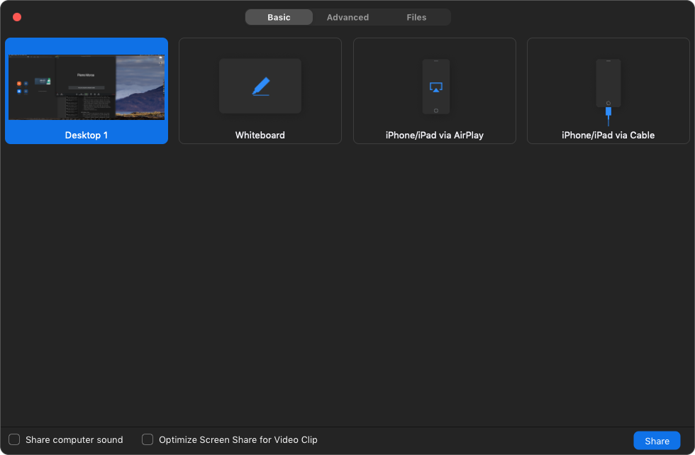

## Une bonne configuration de base pour les présentations à distance

Une bonne configuration va rendre l’expérience de présentation à distance beaucoup plus agréable pour votre auditoire. Obtenir le meilleur équipement possible coûte des milliers de dollars/euros, mais nous pensons que c’est exagéré pour la plupart des situations. Il y a trois éléments clés auxquels vous devez faire attention : la facilité d’accès, la fiabilité de la conférence et un son clair. De plus, avoir une bonne qualité vidéo va sembler plus professionnel, mais vous n’avez certainement pas besoin d’une caméra haut de gamme pour obtenir de bons résultats. Voici une configuration qui fonctionne sur Mac et PC Windows et qui devrait offrir une bonne expérience à vos participants :

- Une connexion par câble ou fibre (probablement la chose la plus difficile à obtenir si vous n’habitez pas dans la bonne zone), avec une vitesse de téléchargement d’au moins 5 Mb/s.
- Zoom comme logiciel de visioconférence.
- De bons écouteurs et micros. Les Airpod d’Apple fonctionnent bien et ont de bons microphones, une faiblesse courante des autres écouteurs Bluetooth.
- Une webcam Logitech c920s.

## Le niveau supérieur : créer un environnement semi-professionnel pour les présentations à distance

Voulez-vous vraiment briller et donner la meilleure impression lors de votre visioconférence ? Il est temps de passer d’investir ! Chaque élément de la liste suivante améliorera la qualité globale de votre présentation à distance.

- Une connexion par fibre optique est l’option la plus fiable pour fournir une vidéo de haute qualité sur Internet. En effet, lorsque nous parlons de vitesse de ligne de visioconférence, ce n’est qu’un facteur. Les autres sont la latence et les instabilités. À cet égard, les connexions par fibre optique offrent une latence plus faible (plus la valeur est faible, mieux c’est) et une bonne stabilité.
- Zoom reste notre logiciel de choix.
- Un casque de studio. Les Sony MDR-7506 sont des écouteurs robustes et éprouvés, utilisés dans de nombreux studios professionnels. Si vous préférez un look plus discret, j’aime les intra-auriculaires Shure SE215.
- Un microphone à condensateur à large diaphragme. L’USB Blue Yeti est un bon choix et pas trop cher. Sachez cependant que ces microphones captent le moindre bruit et nécessitent une pièce calme.
- Une webcam Logitech Brio. Bien que les couleurs par défaut ne soient pas meilleures que celles de la c920, avec un étalonnage approprié, la Brio peut fournir une meilleure image. J’ai également choisi cette webcam car le champ de vision peut être rétréci ou élargi, me donnant plus d’options. Mais la c920, beaucoup moins chère, est souvent un meilleur choix car elle offre une bonne qualité dès la sortie de l’emballage et est plus facile à utiliser.
- Un éclairage supplémentaire, tel qu’un anneau lumineux LED. Cela améliorera l’éclairage de votre vidéo. Ils peuvent être trouvés pour quelques dizaines d’euros sur un certain marché en ligne nommé d’après des guerrières mythiques.
- Un fond neutre pour cacher l’éventuel désordre de votre bureau.

Le niveau encore au-dessus consiste à obtenir une console de mixage numérique et l’équipement approprié pour s’y connecter, à insonoriser votre pièce, à ajouter un éclairage professionnel et utiliser un reflex numérique pour capturer la vidéo. Mais c’est vraiment exagéré pour 99 % des cas d’utilisation, et si vous n’êtes pas à l’aise pour utiliser un tel équipement pendant une présentation en direct, cela peut aggraver les choses.

## Fournissez un accès facile à votre vidéoconférence

Ne pas pouvoir accéder à la vidéoconférence en raison de problèmes techniques est la principale raison pour laquelle les gens n’aiment pas les vidéoconférences. Rien de plus frustrant que d’être bloqué à la porte à cause d’un problème technique. Bien qu’elle ne soit pas infaillible, Zoom est la solution avec laquelle nous avons eu le plus de succès et, selon notre expérience, le taux d’échec de connexion est inférieur à celui de Skype. Pourquoi ? Parce qu’il est facile à utiliser et guide l’utilisateur à chaque étape. Un simple clic sur un lien donne un accès direct à la salle de réunion, et si le logiciel n’est pas installé, il vous propose de le télécharger et de l’installer (avec votre accord).

> **Conseil de pro :** demandez à vos participants de tester leur audio et vidéo avant la réunion. L’audio et la vidéo qui ne fonctionnent pas sont la principale raison pour laquelle la plupart des vidéoconférences ne démarrent pas à l’heure. Pour ce faire, dans Zoom, accédez à l’icône du microphone en bas à gauche, cliquez sur la flèche vers le haut à côté de celui-ci et sélectionnez « tester le haut-parleur et le microphone ».

## Accueillir vos participants

Si les gens se connaissent, vous pouvez vous mettre rapidement au travail. Sinon, assurez-vous que les gens sont prêts à démarrer et n’interrompent pas la session. Il n’y a rien de plus ennuyeux pour les participants que de devoir refaire l’introduction plusieurs fois à cause de participants tardifs ou de personnes interrompues en raison d’un problème technique.

## Utilisation de PowerPoint pour des présentations à distance

Tout logiciel de présentation peut être utilisé. Nous utilisons PowerPoint car il reste la norme de l’industrie.

Commencez par partager votre écran avec Zoom. L’option la plus simple consiste à partager simplement tout l’écran. Pour ce faire, cliquez sur le bouton « Partager l’écran » en bas de la fenêtre Zoom, puis sélectionnez « Bureau 1 » ou quel que soit le nom de la vue d’écran entière.

Ensuite, démarrez le diaporama dans PowerPoint, afin que les participants puissent voir vos diapositives en plein écran (vous devrez peut-être cliquer à nouveau sur votre présentation pour mettre l’accent sur PowerPoint). Si vous souhaitez utiliser le mode présentateur de PowerPoint et voir vos notes, vous aurez besoin de deux écrans, par exemple un ordinateur portable connecté à un moniteur externe ou à un téléviseur.

Vous pouvez alors commencer à faire vos présentations dans les meilleures conditions possible. Utilisez les flèches gauche et droite pour passer d’une diapositive à l’autre.

## Mettre un élément en surbrillance sur votre diapositive

Avec Zoom et PowerPoint, vous n’avez pas une, mais deux options pour faire des annotations en direct sur vos diapositives.

Depuis PowerPoint : déplacez la souris dans le coin inférieur gauche. Une série d’icônes apparaîtra. Cliquez sur l’icône du stylo pour afficher un menu contextuel avec diverses options pour mettre en évidence des parties spécifiques de votre diapositive.

Depuis Zoom : dans la palette flottante d’outils de Zoom, cliquez sur l’icône du stylet « Annoter ». Une deuxième palette flottante, la palette d’annotations, apparaîtra juste au-dessous de la palette principale, vous offrant des options pour annoter une partie de l’écran.

Devez-vous utiliser les outils d’annotation PowerPoint ou Zoom ? Voici les principales différences entre les deux :

- Les annotations PowerPoint seront automatiquement effacées lorsque vous passez d’une diapositive à l’autre. Les annotations de Zoom resteront sur l’écran partagé jusqu’à ce que vous décidiez de les effacer en cliquant sur l’icône de la corbeille dans la palette d’annotations.
- Les annotations PowerPoint sont plus faciles à utiliser pour le présentateur, car il n’est pas nécessaire de basculer constamment entre Zoom et PowerPoint.
- Les annotations de Zoom peuvent être effectuées par tous les participants (cliquez sur le bouton Plus dans la palette flottante Zoom pour plus d’options telles que masquer les annotations des participants ou afficher les noms des participants à côté des annotations).

## Comment être un bon présentateur à distance

Si les présentations lors de réunions en face à face peuvent être ennuyeuses, les mauvaises présentations à distance peuvent être incroyablement ennuyeuses. Parce que nous n’avons pas de communication directe avec l’auditoire, parce que nous manquons de présence physique, parce que notre cerveau doit traiter la charge de travail supplémentaire relative à l’utilisation correcte du logiciel de vidéoconférence, il est facile d’avoir l’air d’un robot lisant un tas de diapositives. Voici nos conseils pour continuer à créer du lien dans un environnement à distance :

La chose la plus importante est de garder un ton de voix naturel et énergique. Garder un ton conversationnel, votre ton, est la clé pour offrir une présentation agréable et engageante en ligne.

> **Conseil de pro :** ma configuration me permet d’écouter ma propre voix lors de la présentation. Le son de mon microphone est réinjecté dans mon casque. Beaucoup de gens détestent entendre leur propre voix, mais vous écouter est le seul moyen d’être sûr de la façon dont vous parlez.

Il est plus difficile de détecter des indices de langage corporel dans une conférence virtuelle, comme le besoin d’une pause pour les participants ou s’ils souhaitent que vous ralentissiez. Pour éviter de les perdre, ne parlez pas trop longtemps sans interruption. Intégrez des échanges fréquents entre les participants.

N’oubliez pas de vous mettre à la place du participant. Ajoutez de la variété pour éviter la monotonie. Divisez la présentation en sections plus petites. Variez le rythme et le style de chaque section. Ce que le participant verra, c’est une vidéo, proche de ce qu’il verrait à la télévision ou sur YouTube, avec votre narration par dessus. Vous ne voyez jamais de diapositives remplies de puces sur l’un ou l’autre de ces médias pour une bonne raison : c’est inefficace et ennuyeux. Concevez votre présentation pour qu’elle ressemble à une bonne vidéo avec votre narration par-dessus. La télévision évite les petits textes car ils peuvent être difficiles à lire sur les petits écrans ; nous ne recommandons pas d’assister à un webinaire à partir d’un smartphone en raison de la petite taille de l’écran, mais gardez à l’esprit que certaines tablettes peuvent avoir des écrans aussi petits que 7 pouces, il est donc préférable d’utiliser une grande police pour le texte.

> Nous pouvons former vos employés à donner de superbes présentations à distance, et nous pouvons le faire… à distance ! Nous pouvons également vous aider à mettre en place des webinaires pour communiquer votre message à tous vos employés dans plusieurs pays.

## Voir la vidéoconférence en différé

L’un des avantages de Zoom est que vous pouvez enregistrer votre session. Après avoir terminé celle-ci, vous pouvez simplement envoyer un lien aux personnes absentes pour qu’elles puissent regarder votre présentation. C’est un excellent moyen d’augmenter l’impact sur votre organisation sans avoir à refaire la présentation plusieurs fois.

> Si vous voulez une version modifiée de votre présentation à distance, avec une introduction et une conclusion, en supprimant les pauses et les hésitations inutiles et en mettant en évidence les messages clés, nous pouvons le faire pour vous.

