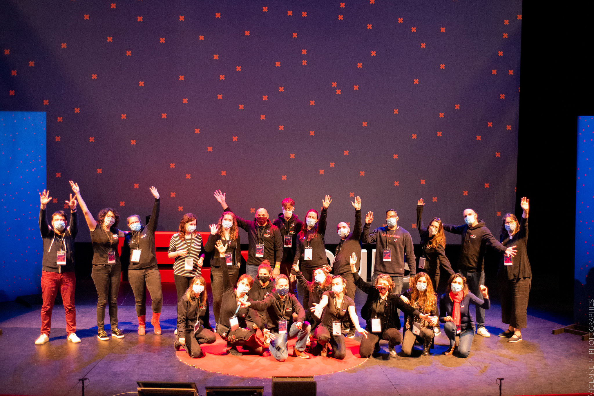

+++
draft = false
title = "Comment organiser un événement TEDx ? Guide complet"
description = "Tout pour organiser un événement TEDx réussi, par l'équipe qui a accompagné des dizaines d'événements TEDx, en France, aux États-Unis et en Angleterre."
categories = [ "Prise de parole en public", "TEDx" ]
url = "/comment-organiser-un-evenement-tedx/"
picture = "tedx-saclay-03.jpg"
summary = "Ce guide vous donnera tous les conseils nécessaires pour organiser votre événement TEDx, que ce soit en tant que bénévole ou pour votre entreprise. Si vous êtes déjà expérimenté, nous espérons que vous y découvrirez des conseils utiles."
+++

## Qu’est-ce qu’un événement TEDx ?

> Ideas on Stage est une entreprise indépendante de TED et TEDx. Cette page nous permet de partager l'expérience accumulée.

Les événements TEDx ont révolutionné le monde des conférences par la qualité et le style des présentations réalisées sur scène. Un événement TEDx est général organisé sur une demi-journée ou une soirée, pendant laquelle plusieurs intervenants se succèdent sur scène selon un programme ou un thème prédéfini.

Des événements TEDx ont lieu partout dans le monde, depuis 2009, de manière indépendante pour toucher toutes les communautés. Chaque conférence TEDx est rattachée à l’organisation nord-américaine TED, qui se consacre à la diffusion « d’idées qui valent la peine d’être partagées », comme son slogan l’indique.

Ce qui fait la particularité des conférences TEDx, c’est le style des interventions. Courtes (maximum 18 minutes), très bien préparées, elles sont bien plus intéressantes que les conférences habituelles. L’approche et la façon dont les idées sont présentées et partagées avec le public font toute la différence.

Beaucoup se demandent pourquoi un format court de 18 minutes. La réponse ? Chris Anderson, curateur de TED, affirme que 18 minutes « sont suffisamment longues pour être sérieuses et suffisamment courtes pour retenir l’attention des gens ». Il ajoute : « En obligeant les orateurs qui ont l’habitude de parler pendant 45 minutes à réduire leur temps d’intervention à 18 minutes, vous les amenez à vraiment réfléchir à ce qu’ils veulent dire. Cela a un effet de clarification. Cela apporte de la discipline ». Notre expérience personnelle montre même que les interventions encore plus courtes, entre 12 à 15 minutes, sont encore plus efficaces.

À l’origine, l’acronyme TED voulait dire « Technologie, Entertainment, Design », mais au fil du temps les sujets sont devenus beaucoup plus variés : arts, science, philosophie, etc. La multidisciplinarité est un maître mot des conférences TED et TEDx : quel que soit le sujet, il est essentiel de mettre en lumière les idées qui peuvent changer le monde.

L’esprit de TEDx, c’est de partager des idées passionnantes avec l’auditoire, pas de promouvoir un agenda politique, religieux ou commercial. Un événement TEDx doit respecter une série de règles précises. En voici quelques-unes :

- Les présentations doivent être variées, que ce soit vis-à-vis des sujets, des intervenants ou du style. Il ne faut pas que l’événement soit concentré sur un seul sujet.
- La vidéo d’introduction officielle TEDx doit être diffusée au début de la conférence, et doit permettre au public de bien comprendre ce qu’est un TEDx et la différence avec TED.
- Chaque présentation doit être de 18 minutes maximum, et réalisée par un seul intervenant. 5, 10, 15 minutes… l’important c’est d’être percutant !
- Il n’y a pas de séance de questions-réponses ni d’intervention du public.
- Il peut y avoir des ateliers, des temps forts ou des séances de travail annexes aux conférences, mais ils doivent avoir lieu dans un espace autre que celui où les intervenants se produisent.
- L’événement peut accueillir jusqu’à 100 personnes pour une licence TEDx standard, ou plus si l’organisateur a participé à un événement TED reconnu (et peut donc demander une licence supérieure pour un public plus nombreux).
- La durée de l’événement est en général d’une journée maximum.
- L’événement peut être retransmis en direct dans d’autres lieux sous certaines conditions.
- Un webcast en direct de l’événement doit être gratuit et ne peut pas être diffusé à la télévision, à la radio…

Nous allons maintenant vous guider pas à pas dans les étapes nécessaires pour organiser votre propre événement TEDx.

> Vous souhaitez organiser un événement dans votre entreprise ? Consultez notre [guide pratique de l'organisateur d'événements](https://www.ideasonstage.fr/guide-organisateur-evenement-entreprise/).

## 1. Faire la demande de licence TEDx

### 1.1. Créer une association pour votre TEDx

Un événement TEDx nécessite la levée de fonds, l’ouverture d’un compte en banque et la gestion d’un budget. Vous pouvez organiser un événement « business » si vous travaillez déjà pour une entreprise, ou un événement « interne » si vous êtes une entité gouvernementale. Cependant ces événements ne pourront pas accueillir de public externe. C’est pourquoi nous vous conseillons de toujours créer une association loi de 1901 pour la gestion de votre événement TEDx. De toute façon, TED interdit explicitement que les événements TEDx soient à but lucratif.

### 1.2. Trouver un thème (non obligatoire)

En inscrivant une thématique à votre événement TEDx, vous donnez le ton et une direction à l’ensemble de votre événement. Cela permet essentiellement à votre public de savoir ce qu’il doit attendre de cette journée. Cela facilite également l’élaboration de votre programme et la recherche de vos intervenants. Et votre communication sera ainsi plus ciblée.

Comme l’explique l’organisation TED, votre thème doit être abstrait et ouvert à l’interprétation. Il doit être suffisamment large pour laisser place à un large éventail de sujets et d’intervenants. Pensez-le comme un titre ou un slogan pour votre événement.

### 1.3.Choisir le type d’événement que vous voulez organiser

Il existe plusieurs événements TEDx possibles. Voici les plus populaires :

- **Standard** : le plus fréquent, ouvert à tous. Il porte le nom de la ville/du territoire dans lequel il a lieu. TEDxTours ou TEDxSaclay par exemple.
- **Université/École** : un événement organisé par les étudiants.
- **Jeunes** : un événement organisé par les jeunes, et qui donne la parole à de jeunes intervenants.
- **Éducation** : un événement organisé pour le monde de l’éducation.
- **Salon** : un événement plus intime avec des publics plus restreints, pouvant avoir lieu plus fréquemment, qui participe à l’animation régulière de la communauté TEDx locale.
- **Business* *: un événement organisé par une entreprise pour ses employés. Il permet de stimuler l’innovation et de susciter des conversations en interne.
- **Interne** : un événement organisé au sein d’une ONG, d’une entité gouvernementale ou d’une institution de santé. C’est un événement interne, réservé aux employés.

### 1.4. Demander la licence pour chacun de vos événements TEDx

Cette étape est indispensable avant d’organiser un événement TEDx. Elle se découpe en plusieurs parties simples :

- Commencez par sélectionner le type d’événement que vous voulez organiser (voir étape précédente).
- Choisissez ensuite le nom de votre événement. [En savoir plus pour nommer son événement TEDx (en anglais)](https://www.ted.com/participate/organize-a-local-tedx-event/before-you-start/application-tips/naming-your-event).
- Faites votre demande de licence **au moins 6 mois à l’avance**. [Comment faire la demande de licence (en anglais)](https://www.ted.com/participate/organize-a-local-tedx-event/apply-for-a-tedx-license/tedx-license-agreement).
- Définissez un premier programme pour votre événement, incomplet, mais qui vous servira de premier point de repère.

L’accord de licence prend en général 8 semaines. 

> Vérifiez bien que l’organisation TED vous a accordé la licence. Certains événements ont été annulés au dernier moment, car ils pensaient l’avoir obtenue, mais TED ne la leur a pas accordée.

## 2. Mettre en place une organisation et des outils internes

### 2.1 Constituer une équipe

Ce que le public voit et retient, ce sont surtout les intervenants. Pourtant, en coulisses, c’est surtout la qualité de l’équipe qui fait la réussite d’un événement TEDx. Voici quelques critères pour savoir sur qui compter :

- Prenez des personnes fiables et qui ont suffisamment de temps à consacrer à la préparation. Évitez les personnes qui promettent, mais ne font jamais.
- Prenez des personnes autonomes et proactives, qui sauront prendre des initiatives. Évitez les personnes qui comptent toujours sur les autres.
- Prenez des personnes qui savent s’adapter au travail en équipe. Évitez les personnalités qui recherchent le conflit.
- Prenez des personnes qui s’impliquent pour l’événement. Évitez les personnes qui le font uniquement pour leur propre intérêt.

Si possible, essayez d’avoir au sein de votre équipe au moins une personne ayant déjà participé à l’organisation d’un autre événement TEDx.

### 2.2 Définir les rôles clés

Il existe plusieurs rôles clés pour l’organisation d’un TEDx, qui peuvent être tenus par des individus ou bien être portés par tout un pôle de personnes. Certaines personnes peuvent assumer plusieurs rôles, mais attention à ce qu’ils ne soient pas trop chronophages.

- **Détenteur de la licence TEDx** : cette licence est indispensable. Pour l’obtenir, il faut participer à un événement TED officiel.
- **Organisateur** : l’organisateur est la personne clé qui va porter l’événement. Souvent cette personne est aussi la détentrice de la licence.
- **Trésorier** : les événements TEDx sont portés par des associations, elles doivent donc faire preuve de rigueur dans la gestion des entrées/sorties d’argent.
- **Coordinateur de projet (ou chef de projet)** : il va être le garant du suivi du planning à tenir en amont de l’événement et le jour J. Il va s’assurer que rien n’a été oublié, jusque dans les moindres détails. Ce rôle est souvent rattaché à un pôle dit « logistique/événementiel » qui coordonne toutes les missions qui vont permettre « d’habiller l’événement » : la signalétique, la gestion de l’accueil du public et des titres d’accès, les goodies, la restauration, la commande de fournitures et de petit matériel, le mobilier…
- **Designer** : pour aider à définir l’identité visuelle de l’événement, du site web à la scénographie.
- **Gestionnaire du site web** : cette personne aura la responsabilité du site de promotion de l’événement, ainsi que de la billetterie en ligne.
- **Responsable partenaires** : un rôle absolument vital ! Cette personne recherche les sponsors qui financeront l’événement et les partenaires qui aideront à l’organiser et à assurer sa réussite.
- **Responsable intervenants (curateur)** : il peut y en avoir un ou plusieurs. Chaque contact sera responsable d’un groupe d’intervenants. Il vaut mieux avoir un curateur principal qui pourra décider de la liste finale des intervenants.
- **Responsable marketing/communication** : qui assurera la promotion et la visibilité de l’événement.
- **Photographes et techniciens audiovisuels** : ils seront indispensables pour capturer les images et les vidéos de votre événement, ainsi que pour orchestrer la régie de la captation et faire le montage vidéo a posteriori.
- **Volontaires** : le jour J, vous aurez besoin d’une équipe de volontaires sur place (montage/démontage des divers espaces au sein du lieu, installation de la signalétique, préparation des sacs contenant les goodies, accueil du public, encadrement des intervenants, etc.)

Parmi l’équipe, il y aura un noyau de quelques personnes qui réalisera 80 % des tâches. C’est un phénomène que nous avons pu remarquer sur tous les événements que nous avons accompagnés. Même lorsque l’équipe organisatrice regroupe plus de 10 personnes, en réalité la majorité des actions sont portées par un noyau de 3 à 6 personnes. Avoir ce groupe de personnes motivées et déterminées est primordial pour la réussite de l’événement.

Certaines tâches sont moins « attractives », mais sont pourtant essentielles pour le succès de l’événement. Il est certain que c’est séduisant et valorisant de visiter les lieux qui pourraient accueillir l’événement ou bien encore d’encadrer les intervenants. Alors que **la recherche des sponsors et le bouclage du budget sont les tâches les plus critiques**.

Si c’est votre premier événement TEDx, nous ne pouvons que vous encourager à vous faire conseiller ou accompagner par quelqu’un ayant déjà organisé un événement que vous avez apprécié.

### 2.3. Coordonner l’événement

La clé d’un événement TEDx réussi réside toujours dans la planification préalable et la coordination des différents acteurs, qu’ils soient internes au projet ou externes. En travaillant en équipe de manière structurée et en planifiant la moindre action selon un calendrier, vous vous assurerez un événement réussi.
Au commencement du projet, il vous faudra créer une liste de tâches et un calendrier avec des échéances précises, à construire en collaboration avec votre équipe.
À chaque étape du projet, vous devrez tout vérifier, afin de vous assurer que tout se déroule comme il se doit.
Prévoir une organisation sur 6 mois minimum, idéalement 1 an.

### 2.4. Organiser la communication au sein de l’équipe

Afin de suivre l’avancement de votre événement, prévoyez des réunions et des contrôles réguliers. Veillez à ce que votre équipe se rencontre — tous ensemble ou par pôle — à intervalles réguliers (par exemple, chaque semaine) pour faire le point sur les actions en cours et discuter des prochaines étapes.
Il existe des outils en ligne qui favorisent cette interaction, qu’elle soit présentielle ou virtuelle, et qui permettent de travailler de manière collaborative.
Un outil tel que Klaxoon par exemple offre la possibilité de se synchroniser rapidement en équipe, jour après jour, grâce à ses outils et ses méthodes faciles à mettre en pratique. Plusieurs templates existent ou bien en partant d’une feuille blanche vous pourrez mettre en place des brainstormings, des présentations, des tableaux de coordination, des timelines, des sondages… Grâce à ce genre de plateformes, chacun participe et le suivi du projet est simplifié, voire ludique.

Entre chaque réunion, assurez-vous que votre équipe ou vos pôles aient tous les éléments pour avancer correctement dans leurs missions et qu’ils soient assidus. La communication doit être constante.

### 2.5 Partager les données sur un répertoire commun

Afin que chaque membre de votre équipe ait accès aux mêmes ressources, utilisez des outils de partage en ligne. Dropbox, Google Drive ou PBWorks peuvent être utiles pour le partage de documents et la gestion de contenu au sein de votre équipe.

## 3. Rechercher des intervenants

Ce sont eux qui sont la raison pour laquelle les gens viendront à votre événement. Il est donc important de construire un programme d’interventions attractif.

- Choisissez des intervenants qui ont quelque chose d’original ou de surprenant à présenter. Évitez d’inviter les personnes qui présentent toujours la même chose ou qui vont aborder des sujets déjà rabâchés.
- Un bon intervenant a un point de vue unique ou nouveau à faire découvrir à l’auditoire.
- Pensez à ce qui plaît dans votre région. Faire découvrir votre culture locale, c’est aussi ce qui fait la richesse d’un événement TEDx.
- Évitez les intervenants polémiques ou qui risquent de ne pas respecter les conditions TEDx.

### 3.1. Comment trouver vos intervenants

Trouver des orateurs extraordinaires n’est pas toujours une tâche facile. Voici quelques conseils à suivre dans votre recherche :

**Privilégiez l’idée plutôt que l’intervenant lui-même**. En fait, ce n’est pas la personne que vous devez rechercher, mais son idée ou son innovation. C’est un excellent moyen de faire la différence entre un intervenant TEDx et un intervenant « classique ». Que retiendra l’auditoire : la personne ou l’idée ? Pour cela, recherchez des idées nouvelles, qui doivent être défendues et/ou qui pourraient changer les perceptions de votre communauté. 

**Faites des recherches au sein de votre tissu local** (entreprises ou organisations caritatives). Vous aurez ainsi peut-être la chance de découvrir d’éventuelles personnalités dont les réalisations représentent vraiment votre région.

**Lisez des publications en lien avec votre thème**. Parcourez différentes ressources scientifiques, des revues d’affaires politiques et des journaux. Regardez les personnes citées et découvrez si elles sont en cohérence avec votre thème et si elles ont une idée intéressante pour votre événement.

**Recherchez dans les réseaux sociaux**. Apprenez à connaître les personnes qui travaillent dans votre région et qui pourraient vous conduire à d’autres personnes ayant des idées qui valent la peine d’être partagées lors de votre événement TEDx.

**Assistez à des événements en lien avec votre thème**. Ces événements vous permettront de rencontrer et d’échanger avec des experts ou des acteurs locaux directement liés à la thématique que vous proposez. Ils partageront avec vous les dernières actualités du sujet qui vous réunit afin de vous inspirer et vous orienter dans votre recherche.  

**Organisez un événement par et pour les partenaires potentiels**. Ce type d’événement vous permettra de réunir vos partenaires actuels et de les fidéliser. Mais il vous permettra aussi de convier des partenaires potentiels.
Il peut s’agir d’une soirée conviviale qui leur est dédiée et qui leur permettra de se rencontrer/se retrouver. Ou bien il peut s’agir d’une journée ou demi-journée pendant laquelle ils sont mis à contribution et doivent collaborer d’une manière ou d’une autre. Par exemple, participer à un brainstorming autour de sujets directement liés au thème de votre événement TEDx.

Le but étant de favoriser des moments d’échanges et de partages avec vos partenaires et de séduire de nouvelles cibles qui pourraient à la fois devenir partenaire à leur tour ou vous ouvrir leur communauté pour y chercher des intervenants potentiels.

**Lancez un appel à candidatures**. En créant un appel à candidatures et en le communiquant largement, vous augmentez vos chances de toucher n’importe quelle catégorie de personnes. Qu’il s’agisse d’un scientifique, d’un passionné par le sujet, d’un artiste, d’un étudiant… vous offrez l’opportunité à tout type de profils de devenir un intervenant sur la scène de votre TEDx.

Pour lancer cet appel, demandez aux candidats de répondre à un formulaire dans lequel ils expliqueront leur idée et parleront d’eux-mêmes, ainsi que de la manière dont leur intervention s’inscrit dans le thème et profitera à l’auditoire. Prévoyez une date limite de candidatures et un jury pour sélectionner les profils à retenir.

**Au final, trouvez un bon équilibre entre :**

- Intervenants expérimentés et novices. Nous conseillons d’avoir au moins 20 % à 30 % d’intervenants connaissant déjà bien le format de présentation TEDx.
- Le style des intervenants. Ne prenez pas que des personnes drôles ou au style philosophique. Le mélange est ce qui fait la richesse d’un événement TEDx.
- Les sujets abordés (voir point suivant).

**N’acceptez que des intervenants qui acceptent de se faire coacher et de réaliser un travail de préparation collaboratif.** N’acceptez aucune exception. Même si votre intervenant est très célèbre, même s’il a l’habitude de faire des présentations, le style TEDx est très particulier et nécessite une préparation spécifique. Pour les personnes à l’étranger, la préparation peut se réaliser en visioconférence.

**Équilibrer le programme**
Certains événements se focalisent uniquement sur des sujets de type « expérience de vie » ou « sujets émotionnels ». Cela ne fonctionne pas très bien, car ce n’est pas assez varié. Voici des sujets que nous vous conseillons d’avoir dans tout événement TEDx :

- Science
- Économie
- Leadership/Organisation et management des entreprises
- Philosophie
- Art
- Musique/Danse

Vous pouvez également aller chercher des sujets sur le design, la communication ou la technologie. Le développement personnel et les expériences de vie sont des sujets à inclure avec prudence, car il y a plus de risques d’abus ou de dérive ; dans le doute, mieux vaut s’abstenir. Certains sont interdits par TEDx :

- La politique ou la religion.
- Les sujets considérés comme pseudoscientifiques : naturopathie, homéopathie, astrologie…

Au-delà des sujets formellement interdits, évitez les intervenants connus pour créer des scandales **surtout si ceux-ci vous promettent qu’ils seront sages sur scène**.

Un programme équilibré créera des moments de détente et d’expérience. À d’autres moments, il fera réfléchir et à d’autres il fera rire. Il changera la perception du monde des participants. L’ordre exact ne pourra être établi qu’après avoir fini la préparation des intervenants.

> Pour vous aider à préparer vos intervenants, vous pouvez consulter notre [guide ultime du TEDx Speaker.](https://www.ideasonstage.fr/guide-tedx-speaker/)

## 4. Constituer son budget et rechercher des partenaires

Un événement TEDx, aussi simple soit-il, engendre des coûts quoiqu’il arrive. Pour couvrir ces dépenses, il existe deux sources principales de revenu : la billetterie et le partenariat. Concentrons-nous ici sur la deuxième source.

### 4.1. Établir un budget

Gérer le budget d’un événement TEDx peut en effet être un véritable challenge. C’est pourquoi il est recommandé de se faire accompagner de partenaires. Qu’il s’agisse de partenariat financier, en nature (prêt de matériel, don de magazines…) ou de services (coaching, design, imprimeur…), les possibilités sont nombreuses.

Dans un premier temps, faites la liste de toutes les dépenses prévisionnelles liées à votre événement, telles que :

- Location du lieu
- Photo et vidéo (pendant et après l’événement)
- Marketing (signalétique, documentation, goodies)
- Gestion des intervenants (hébergement, transport…)
- Restauration (encas/déjeuners pendant le montage, cocktail le jour J)
- Administration et commandes diverses (fournitures, mobilier, décoration…)
- Expérience du public (titre d’accès, animations, exposition…)

Et provisionnez un montant pour chacune, afin de déterminer le budget global dont vous aurez besoin.
Ensuite, il convient de trouver des partenaires qui vous aideront à soutenir ce budget.

### 4.2. Identifier des partenaires potentiels

Avant de chercher quelque part, utilisez votre propre réseau.
Regardez qui vous connaissez déjà et voyez si un organisme vous saute aux yeux comme partenaire potentiel. Sinon, demandez à vos contacts s’ils connaissent quelqu’un.

Il existe aussi plusieurs ressources en ligne qui peuvent vous aider. Vous pouvez par exemple utiliser les groupes LinkedIn ou Facebook pour faire connaître votre événement TEDx et intéresser des cibles potentielles, attirées par l’aura TEDx ou votre thème.

Qui dit partenaire fait aussi référence à l’écosystème.
Renseignez-vous auprès des entreprises de votre territoire : elles seront certainement les premières intéressées par le public de votre événement, qui est par définition local lui aussi et donc proche de ces entreprises.
Fréquentez les événements organisés au sein de votre tissu local pour accroître votre réseau. Et intéressez-vous aux partenaires récurrents de ces événements : ils ont vraisemblablement le budget pour financer des initiatives.
Ce sont ici de bonnes premières pistes pour atteindre des cibles de proximité.

### 4.3. Entrer en contact

Le « qui » et le « comment » sont deux éléments importants à garder à l’esprit lorsqu’il s’agit ensuite d’entrer en contact avec des partenaires. Vous devez contacter la (ou les) bonne(s) personne(s) au sein de l’entreprise, celle(s) qui peut (vent) prendre des décisions en matière de parrainage.

Un autre élément à prendre en compte est le calendrier. Certaines entreprises seront déjà familiarisées avec TEDx et la marque TED, tandis que d’autres n’en auront jamais entendu parler. Le timing de votre approche doit donc varier en fonction du degré de familiarité du partenaire : vous devez vous donner suffisamment de temps pour les contacter, surtout s’ils ne connaissent pas TEDx.

### 4.4. Ce qu’il faut dire aux partenaires potentiels

Une fois que vous avez pris contact avec le partenaire potentiel, il est important de savoir « quoi » lui dire.

Les intervenants TEDx s’attaquent aux questions les plus difficiles de l’humanité, en tentant d’y répondre par l’innovation, l’esprit d’entreprise et un optimisme solide. Expliquez que votre événement TEDx est un lieu dans votre/leur communauté qui inspire les gens à changer leur vie, leur avenir et, finalement, le monde.

Si vous avez déjà organisé un événement TEDx, recherchez des anecdotes/des exemples qui démontrent comment les gens ont été positivement affectés par votre événement TEDx, dont les vies ont été améliorées par l’accès à ce large éventail d’idées. Si ce n’est pas le cas, tournez-vous vers la communauté TEDx pour leur montrer des exemples de ce qui est possible.

Parlez-leur de la communauté à laquelle vous vous adressez et expliquez-leur pourquoi elle constitue un groupe remarquable : ouverte d’esprit, curieuse, intelligente et avide d’apprendre.

Faites preuve de créativité pour communiquer votre vision de l’événement, le thème que vous avez choisi et les intervenants que vous avez déjà sélectionnés ou que vous prévoyez de recruter. Il est tout aussi important de communiquer les bénéfices attendus pour l’entreprise. Ceux-ci peuvent inclure :

- l’occasion de lancer un nouveau produit
- la possibilité de créer des réseaux et d’accroître sa notoriété
- la présentation d’un projet spécifique

Il est extrêmement utile pour les partenaires de disposer d’un plan détaillé de ce à quoi le parrainage pourrait ressembler, y compris la valeur et ce qu’ils obtiendront en s’associant à votre événement TEDx. Ce dossier peut inclure :

- Un résumé de l’histoire de TED et de TEDx
- Un aperçu de votre événement TEDx, y compris le thème, les intervenants et le public visé
- Des niveaux de partenariat pour différents montants *(exemple via le tableau ci-dessous)*
- Un budget détaillant l’utilisation du montant qu’ils vous verseront
- Une section de contribution en services (coaching, design, imprimeur…) ou en nature (fourniture de mobilier, don de presse écrite à distribuer au public, nourriture, textiles, goodies…) pour ceux qui ne peuvent pas apporter d’argent.

*Packs Partenaires*

|                                                                    | **BRONZE** | **SILVER** | **GOLD** |
| ------------------------------------------------------------------ | ---------- | ---------- | -------- |
| Invitations à la conférence                                        | 4          | 8          | 10       |
| Invitations VIP à la conférence *(places réservées)*               | 1          | 2          | 4        |
| Votre logo sur notre site internet                                 | X          | X          | X        |
| Article dédié dans l’une de nos newsletters                        |            | X          | X        |
| Votre logo dans nos newsletters                                    | X          | X          | X        |
| Votre logo sur le programme et sur l’écran sur scène le jour J     | X          | X          | X        |
| Votre logo sur les vidéos (générique de fin) diffusées sur YouTube |            | X          | X        |
| Votre présence au dîner VIP en présence des intervenants           |            |            | X        |
| Un espace dédié lors du cocktail post-conférence                   |            |            | X        |
| **MONTANT NÉGOCIÉ**                                                | xxxx €     | xxxx €     | xxxx €   |

### 4.5. Règles TED à respecter

Vous ne pouvez pas avoir de partenaires qui vendent des armes/munitions, du tabac/cigarettes ou des produits/services destinés aux adultes.
Ils ne peuvent pas être intervenants lors de l’événement TEDx qu’ils parrainent.
Et ils n’ont aucun contrôle éditorial ni droit de veto sur votre programme.

## 5. S’approprier le lieu

Un lieu agréable sera forcément apprécié par vos spectateurs, mais si aucune salle prestigieuse n’accepte d’accueillir votre événement, ne vous laissez pas décourager ; certains grands événements ont démarré dans une salle très simple, où les gens étaient assis par terre. Le principal, c’est que la salle soit assez grande pour accueillir tout le monde, mais pas trop grande non plus.

### 5.1. Régie, son et éclairage

La qualité de l’éclairage, mais surtout du son, seront déterminants pour la qualité de la conférence, surtout si celle-ci est retransmise. N’acceptez que la perfection pour la qualité sonore, sinon cela ruinera l’expérience pour le public.
Soyez accompagnés d’un prestataire audiovisuel qui aura l’expertise de la captation, mais aussi de l’équipement micro des intervenants.

### 5.2. Les espaces essentiels

Pour aller de pair avec le soin apporté à la mise en scène de votre événement TEDx, il est non obligatoire, mais recommandé de travailler la scénographie de la salle principale. La façon dont votre scène est conçue aura un impact important sur la présentation de votre événement. Elle doit inclure un tapis rouge sur lesquels les orateurs interviendront. Ainsi que votre logo TEDx avec le nom complet de votre événement, de taille suffisamment grande pour être visible de tout le public ; soit en format 3D, soit sur le grand écran de projection

Soignez le reste de votre scène en cachant tous les accessoires techniques (câbles, appareils de projection ou ordinateurs) et en la décorant : c’est le bon moyen de valoriser votre région, votre ville ou votre culture locale à l’aide d’accessoires et d’éléments visuels, ou bien encore d’œuvres d’art. Cela peut donner à votre événement un cachet unique.

N’oubliez pas d’apporter un soin à l’ensemble de vos autres espaces, en dehors de la salle de conférence. Les loges de vos intervenants doivent être agréables et accueillantes, accessibles simplement et rapidement. L’accueil et les vestiaires dédiés à votre public doivent être suffisamment grands et bien équipés, voire habillés de votre identité visuelle et des logos partenaires.

Une exposition — participative ou non — est également une belle occasion de faire vivre une expérience à votre public. Pensez à soigner l’espace réception/cocktail, si vous en disposez. Le choix de la prestation traiteur, la scénographie de votre buffet sont autant d’opportunités de marquer les esprits.

Enfin, assurez-vous d’avoir à votre disposition un espace de stockage et/ou de rassemblement pour votre équipe. C’est essentiel pour que tout votre matériel soit à l’abri des regards (et des vols), qu’il soit ordonné et uniquement accessible aux personnes concernées.

### 5.3. La restauration

Il n’y a pas que parler qui donne soif, écouter une conférence TEDx dans une salle bondée aussi ! C’est pourquoi il faut prévoir des rafraîchissements lors de l’entracte et après la conférence.

Créez la surprise en proposant une expérience culinaire originale. Et surtout, pour faire écho à la recherche de partenariat en nature dont nous parlions plus tôt, privilégiez des restaurateurs/fournisseurs locaux avec qui vous aurez toute la légitimité de négocier un échange gagnant-gagnant.

### 5.4. La signalétique

Dans la préparation de votre événement, il faut aussi penser à travailler la signalétique. Elle peut être propre à la communication de votre événement : affiches, kakémonos, visuels sur écrans digitaux… Ou bien il peut s’agir de signalétique d’orientation, pour vous aider à gérer les flux de votre public, tant à intérieur du lieu qu’à l’extérieur.

## 6. Préparer les intervenants

**Les intervenants doivent être préparés et coachés au moins 2 mois avant l’événement**. Nous ne le dirons jamais assez : **n’acceptez aucun intervenant qui refuse de suivre la procédure de préparation, surtout s’il est célèbre**. Ils ont toutes les chances de rater leur intervention et de créer une déception vis-à-vis du public.

> Vous voulez une préparation de qualité pour vos speakers ? [Consultez nos formules de sponsorship et de coaching des intervenants pour votre événement](https://www.ideasonstage.fr/coaching-prise-de-parole-en-public/coaching-tedx/).

La préparation se déroule en plusieurs étapes :

- Définir l’idée clé et le fil conducteur.
- Préparer l’histoire et le support visuel.
- Répéter. Répéter. Répéter.
- Répétition générale le jour ou la veille de l’événement.

Le travail de préparation se déroule souvent en collaboration avec l’intervenant, le responsable intervenants et le coach. À ce sujet, vous pouvez vous référer à notre [guide du speaker TEDx](https://www.ideasonstage.fr/guide-tedx-speaker/).

En général, la première version de l’idée clé et du fil conducteur sont travaillés par l’intervenant et le responsable intervenants. Ensuite, le coach commence à intervenir dans le processus de préparation.

Un bon coach sera un « directeur de présentation » : il pourra accompagner l’intervenant non seulement sur l’art oratoire, mais également sur les techniques modernes de storytelling visuel et la création d’une présentation style « TED ». Il respectera la personnalité et le style de chaque personne. Il aidera l’intervenant à maîtriser parfaitement son discours tout en évitant les écueils du par cœur.

Les meilleurs intervenants investissent jusqu’à 40 heures de préparation et de répétition pour être parfait le jour J ! Si tous ne vont pas aussi loin, voici à quoi ressemble une préparation typique :

- L’idée clé et le fil conducteur sont identifiés dès que possible, au minimum 2 mois avant l’événement.
- L’histoire et les visuels sont prêts au minimum 1 mois avant.
- Les répétitions démarrent au minimum 1 mois avant l’événement, et de préférence 2 mois avant. Il y a **au moins** 2 séances de répétition individuelles. Il peut également y avoir une séance de répétition collective organisée à mi-chemin, pour que les intervenants prennent conscience de leur propre avancement.
- Une répétition générale est organisée le jour J.

Il est aussi important de préparer un planning minuté de la conférence que vous partagerez avec le prestataire de la régie audiovisuelle afin que tout le monde connaisse l’ordre de passage des intervenants, les temps de parole de chacun y compris ceux du maître de cérémonie. Sur ce document, veillez à bien spécifier s’il y a des ajustements de lumière ou de son spécifiques à un intervenant, s’il y a une mise en scène particulière à prévoir ou du mobilier à installer à un moment clé de la conférence.

## 7. Gestion du public

Nous l’évoquions précédemment : l’une des deux sources de revenus de votre événement réside dans la billetterie.
Le public de votre TEDx est tout aussi important que vos intervenants et votre équipe. Il est préférable qu’il soit issu d’horizons très divers pour pouvoir contribuer de manière significative au rayonnement de votre événement.

80 % des places doivent être prises 1 mois avant votre événement, pour vous permettre de confirmer les commandes en tout genre (restauration, goodies, titres d’accès/bracelets…).
Ce qui nécessite une communication solide et multicanal plusieurs semaines à l’avance.

En amont de l’ouverture de votre billetterie, vous devez penser au processus d’accueil que vous souhaitez mettre en place le jour J. Souhaitez-vous différencier plusieurs publics, avec des entrées distinctes par exemple ? Des privilèges différents, comme l’accès à votre cocktail à une partie seulement de votre public ? Si tel est votre choix et votre stratégie, il vous faudra prévoir plusieurs types de billets sur votre billetterie. Et par conséquent, un moyen physique et facilement identifiable de distinguer ces différentes catégories de public le jour de l’événement.

Pensez à travailler une signalétique adéquate, dans le cas de plusieurs catégories de public et de parcours distincts.

Pour accueillir vos participants, il faut aussi penser à la gestion du contrôle des titres d’accès en amont :

- Avoir les ressources humaines suffisantes pour encadrer un nombre élevé d’individus qui vont potentiellement tous arriver en même temps, sur 30 minutes de délai, avant le début de la conférence.
- Avoir mis en place un système facile et rapide de contrôle et de distinction des catégories de public. Grâce aux nouvelles technologies, les organisateurs d’événements ont bien souvent recours à une billetterie en ligne, avec un système de bipage via smartphone. C’est aussi un moyen instantané de savoir combien de personnes sont déjà présentes.

La gestion du public va comprendre également la restauration à prévoir en conséquence, que ce soit pour l’entracte si vous en proposez une, ou bien pour le cocktail que vous pouvez organiser à la fin de la conférence, comme une opportunité unique pour votre public de rencontrer et d’échanger entre eux et avec vos intervenants.

Un événement TEDx ne concerne pas seulement les orateurs, mais aussi les personnes de votre public. Donnez-leur suffisamment de temps entre les sessions et un espace sur le lieu de l’événement pour qu’elles puissent interagir, participer aux activités éventuelles, etc.

Souhaitez-vous laisser un souvenir matériel à vos participants ? Les cadeaux, même s’ils ne sont pas une obligation, font partie intégrante de l’expérience TEDx. C’est toujours un petit plus amusant ou marquant. Les participants se sentent bien s’ils ont reçu quelque chose fait spécialement pour eux, ou des articles qui ont un rapport avec le thème ou les intervenants. N’oubliez pas que les partenaires peuvent également contribuer à fournir ces cadeaux.

Dans cette même volonté de marquer les consciences et faire vivre une expérience, certains organisateurs TEDx mettent en place des animations ou des expositions, bien souvent participatives. L’approche participative est une notion en vogue : faire intervenir le public dans la conception d’une exposition donne une autre dimension à cette participation.
Il peut s’agir d’une fresque géante, d’un mur de post-it à compléter, d’un arbre de mots à alimenter… ayant bien souvent pour objectif de constituer une œuvre collective, de soulever un questionnement de fond en lien avec le thème du TEDx… de faire vivre une expérience mémorable, en somme !

## 8. Le déroulé typique d’un événement TEDx

Après avoir analysé et travaillé sur tous les points précédents, il est temps de se projeter et de préparer le planning du jour de votre événement TEDx.

> Nous pouvons vous aider à organiser la journée de votre événement TEDx. [Consultez nos formules de support événementiel](https://www.ideasonstage.fr/evenements-entreprise/).

### 8.1. Construire le déroulé de la journée

Il faut à la fois réfléchir et construire le planning de la conférence en elle-même — ce qui sera d’une aide précieuse pour la régie technique et audiovisuelle —, mais aussi le planning du montage, du démontage et de tout ce qui se passera « en coulisse » pendant la conférence.

Puisque pendant que votre public assiste à l’événement, votre équipe continue de s’affairer pour orchestrer les coulisses et pour préparer la suite (entracte, sortie de la salle, cocktail…). Pour plus de clarté, produisez un planning par jour de montage/démontage/exploitation.

Le jour J, plusieurs missions doivent être remplies :
– Montage/Démontage des postes suivants
– Accueil/Vestiaires
– Salle de conférence
– Signalétique
– Mobilier
– Scénographie
– Gestion des flux
– Restauration/Collation
– Loges/QG équipe

### 8.2. Gestion générale pendant l’événement

**Gestion des intervenants** :

- Répétitions > ordre de passage
- Micros
- Slides (passage des slides, modifications éventuelles)
- Entrée/sortie de scène
- Rassurer/coacher les intervenants
- Maquillage
- Présence en loges pour toute demande
- Gestion des repas/collations

**Gestion du public** :

- Dispositif d’accueil (contrôle des titres d’accès, gestion des flux selon les titres d’accès, remise de goodies ou documents)
- Placement en salle
- Restauration/Collation
- Sécurité

**Gestion technique audiovisuelle** :

- Équiper les intervenants de micros
- Gérer le son en régie
- Captation vidéo (réalisateur en régie + cadreurs derrière les caméras)
- Passage/Diffusion des slides
- Gestion du timer et des retours-écrans
- Topeur => planning, storyboard

### 8.3. La conférence en elle-même

La conférence TEDx dure en moyenne 3 heures, hors entracte et activité post-conférence, et suit quelques passages obligés :

- Mot du curateur/président de l’association
- Clip d’introduction officiel TED
- Entrée sur scène du maître de cérémonie
- Présentations de la première partie
- Entracte avec rafraîchissements
- Présentations de la deuxième partie
- Remerciements pour les partenaires, pour l’équipe et les intervenants
- Cocktail

> Jusqu’en 2018, il était obligatoire de passer deux vidéos d’autres événements TEDx dans le cours de la conférence. Cette obligation a été supprimée en 2019, mais rien ne vous empêche de passer une vidéo d’une intervention TED ou TEDx qui vous a particulièrement plu.

**Boucler les dernières confirmations**. Dans les semaines qui précèdent l’événement, il convient de refaire un point global avec le responsable du lieu qui vous accueille, pour lui présenter le contenu détaillé de votre événement, pour confirmer l’occupation des espaces et le mobilier/matériel mis à disposition ou à prévoir, pour coordonner les livraisons éventuelles…

Il faut aussi reprendre contact avec vos fournisseurs pour leur expliciter les modalités de livraison, les horaires, les points essentiels à leur participation ou contribution.
Les membres de votre équipe en charge de superviser les intervenants. 

Enfin, de manière générale au sein de votre équipe de bénévoles, assurez-vous que chacun connaît le déroulé de la journée et ses responsabilités.

**Mettre en place un moyen de communication pour le jour J**. Afin que votre équipe soit en contact les uns avec les autres le jour de l’événement, il est préférable de trouver l’outil de communication le plus adaptée à vos bénévoles.
Il est primordial que cet outil soit adopté par eux, pour qu’il puisse être utilisé, et qu’il permette aussi des échanges brefs et rapides, partagés par tous.

Les textos de groupe, les applications pour smartphone type WhatsApp ou les talkies-walkies… Il existe une multitude d’outils qui peuvent vous aider à communiquer facilement avec votre équipe.

N’oubliez pas non plus de partager une liste de coordonnées et un process pour savoir qui contacter en cas de problème ou de question.

**Prévoir une répétition générale la veille ou le matin même**. Demandez à vos intervenants d’être présents à cette répétition, qui leur permettra de travailler leur entrée et sortie de scène, de prendre conscience de l’espace, de se familiariser avec le micro, la lumière et les éventuels écrans de retour.

Cette répétition permettra aussi à la régie technique et audiovisuelle de préparer la mise en scène propre à chaque intervenant.

Du côté de vos bénévoles, la répétition de la conférence permet d’exécuter le script et de mettre en place une organisation précise en coulisse, pour aller chercher l’intervenant prêt à monter sur scène.

N’oublions pas de faire répéter aussi à vos bénévoles l’accueil du public : il faut bien visualiser les accès, le processus de contrôle des billets, le flux du public vers la salle, le placement une fois en salle, les accès de sortie et les éventuels flux vers le cocktail si vous en organisez un.
C’est l’occasion de donner à l’ensemble de vos bénévoles tous les détails nécessaires sur les personnes avec lesquelles ils travaillent et sur les personnes à qui ils doivent s’adresser en cas de besoin. Assurez-vous aussi qu’ils savent où ils doivent se trouver à tout moment.

**Être flexible**. Il est inévitable que quelque chose ne se passe pas comme prévu. Prévoyez des plans de secours pour autant de scénarios que possible.

**Remercier chaleureusement**. À la fin de votre événement, vous voudrez remercier l’ensemble de votre équipe TEDx pour tout son travail. Ils ont sacrifié beaucoup de temps et d’énergie pour faire de cet événement un succès, alors pensez à la façon dont vous pourriez montrer votre gratitude, que ce soit par un remerciement spécial sur la scène, en les invitant à un bon dîner après l’événement, ou même par des cartes de remerciement. Un simple « merci » sur scène peut être très utile.

## 9. Conseils complémentaires

- Lorsque vous récupérer les slides de vos intervenants, ne JAMAIS les passer par un Google slide, car cela fait sauter l’intégralité des animations.
- Attention vous devez avoir les droits sur l’intégralité des images, vidéos ou musiques qui sont diffusées par les intervenants lors de l’événement.
- Vous devez produire des « Slides intercalaires » avec le nom de chacun de vos intervenants.
- Pour que les vidéos tournées lors de l’événement soient acceptées par TEDx, il faut que les intervenants RESTENT DANS LE CERCLE pour un minimum de 70-80 % du temps de parole — → prévoir un tapis relativement grand (2 m de diamètre minimum).
- Si vous effectuez une rotation des micros, pensez à équiper la personne avec 2 talks d’avance (exemple quand A est sur scène, B est déjà équipé et C doit aller s’équiper). Il faut donc prévoir assez de micros.
- Optez pour le cliqueur le plus simple possible ! Pas de boutons en trop au risque que les speakers les dérèglent/éteignent.
- Lors des répétitions en amont de l’événement, pensez à avoir une personne qui voit l’intégralité des talks afin de pouvoir plus facilement établir un ordre de passage cohérent.
- Si les intervenants veulent utiliser une police de texte particulière, pensez à la demander et à l’installer sur les diverses machines servant à la projection des slides.
- Au moment de choisir le lieu, bien vérifier l’amplitude horaire possible (pour avoir le temps du montage/démontage et le temps de l’événement sans urgence ni pression de timing) + son accessibilité même tardive (parking, transports…) + sa capacité d’accueil du public + la possibilité de restauration sur place et à des horaires cohérents par rapport au planning de l’événement + la mise à disposition de certaines salles annexes pour les loges/le QG équipe/une salle de stockage du matériel + la mise à disposition d’une salle type auditorium/amphithéâtre avec régie technique si possible.
- Pensez à informer les intervenants qu’ils s’habillent en cohérence avec le port d’un micro et du boitier à fixer sur une ceinture ou dans une poche (pas de robe…).
- Privilégiez les micros casque aux micros main ou micro-cravate.
- Ayez des équipes d’encadrants pour driver chaque pôle/chaque personne responsable d’une mission, surtout en cas d’équipe novice.
- Ne pas hésiter à s’approprier le lieu en le décorant (même simplement avec des fleurs/plantes).
