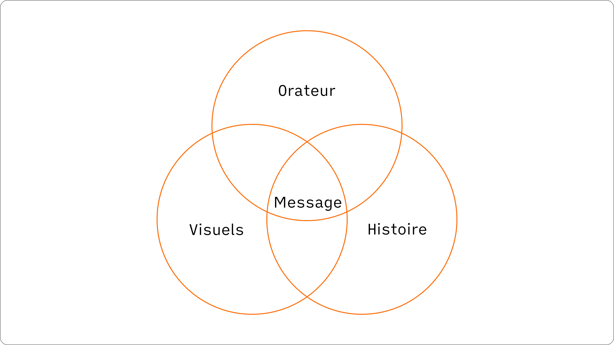

Une présentation réussie est une présentation qui atteint notre objectif de transformation. L'objectif de transformation est le changement que nous voulons voir se produire dans notre audience.

Pour que ce changement se produise, nous avons besoin de nous appuyer sur un **message** clair et persuasif. Sa communication s'appuie sur trois piliers :

- **l'histoire**
- **les visuels**
- **l'orateur**

L'histoire communique notre message de manière claire et convaincante. Les visuels sont optionnels et servent à clarifier et renforcer l'histoire. L'orateur porte et incarne le message.