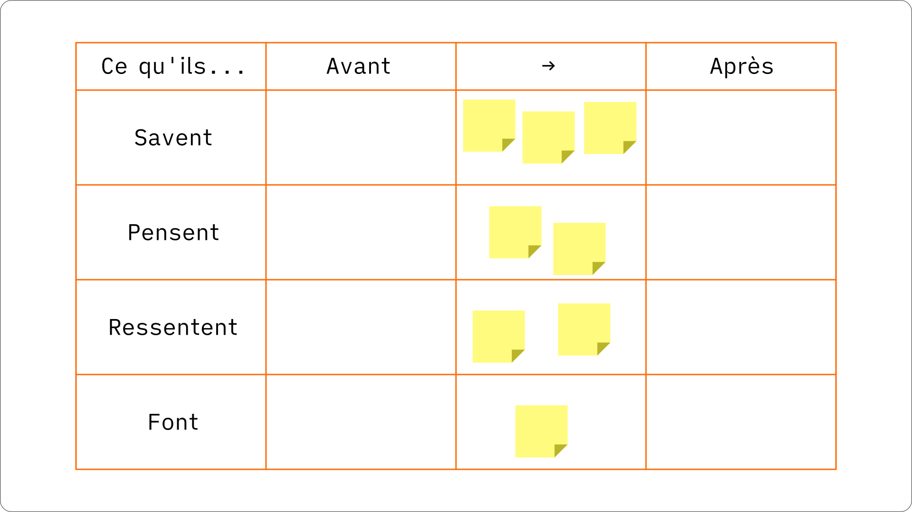

+++
title = "Storytelling"
+++

Prérequis : avoir un sujet pour créer une histoire. Cela peut être une présentation que vous devez donner, ou un sujet qui vous intéresse.

## Introduction

[Les trois piliers d'une bonne présentation](../elements/les-trois-piliers-d-une-bonne-presentation/)

Cette formation est dédiée à la partie histoire. Nous allons découvrir comment utiliser les techniques de storytelling pour créer de meilleures présentations.

### À propos d’Ideas on Stage

[À propos d'Ideas on Stage](../elements/a-propos-d-ideas-on-stage/)

### À propos de vous

> Je prends une minute pour me présenter.

### Agenda et objectifs

Présenter l’agenda et les objectifs de la journée.

### Vos attentes

> Quelles sont vos attentes pour cette formation ? Y a-t-il des points spécifiques que vous voulez aborder ?

## Qu’est-ce que vous n’aimez pas dans les présentations en entreprise ?

> Qu’est-ce que vous n’aimez pas dans les présentations en entreprise ? Qu’est-ce qui fonctionne, et qu’est-ce qui devrait être amélioré ?

## Fondation : ce n’est pas votre présentation… c’est la leur

### ABC

Lorsque nous avons une présentation à donner, la première chose à faire est d’en savoir plus sur notre audience. Qui est-elle ? Quels sont ses besoins ? Quel est le contexte dans lequel nous allons donner la présentation ? C’est pour cela que nous démarrons par l’ABC.

- A : Audience
- B : Besoins
- C : Contexte

L’**audience** est constituée des personnes à qui nous allons faire notre présentation et que nous devons convaincre de créer le changement que nous voulons réaliser. Nous devons connaître le mieux possible notre audience, qui ils sont, leur histoire, ce qu’ils aiment, ce qu’ils détestent, les jeux politiques au sein de leur entreprise.

Cette audience a des **besoins**. Qu’est-ce qui l’empêche de dormir la nuit ? À propos de quoi ont-elles envie d’en savoir plus et d’être rassurées ? Mieux nous connaissons leurs envies, plus il devient facile de les convaincre.

Le **contexte** est l’ensemble des éléments externes qui peuvent influencer votre présentation. Imaginez par exemple une société pétrolière qui communique sur la responsabilité environnementale. Le mot « responsabilité » aura une signification complètement différente si la société a causé une marée noire récente. Si nous parlons de cryptomonnaie, le contexte peut être positif (le prix du Bitcoin atteint des sommets) ou négatif (un scandale vient d’éclater). Des éléments typiques de contexte à analyser sont le marché, les prévisions économiques, le climat géopolitique, la compétition, la culture locale…

> Exercice : prenez cinq minutes pour définir votre ABC. Ensuite nous partageons et nous analysions les ABC en groupe.

## Idéation : n’informez pas, transformez

Pour nous, le vrai but d’une présentation n’est pas simplement d’informer, c’est de transformer votre audience et d’initier l’action qui mène au changement.

### Objectif de transformation

L’objectif de transformation est l’action que nous voulons voir notre audience faire. Pour identifier cet objectif de transformation, le plus simple est de répondre à cette question : après ma présentation, que va **faire** mon auditoire ?

- Après ma présentation, mon auditoire va… *(que va-t-elle faire ?)*

Voici quelques exemples d’objectifs de transformation concrets :

- « ils vont signer le contrat »
- « ils vont valider mon budget »
- « ils vont dédier 1 jour par mois à mon projet »

> Prenez 5 minutes pour identifier votre objectif de transformation. Ensuite nous partageons et nous analysons les objectifs en groupe.

Conseils :

- L’objectif de transformation doit prendre l’ABC en compte.
- Informer n’est pas suffisant. « J’ai communiqué mon information clairement » n’est pas suffisant.
- L’objectif de transformation est un résultat concret.
- Il vaut mieux définir un objectif de transformation réaliste plutôt qu’un objectif trop ambitieux ou insuffisant pour atteindre notre objectif. Par exemple :
	- Si nous vendons un produit complexe, il est probablement irréaliste de vouloir conclure la vente lors de premier rendez-vous.
	- Si notre objectif est de valider le budget d’un projet, simplement expliquer la répartition des dépenses est insuffisant. Nous devons viser la validation formelle du budget par le comité de direction.

### Faits, émotions, changement

Il est nécessaire d’utiliser les faits et les émotions pour atteindre notre objectif de transformation et créer le changement. Un objectif de transformation ne peut pas être atteint en ne communiquant que des faits. Il peut être atteint en communiquant uniquement des émotions pour des décisions irrationnelles, mais en entreprise cela n’est en général pas suffisant.

Pourquoi ? Parce que c’est lié au fonctionnement de notre cerveau : c’est en mélangeant faits et émotions que nous apprenons et que nous prenons des décisions. Sans émotion, nous ne serions pas capables de prendre des décisions. Par exemple, nous ne pourrions pas choisir entre une voiture bleue ou rouge, car il n’y a pas de fait rationnel pour nous permettre de faire un choix. Sans faits, il nous est impossible de rationaliser notre décision, et nous ne prenons pas de décision.

Les émotions peuvent supplanter notre processus de décision rationnel. Lorsque cela se passe, il se produit deux phénomènes :

- **Biais de confirmation** : nous devenons « aveugles » aux faits, ou nous ne choisissons que les faits qui correspondent à notre choix inconscient. Nous sommes tous sensibles aux biais de confirmation, même si nous pensons être purement rationnels.
- **Instinct de préservation** : nous rejetons les faits qui contredisent notre vision du monde. Notre cerveau interprète ces faits contradictoires comme étant une véritable agression physique et nous nous mettons en mode d’autodéfense.

Par exemple, il ne sert à rien d’essayer de convaincre un « platiste » que la terre est ronde. Il a mis en place tout un système de pensée qui valide sa vision du monde et tout fait contradictoire est vécu comme une agression. Il est facile de rire de cet exemple extrême, mais nous avons tous, à notre niveau, des croyances que nous ne voulons pas remettre en question.

Pour notre histoire, notre objectif est d’identifier les faits et les émotions nécessaires pour créer l’action dans l’esprit de notre audience, et ainsi réaliser le changement voulu.

### Parcours de Transformation de l'Auditoire

Le parcours de transformation de l'auditoire ou « PTA » (ATR en anglais) est un outil créer pour nous aider à identifier les faits et les émotions sur lesquels nous devons agir dans notre présentation.

Dans la colonne de gauche, le PTA reprend quatre catégories. Ce que notre auditoire (pas nous)…

- …Sait (faits démontrés)
- …Pense (croyances, faits non démontrés)
- …Ressent (émotions)
- …Fait (actions)

Il y a trois colonnes en plus :

- Avant
- →
- Après

Nous commençons par remplir la colonne « avant » : nous listons ce que notre auditoire sait, croit, ressent et fait **avant** notre présentation. Il est important de bien distinguer faits et croyances. Par exemple, si nous avions rempli le PTA lorsque la tour Eiffel a été construite, pour un auditoire constitué de Parisiens, nous aurions obtenu quelque chose qui ressemble à ceci :

- Sait : la tour Eiffel est faite d’acier, elle fait 300 mètres et est située près du champ de Mars.
- Pense : c’est très cher pour ce que c’est (« cher » est un jugement, une croyance, pas un fait), ça va bien mal vieillir, mais heureusement cela sera démoli à la fin de l’exposition.
- Ressent : c’est laid et c’est une verrue dans le paysage parisien.
- Fait : on critique la tour Eiffel, mais on va quand même la visiter.

Une fois que nous avons complété la colonne « avant », nous remplissons la colonne « après » dans l’ordre opposé, de bas en haut : nous commençons par « fait » et terminons par « sait ». Si nous listions ce que les Parisiens pensaient de la tour Eiffel après quelques décades, cela pourrait ressembler à ceci :

- Sait : la tour Eiffel est faite d’acier, fait 300 mètres de haut et est située près du champ de Mars. C’est un symbole universellement reconnu. (tous ces éléments peuvent être prouvés, démontrés, vérifiés, mesurés)
- Pense : la tour Eiffel va rester, elle est avant-gardiste (qu’est-ce qui est vraiment avant-gardiste ou qui ne l’est pas ? Cela reste en partie subjectif).
- Ressent : fier de vivre dans une ville avec un tel monument.
- Fait : Parisians talk about it proudly to foreigners to prove that they are better than the rest, but they never go to see it.

Maintenant la question est : comment fait-on pour passer de « avant » à « après » ? Pour répondre a cette question, nous allons remplir la colonne du milieu, de haut en bas, avec les **éléments de langage** nécessaires pour passer de l’avant à l’après.

- Sait : quels faits devons-nous inclure dans la présentation pour combler le « fossé » de connaissance ?
- Pense : que devons-nous dire pour changer les croyances ?
- Ressent : que devons-nous dire pour changer les émotions ?
- Do : quel appel à l’action devons-nous faire ?

Dans l’exemple de la tour Eiffel, passer de « avant » à « après » a pris du temps, des décennies, avant que le point de vue des Parisiens ne change :

- Sait : la plupart des faits sont restés vrais, mais de nouveaux faits sont apparus, comme le fait que ce soit une attraction pour les touristes.
- Pense : parce que les faits ont changé, parce qu’ils s’y sont habitués, et parce que la communication autour de la tour a changé, les Parisiens ont commencé à la percevoir de manière positive.
- Ressent : les Parisiens ont commencé à ressentir un sentiment de fierté par rapport à la tour Eiffel. Ce changement a été causé par l’évolution des faits, mais surtout des croyances.
- Fait : comme ils ont commencé à percevoir la tour Eiffel de manière positive, ils ont commencé à en parler de manière positive. Par contre tout le monde sait que la plupart des Parisiens ne vont jamais sur la tour Eiffel !

Il est important de noter que chaque changement se construit à partir de la couche précédente : ce que les gens pensent est influencé par les faits, ce qu’ils ressentent est influencé par ce qu’ils pensent, et ce qu’ils font est influencé par ce qu’ils ressentent. C’est pourquoi il est si difficile de faire changer les personnes qui refusent de faire évoluer leur compréhension des faits. 

> Exercice : prendre 10/20 minutes pour créer la PTA.

## Création : construisez votre structure

Une histoire a toujours au minimum trois parties : un début, un milieu et une fin. Une bonne structure accroche l’attention et rend la présentation simple à suivre et à comprendre.

Dans cette section, nous allons expliquer comment créer une bonne structure, puis nous utiliserons notre ABC et notre PTA pour ajouter du contenu à notre histoire.

### Choisir une structure

Il existe un nombre infini de structures possibles. Nous allons donc proposer ici quelques formules éprouvées, souvent utilisées pour créer des présentations.

| Structure | Début | Milieu | Fin |
|----------|-----------|---------|-----|
| Les 3 actes | Introduction | Développement des idées (changement) | Conclusion |
| Changer le monde | Idéal contre réalité | Problème, puis solution | Conclusion avec les prochaines étapes |
| Le pitch de vente | Problème ou besoin du client | Deux mauvaises solutions, la bonne solution (votre solution ) | Conclusion avec appel à l'action |
| La présentation de Comité | Recommandation | Problème ou besoin, solution | Appel à l'action |
| Présentation de projet | Contexte & analyse | Actions et résultats | Conclusion |

D'autres structures simples que vous pouvez utiliser sont par exemple :

- Recommendation, explication/démonstration, appel à l'action
- Ligne du temps
- Questions/réponses ou Objections/réponses

Si possible, évitez les structures « composées », par exemple une structure qui mélange une ligne du temps avec des questions/réponses. Si vous devez mélanger plusieurs types de structures, découpez votre présentation en plus petites sections, chacune avec son propre début - milieu - fin.

> Exercice : sur base de votre ABC et de votre PTA, choisissez une des structures types pour votre présentation.

### Placez les éléments de langage

Une fois notre structure choisie, nous prenons nos éléments de langage dans la PTA et nous les ajoutons à la structure choisie.

Nous organisons ces éléments sur notre structure. Si possible, nous les organisons par ordre importance :

- Ce que nous devons absolument dire,
- Ce qui est utile, mais non prioritaire,
- Ce qui est intéressant, mais peu utile.

 
> Exercice : prenez les éléments de langage de votre PTA et placez-les sur votre structure.

### Complétez votre structure

Nous avons identifié des éléments de langage importants avec la PTA, mais il y a probablement des trous à combler.

Voici une liste des éléments que vous pouvez inclure dans votre présentation :

Début :

- Qui est le présentateur ?
- Pourquoi êtes-vous crédible ? (diplômes, expérience, références)
- Pourquoi vous êtes là : quels sont l’objectif et l’agenda de la présentation ?

Milieu :

- Éléments de contexte importants (chiffres clés, évolution globale du marché, etc.) Par exemple, un recul des ventes n’a pas la même signification si le marché est en décroissance ou s’il est en croissance.
- Démonstration ou histoire inspirante pour créer le changement voulu.

Fin :

- Résumé
- Appel à l’action

### Reliez les éléments 

Une fois la structure de base complétée, nous pouvons écrire un premier brouillon de notre histoire. L’objectif de ce premier jet est de vérifier que l’histoire choisie « fonctionne ». En particulier, nous vérifions que :

- L’enchaînement des idées est logique et facile à suivre
- Les transitions d’une idée à l’autre sont faciles (elles devraient l’être si la structure est adaptée)
- Tous les éléments inclus dans l’histoire sont nécessaires pour atteindre notre objectif (sinon nous les retirons)
- Il n’y a pas de manquements dans notre histoire (sinon nous les remplissons)

> Exercice : j’écris un premier brouillon de mon histoire pour valider la structure et les éléments de langage choisis.

## Création : écrire l’histoire

Une fois le premier brouillon validé, nous pouvons écrire l’histoire complète. Dans cette partie, nous allons voir plusieurs techniques pour écrire de meilleures histoires.

> Vidéo : Chanel

### Commencer fort, terminer en beauté

Le début et la fin sont les deux moments où l’attention de l’auditoire est maximale, et sont donc cruciaux pour atteindre notre objectif de transformation. Nous verrons ensuite comment écrire une bonne histoire, mais pour l’instant nous allons nous focaliser sur le début et la fin.

La surprise et la curiosité sont les deux émotions les plus efficaces pour attirer l’attention de notre auditoire. Pour créer de la surprise et de la curiosité, nous pouvons utiliser une des techniques narratives suivantes :

- Une anecdote surprenante, à propos de nous, à propos d’un client…
- Un fait peu connu (car les faits peuvent également créer de l’émotion !)
- Une citation émotionnelle et forte, éventuellement d’une personne célèbre
- Une question rhétorique pour susciter la curiosité

À la fin, vous pouvez inciter l’auditoire à passer à l’action :

- Donner un sujet de réflexion et de discussion à l’auditoire.
- Faire un appel à l’action : que voulez-vous qu’ils fassent ?

### Rester léger

Lors de la préparation d’une présentation, une règle essentielle est : rester léger. Nous devons dire ce qui est nécessaire, mais pas plus.

Nous avons appris à l’école que « plus, c’est plus », et nous appliquons cette logique à nos présentations. Nous pensons qu’en donnant le plus grand nombre possible d’arguments en notre faveur, cela nous aidera à convaincre notre auditoire. Mais cela peut avoir l’effet inverse : lorsque nous donnons trop d’information, nous surchargeons notre processus de décision, comme une route avec trop de voitures. Il devient si difficile de prendre tout en compte que nous nous focalisons sur nos pensées. Nous bloquons nos émotions, et cela mène au gel des décisions, ce qui est l’inverse de ce que nous recherchons.

Pour éviter ce problème, nous utilisons l’exercice du pitch de 2 minutes : si nous n’avions que deux minutes pour convaincre notre auditoire, que dirions-nous pour atteindre notre objectif de transformation ? En aussi peu de temps, nous sommes obligés de faire des choix, mais notre histoire doit toujours avoir un début, un milieu et une fin, et utiliser une structure qui sert les éléments de langage. Une structure typique pour un pitch est « problème - solution - magie - appel à l’action » :

- Au début, nous prenons 30 secondes maximum pour expliquer le problème ou besoin.
- Au milieu, nous expliquons notre solution et pourquoi elle est « magique », autrement dit pourquoi elle est meilleure que les solutions concurrentes.
- À la fin, nous prenons 30 secondes maximum pour faire un appel à l’action : que voulons-nous que notre auditoire fasse ?

> Exercice : je crée un pitch de 2 minutes avec un début, un milieu et une fin. J’utilise la technique « commencer fort, terminer en beauté ».

### Rendre le problème/besoin essentiel

Si le problème ou besoin n’est pas *perçu* comme assez important, nous n’y accorderons pas beaucoup d’attention. C’est une question de perception : le problème peut être sans importance, ce qui compte c’est qu’il soit *perçu* comme important par le décideur. Cela peut paraître un peu stupide, mais il peut être plus important pour nous de choisir la bonne paire de chaussures que de résoudre le problème de la faim dans le monde.

> Vidéo : Bill Gates et les moustiques

Hollywood sait comment rendre le problème important : les superhéros ont toujours au moins deux problèmes clés à résoudre, liés à la même solution : un problème général et un problème personnel. Par exemple, dans Star Wars, la solution est de détruire l’Étoile de la mort. En faisant cela, Luke résout ses deux problèmes : il sauve la galaxie (enjeu global) et sauve la princesse Leia (enjeu personnel).

Pour déterminer comment rendre le problème ou besoin plus important, nous pouvons répondre à la question suivante :

- Si notre *objectif de transformation* n’est pas atteint, alors les conséquences sont… *(une catastrophe, à un niveau personnel et global)*.

Par exemple, si nous n’avons pas de système pour suivre les marchés en temps réel, vous ne serez pas compétitifs, votre entreprise sera en danger et vous perdrez votre emploi. Un tel message peut être trop brutal et causer un rejet de la part de votre auditoire. Une façon plus politiquement correcte de le présenter peut-être : aujourd’hui, les meilleures entreprises de votre secteur ont toutes un système de suivi en temps réel des marchés. Le taux de croissance des entreprises qui ont adopté ce type de systèmes est, en moyenne, 10 % supérieur aux autres entreprises. Les analystes estiment qu’elles pourraient conquérir toutes les parts de marché en 2025…

> Exercice : donnez de l’importance au problème/besoin/enjeu de votre présentation.

### Utiliser des anecdotes (mini-histoires)

Les anecdotes sont des mini-histoires qui nous aident à communiquer avec authenticité et émotion. Différentes études démontrent que l’utilisation d’histoires améliore la mémorisation des informations. Ces anecdotes peuvent être des histoires personnelles, des histoires de clients…

> Exercice : ajouter une anecdote à votre histoire pour communiquer un des éléments de langage.

### Personnaliser et rendre unique

Personnaliser notre histoire est un moyen très efficace pour accroître la « connexion » avec notre auditoire. Par exemple, si nous allons voir un client dans le secteur pharmaceutique, nous prendrons le temps de personnaliser la présentation avec ses produits et son secteur d’activité. C’est encore mieux si nous pouvons la personnaliser avec des éléments de sa culture d’entreprise. Si nous allons en Inde, prenons le temps de montrer notre respect pour la culture locale et évitons les conflits culturels. 

> Vidéos : Jamie Oliver et Steve Jobs

> Exercice : j’ajoute un élément pour personnaliser ma présentation en fonction de mon auditoire.

### Simplifier les chiffres et les données

> Vidéo : la petite terre

### Utiliser les techniques de rhétorique

Il y a plusieurs techniques de rhétorique que nous pouvons utiliser pour rendre notre présentation plus efficace. Voici une liste des plus utiles, adaptée pour les présentations :

- Répétition : répétez les idées clés et les messages clés tout au long de la présentation, au début, au milieu et à la fin.
- Flash-back : emmenez votre auditoire dans le passé pour revivre un moment clé. La bonne façon de faire un flash-back est de le narrer au présent, pas au passé. « Nous sommes en 1983. À la radio, j’écoute Michael Jackson qui chante Billy Jean… »
- Épistrophe : répétez un mot ou une expression à la fin de phrases successives. Par exemple : par le peuple, pour le peuple, au nom du peuple.
- Métaphore : un mot ou une phrase utilisée à la place d’un objet ou d’une idée et qui crée une analogie.
- Oxymore : une combinaison de mots contradictoires ou incongrus.

Il existe de nombreuses autres figures de style, à vous de choisir les plus appropriées pour rendre votre histoire plus intéressante.

> J’utilise une technique de rhétorique pour rendre ma présentation plus percutante.

### Emprunter de la crédibilité

Il vaut parfois mieux que certains messages soient communiqués par d’autres personnes que nous. Par exemple, il est difficile d’avoir l’air impartial si nous présentons un sujet pour lequel nous avons un conflit d’intérêt. Dans ce cas, faire appel à une personne indépendante ou à un témoignage d’un client est probablement une meilleure solution, car ces personnes seront perçues comme étant plus neutres et dignes de confiance.

Une façon d’emprunter de la crédibilité est de citer une personne célèbre. Cela donne du poids aux mots.

> Exercice : ajoutez un témoignage ou une citation à votre présentation.

### Combler le fossé de la connaissance

Une histoire est comme une chaîne : il suffit d’un maillon manquant pour qu’elle se brise. Parfois, les éléments de langage identifiés ne sont pas suffisants, parce que l’auditoire n’a pas la connaissance nécessaire pour comprendre le message. Il existe deux approches opposées pour « combler le fossé » de la connaissance :

- Simplifier (vulgariser) le contenu pour le rendre plus simple à comprendre.
- Éduquer notre auditoire pour lui permettre de comprendre les éléments plus complexes de l’histoire.

Par exemple, une présentation sur l’informatique quantique nécessitera de déployer les deux approches : nous devrons grandement simplifier les concepts, mais même en simplifiant au maximum, ce ne sera pas suffisant, car un sujet aussi complexe requiert l’acquisition d’un minimum de connaissances pour en comprendre les bases.

Voici quelques techniques pour combler de fossé de la connaissance :

- Utiliser des phrases simples, avec une structure très simple.
- Utiliser des métaphores et des analogies, comme le chat de Schrödinger.
- Éliminer le jargon technique, tout le jargon.
- Éviter les concepts autant que possible. Les personnes peuvent-elles facilement se représenter visuellement ce dont vous parlez ? Ou est-ce trop conceptuel pour pouvoir se le représenter ?
- Pour les concepts indispensables, utiliser des noms simples à retenir. Un bon exemple est le concept de « cloud ». Il y a quelques années, personne ne savait ce que c’était. Aujourd’hui, tout le monde « sait » ce que c’est, mais sans savoir ce que c’est réellement. Le concept est cependant devenu suffisamment concret pour être « acheté » par le grand public, mais il a fallu l’éduquer pendant des années. Apple sait comment positionner ses produits avec des mots comme « Max » ou « Pro » (ce n’est cependant pas parfait, les néophytes seront perdus par une telle nomenclature).

> Exercice : comblez les fossés de la connaissance dans votre histoire.

### Simplifier jusqu’à la perfection

Une histoire est comme les boutons d’un four à micro-ondes : cela semble très logique et intuitif pour son concepteur, mais cela peut être difficile à comprendre pour quelqu’un d’autre. Même avec toutes les techniques vues précédemment, notre histoire peut probablement être encore plus simple. Nous devons chercher à simplifier, simplifier, et encore simplifier, jusqu’à ce que tous les points de friction soient éliminés.

Nous pouvons utiliser le test « ma mère comprendrait-elle ce dont je suis en train de parler ? » pour vérifier si notre histoire est assez simple.

> Exercice : présentez votre histoire à quelqu’un d’autre. Écoutez son feedback sur les points de friction restants dans votre histoire.

## Checklist histoire

Une fois votre histoire terminée, vous pouvez faire une ultime vérification avec la liste suivante :

- ABC
	- [ ] A : l’histoire est écrite pour mon auditoire, pas pour moi-même.
	- [ ] B : Je réponds à leurs besoins.
	- [ ] C : J’ai pris en compte les éléments de contexte.
	- [ ] Objectif de transformation : j’expose clairement mon objectif de transformation au début ou à la fin de la présentation (l’objectif de transformation doit parfois être rephrasé avant d’être communiqué à l’auditoire).
- Structure
	- [ ] La structure de mon histoire est simple, logique et se déroule naturellement.
	- [ ] Je peux dire l’essentiel en 2 minutes.
- Histoire
- [ ] Début
	- [ ] J’attire l’attention de mon auditoire au début.
	- [ ] J’établis ma crédibilité.
	- [ ] J’ai expliqué pourquoi nous sommes là aujourd’hui.
- [ ] Milieu
	- [ ] J’utilise le bon mix de faits et émotions dans mon histoire.
	- [ ] Je prends le temps de personnaliser ma présentation pour mon auditoire.
	- [ ] Mon contenu est adapté à mon auditoire. Il n’est ni trop simple, ni trop difficile. J’ai comblé le fossé de la connaissance lorsque c’est nécessaire.
	- [ ] Je n’utilise pas de concepts abstraits que mon auditoire ne connaît pas, ou je prends le temps de les expliquer.
	- [ ] Je ne peux rien simplifier de plus.
- [ ] Fin
	- [ ] Je résume les éléments de langage clés.
	- [ ] Je termine avec un appel à l’action clair.

> Exercice : vérifiez votre histoire avec la checklist.

## Mise en pratique finale

### Préparation

> Exercice : vous avez 20 minutes pour préparer une présentation de cinq minutes. Nous vous recommandons de ne pas utiliser de diapositives, mais de plutôt vous focaliser sur l’histoire.

### Présentation

> Exercice : lorsque tout le monde est prêt, chaque participant présente son histoire face au groupe. Le formateur et le groupe donnent des conseils constructifs.

## Conclusion

Ceci conclut notre formation sur le storytelling. Maintenant, la perfection est atteinte par l’entraînement.

### Ressources supplémentaires

[Ressources complémentaires](../elements/ressources-complementaires)

### Récapitulatif

> Discussion : je partage ce que j’ai appris aujourd’hui avec le groupe, et la façon dont je m’en servirai pour améliorer mes présentations.

## Révisions

- 2024-04-04 Adaptation à la mise en ligne
- 2023-03-02 Première version française
