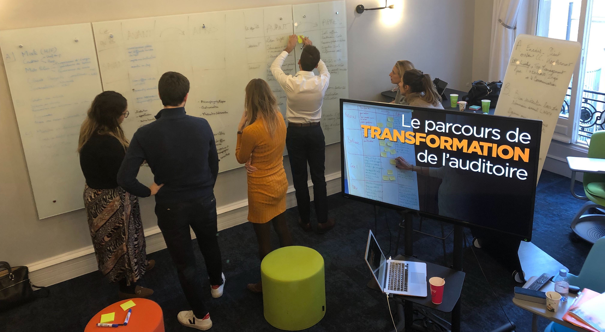
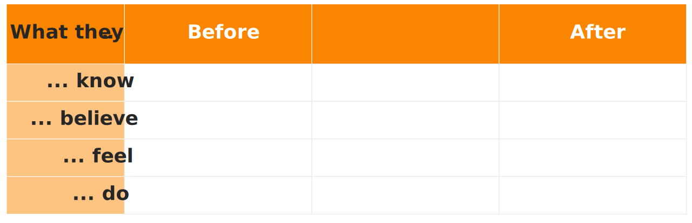

+++
draft			= false
title			= "The Audience Transformation Roadmap™"
description		= "The Audience Transformation Roadmap™ is a simple and powerful tool created by Ideas on Stage to work out what transformations you need to make and what to say to achieve them."
picture			= "ATR_english.jpeg"
url				= "/services/communication-consulting/audience-transformation-roadmap/"
+++

Most people use presentations to share information, which is a terrible waste of everybody’s time because we forget most of what we hear very quickly. 

If you want to share information, give people a written document, and quiet time to read it – and then by all means discuss what you have all read. This is how Amazon runs their meetings, and it works because that’s how human brains work. Meetings that might have taken two hours end up taking 25-30 minutes, even with 10 minutes of quiet reading at the start.

It might sound odd for a presentation company to say how presentations are very ineffective – but that’s only half the story. Presentations are poor at information, but excellent at transformation. If you want to change what people believe, feel and do, presentations can be amazingly powerful.

Imagine you are pitching to raise funds for a project or start-up. You tell them everything about your idea – but they refuse to fund you. Did you succeed? No.

Now imagine you focus on making them feel trusting and confident in you and your team; on making them believe that your idea will work, and that it is a good investment – and on telling them only the few things they need to know to support those beliefs and feelings. Will that give you a better chance of funding? Of course.

So don’t inform: transform. Change what they believe, feel and do, and you will achieve your objectives.

How can you work out what transformations you need to make, and what to say to achieve them? This is where you can use the Audience Transformation Roadmap™, a simple and powerful tool created by Ideas on Stage, and shared with the world via a [Creative Commons BY-NC-ND license](https://creativecommons.org/licenses/by-nc-nd/4.0/). You are free to use this non-commercially and share it, as long as you properly attribute it to Ideas on Stage.

(Non-commercial use means that you can use it yourself to prepare your own presentations, even business presentations; but you can’t sell it as a product or part of a service to your clients.)

### Here’s how it works.

You first ask yourself four questions related to the subject of your presentation, filling in the first column with your answers:

-	What does my audience know? (and what don’t they know, if it’s important?)
-	What do they believe, or think they know?
-	What do they feel?
-	What do they do?

Make a clear distinction between what they believe and what they feel. Beliefs are things they think or expect to be true; feelings are emotions. For example, they believe it is nearly time for lunch; they feel hungry.

Then you go back up the right-hand column, answering the questions:
	
-	What would I like them to do after my presentation?
-	What should they feel, to make them want do that?
-	What do they need to believe, so they feel that way and take those actions?
-	What do they need to know afterwards?

By doing this, you will realize that the main transformation you need to create is in the feelings and actions of your audience. This orients your presentation less towards information (which, remember, isn’t what presentations are good for) and more towards generating beliefs, feelings and actions, which is what presentations do best.

Finally, you then go back down the ‘transformation column’ in the middle, using sticky notes to brainstorm for ideas on what you can say, show and do in your presentation to make these transformations from left (before) to right (after). Later, you can take these sticky notes off the Roadmap, and arrange them into a suitable storyline.

We invented this technique, and even we are often amazed at how easy it is to arrange these ideas into a presentation storyline, with hardly anything missing and hardly any superfluous ideas. It truly is a short-cut to a powerful presentation, and we use this technique with our clients and to prepare our own presentations. It’s our most powerful method, and we’re giving it to you to use, so you can join our Business Presentation Revolution and help us to cure the world of boring, ineffective presentations.

If you would like the help of an experienced facilitator to help you to run a brainstorming session using the Audience Transformation Roadmap™, the Ideas on Stage team would be happy to help: contact us at info@ideasonstage.com. Available in English, French, Spanish, Italian and German.

For a larger version of the Audience Transformation Roadmap™, simply download our short guide [here](./ATR_template_Ideas_on_Stage.pdf).

Have you tried using the Audience Transformation Roadmap™? We’d love to hear your experiences, so please tell us your thoughts using the form below.

