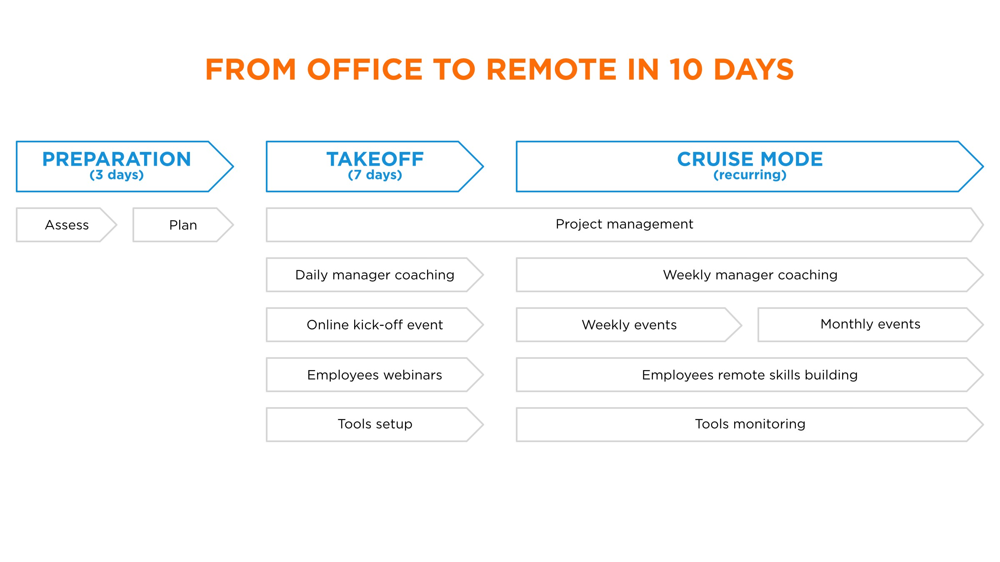

+++
draft 			= false
title 			= "Du bureau au travail à distance en 10 jours"
description		= "Passer du travail au bureau à un mode de travail à distance en 10 jours en créant une communauté de travail en ligne."
weight			= 1
categories		= [ "Consulting" ]
showrefs		= false
showpageslist	= false
urlredirect		= ""
url 				= "/du-bureau-au-travail-a-distance/"
picture			= "remote-work.jpg"
+++
**Ce service vous aidera à passer d’un environnement de travail au bureau à un environnement de travail à distance en dix jours. Nous vous aiderons à créer une communauté de travail en ligne avec des effets positifs à long terme sur la productivité et le moral de vos effectifs.**

Propulsés dans un environnement de travail à distance, les managers et les employés auront instinctivement tendance à reproduire leur environnement de travail traditionnel. Mais ils vont vite se rendre compte des différences : pas de rencontres en face à face, pas de discussions informelles à la machine à café, impossibilité de vérifier ce que chaque employé fait de son temps.

Si ces problèmes ne sont pas réglés immédiatement, de plus grands problèmes surgiront rapidement : perte de confiance entre la direction et les employés, soupçons et rumeurs venant de nulle part, sentiment général de frustration face à la difficulté de travailler efficacement en équipe tout en étant éloignés, perte de motivation et de vision.

> Conserver un modèle traditionnel de travail au bureau dans un environnement de travail à distance produira des résultats peu convaincants.

Chez Ideas on Stage, notre mission principale est de créer des liens. Nous croyons qu’un environnement de travail à distance ne peut pas prospérer sans des relations efficaces et authentiques. Ces liens sont ce qui différencie les employés travaillant à distance d’une véritable **communauté de travail en ligne**. Et nous pratiquons ce que nous prêchons. Nous travaillons en équipe à distance depuis notre création il y a dix ans, tant en interne qu’en externe, avec nos clients. En nous appuyant sur ces années d’expérience, nous avons conçu une méthode pour aider nos clients à passer du travail de bureau au travail à distance en quelques jours.

{}Nous vous aiderons à mettre en place une **communauté de travail en ligne pérenne** qui créera un sentiment d’appartenance et encouragera les pratiques exemplaires à tous les niveaux de votre organisation, peu importe d’où viennent les gens.{}

## Principaux facteurs clés de succès de transformation du travail au bureau au travail à distance
Cinq éléments sont essentiels pour réussir cette transition :

- **Objectifs** : avoir un objectif clair est essentiel pour garder les employés sur la bonne voie lorsqu’aucun bureau physique ne peut créer un sentiment de cohésion. Une vision claire donnera un sens à leur travail et les motivera à travailler à la réalisation de cette vision.
- **Outils** : les bons outils à distance, rapides et faciles à utiliser, éviteront le rejet du travail à distance.
- **Confiance** : pour certaines organisations, c’est le facteur de succès le plus difficile, mais le plus important : passer d’une culture de méfiance à une culture de confiance. La direction et les employés doivent passer à un modèle d’autonomie pour maximiser les résultats et même dépasser la productivité du bureau.
- **Transparence** : s’assurer que les gens savent ce qui se passe au sein de l’entreprise, qu’ils comprennent leur rôle dans tout changement ou projet et se sentent connectés.
- **Surcommunication** : la communication à distance n’est pas aussi naturelle que la communication directe. Par conséquent, parler et échanger fréquemment est la clé de la confiance et d’un environnement de travail sain et efficace.

> Sans ces facteurs clés de succès, un environnement de travail en ligne ne fera que créer un sentiment d’insécurité et de frustration, ce qui se traduira par une faible productivité de la part des employés.

## Du bureau au télétravail en 10 jours
Ideas on Stage peut vous aider à réaliser une transition quasi instantanée du bureau vers un travail à distance parce que nous savons ce qui fonctionne et ne fonctionne pas, que ce soit directement dans notre entreprise ou par l’intermédiaire de nos clients. Voici comment assurer un fonctionnement harmonieux de l’environnement de travail à distance :

- Vérifier que vous avez les outils nécessaires.
- Établir une vision claire que vous communiquerez continuellement à vos employés tout au long de la période de travail à distance.
- Créer un environnement de travail fondé sur la confiance entre les employés et la direction en incarnant ces valeurs et en coachant vos effectifs sur la façon de maintenir une relation productive à distance.
- S’assurer que tout le monde communique avec respect, clarté et régularité. Se concentrer sur la résolution des défis du projet, et non sur les questions interpersonnelles.
- Organiser régulièrement des événements en ligne pour continuer à nourrir une culture d’entreprise connectée ; communiquer la vision, reconnaître et rassurer les employés pour favoriser un sentiment d’appartenance.
- Dans la mesure du possible, prévoyez des rencontres ou des événements en personne.

## Comment faire ?
Notre approche est basée sur trois phases : préparation, décollage et mode croisière. À condition que votre équipe soit prête à agir rapidement, que vous ayez le minimum d’outils pour vous mettre à jour et que vous soyez prêts à faire face à quelques jours intenses, nous pouvons vous aider à faire la transition très rapidement.

### Préparation : évaluation initiale, plan et objectifs

Nous commençons la phase de préparation par une **évaluation initiale** de vos capacités de travail à distance. Nous évaluons dans quelle mesure vous et votre équipe êtes à l’aise avec le concept de télétravail. Ensuite, nous vérifions si vos outils vous permettront de travailler correctement sans créer de rejet supplémentaire.

À partir de l’évaluation initiale, nous élaborons un **plan complet** adapté aux forces et aux domaines d’amélioration de votre entreprise. Notre objectif initial n’est pas de fournir un remplacement complet de votre environnement de travail traditionnel, mais de vous donner les capacités minimales pour travailler efficacement en tant qu’équipe distante.

Nous vous aidons à établir un **ensemble clair d’objectifs** pour votre équipe. C’est essentiel pour maintenir les employés sur la bonne voie lorsqu’aucun bureau physique ne peut créer un sentiment de cohésion. Un objectif clair pour votre projet donnera du sens à leur travail ainsi que des tâches quotidiennes réalistes, et les motivera à travailler à la réalisation de ces objectifs. Tout comme le départ d’un voyage, vous devez avoir une carte pour arriver là où vous vouliez. Il en va de même pour l’organisation de votre projet de travail, et particulièrement lorsque vous travaillez à distance.

Suite à cette évaluation, nous organiserons une séance de 90 minutes pour fixer vos objectifs en utilisant nos propres méthodologies. Nous identifierons des objectifs réalisables, clairement définis et mesurables en commençant par un brainstorming autour des résultats souhaités, puis en les classant selon notre méthodologie des feux de circulation pour lister les mesures les plus cruciales à prendre et les classer par ordre d’importance.

Il en résultera un échéancier clair et une carte du projet qui aideront les employés à maintenir le cap pendant leur voyage et à prendre confiance dans l’environnement de travail à distance.

### Décollage

Sur la base de notre plan et de nos objectifs, nous entrerons ensuite dans la phase de décollage : quitter le sol et atteindre l’altitude de croisière efficacement et en toute sécurité.

Afin de s’assurer que les objectifs sont clairs et afin de renforcer le sentiment d’appartenance à la communauté en ligne, nous commencerons par un **événement de lancement en ligne**, sans minimiser les défis du travail à distance, mais plutôt en donnant une vision très claire de la façon dont tout le monde peut s’adapter et en garantissant que chaque employé reçoive du soutien pendant cette phase.
 
Au cours de la phase de décollage, les managers bénéficieront d’un **coaching quotidien** pour relever les défis auxquels ils vont faire face en s’adaptant au travail à distance. Comme une bonne gestion à distance est essentielle pour favoriser un bon environnement de télétravail, c’est-à-dire conserver les talents clés, nous encourageons fortement l’adoption d’une approche d’encadrement personnalisée au lieu d’une solution universelle. En fonction du nombre de managers et de la taille de votre entreprise, nous pourrions créer des groupes de coaching basés sur les différents styles de leadership afin de maximiser l’efficacité et d’établir des liens de soutien internes.

Nous organiserons des **événements hebdomadaires** pour renforcer la culture de votre communauté de travail en ligne. Une culture forte encouragera le bon état d’esprit de tous vos employés, et augmentera l’engagement et la motivation. Cela pourrait inclure le coaching de vos employés pour donner des mini-présentations de style TED afin de maintenir le groupe engagé. Ou bien de faciliter les check-in de groupe en utilisant des techniques de communication développées dans les entreprises high-tech californiennes et appelées « Conseil ».

Les employés pourront assister à une série de **webinaires en ligne** :

* Comment organiser des réunions virtuelles
* Comment adapter les habitudes de travail au travail à distance de façon efficace et agréable
* Comment utiliser une bonne méthode de communication pour encourager la collaboration et éviter les conflits ou les retards inutiles
* Comment créer une culture de travail en ligne fondée sur la confiance

{}La confiance est au cœur d’une communauté de travail en ligne. C’est ce qui crée un environnement de travail positif et constructif.{}

**La confiance** est au cœur d’une communauté de travail en ligne. Mais comment la bâtir ? En faisant ce que vous dites que vous ferez. Ou au moins en arrangeant les choses si et quand vous loupez le coche. Cela semble simple, et ça l’est, à certaines conditions spécifiques : lorsque toutes les parties partagent la même compréhension de l’accord et une idée commune de ce à quoi le succès ressemble. Il peut être plus difficile d’y parvenir que nous ne le pensons. La communication est roi lorsqu’il s’agit de bâtir la confiance. Par exemple, un manager dit : « Nous devons envoyer la newsletter jeudi. John, pouvez-vous vous assurer que le texte est à jour et Sarah, pouvez-vous confirmer que nous avons les droits d’utilisation des images ? ». Cela semble assez clair. Bien sûr, le manager aurait pu ajouter une échéance : « Pouvez-vous le faire d’ici la fin de la journée pour que nous puissions l’envoyer demain matin ? ». Les objectifs SMART aident à atteindre la clarté et créent ainsi des conditions propices à la réussite.

Mais parfois, les gens ne font pas ce qu’ils ont annoncé. Que se passe-t-il alors ? Nous avons besoin des compétences et des pratiques de communication appropriées pour éviter efficacement les malentendus et, idéalement, pour renforcer les relations et l’apprentissage en vue d’une réussite future. Bâtir la confiance, c’est assurer le suivi, mais c’est aussi gérer les choses lorsqu’elles tournent mal et que les cibles ne sont pas touchées. Enfin, ce n’est pas seulement ce que nous communiquons à notre équipe ou à nos collègues, mais aussi quand et comment.

Voici quelques exemples d’activités que nous utilisons pour bâtir un milieu de travail en ligne basé sur la confiance :

- Initiation à une pratique de communication en ligne (Conseil)
- Techniques de communication non violente, l’un des principaux changements culturels que Satya Nadella a introduits sous sa direction chez Microsoft
- Organiser régulièrement des réunions en ligne avec un programme clair et responsabilisant
- Compétences en résolution de conflits ou de situation de stress
- Reconnaissance : la rendre régulière et spécifique

Enfin, s’il vous manque des outils essentiels pour travailler à distance, nous nous coordonnerons avec vous pour trouver des solutions temporaires ou pérennes afin que votre équipe ne soit pas entravée. Nous sommes des vendeurs agnostiques.

### Mode croisière
La phase de décollage vous aidera à vous mettre à jour rapidement, assurant une perturbation minimale de votre travail quotidien. Cependant, une culture efficace du travail à distance est quelque chose qui se construit pendant plusieurs mois. Nous continuerons de vous aider à régler les derniers points de friction et à mettre sur pied une communauté de travail à distance durable qui offrira un meilleur environnement, plus souple, à tous vos employés, et qui stimulera leur productivité, qui offrira à votre entreprise des bénéfices à long terme et une meilleure préparation à cette transition inévitable vers une plus grande flexibilité du lieu de travail.

Alors, pourquoi attendre ? Contactez-nous et commençons dès aujourd’hui à bâtir votre communauté de travail à distance.
