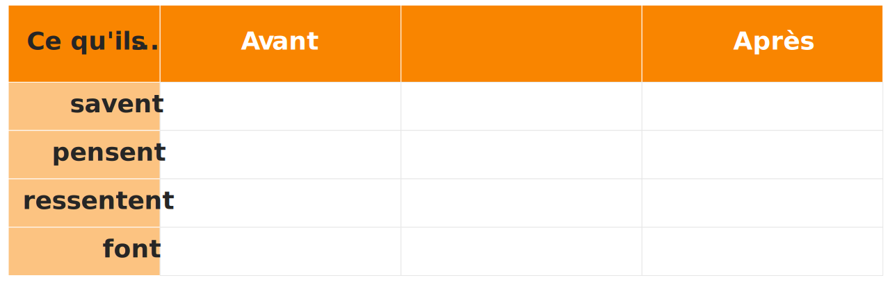

+++
draft		= false
title		= "Parcours de Transformation de l’Auditoire™"
description = "Le Parcours de Transformation de l’Auditoire™ est un outil simple et efficace créé par Ideas on Stage pour identifier les messages clés à inclure dans votre présentation."
weight		= 4
categories	= [ "presentation-creation-agency" ]
urlredirect	= ""
showrefs	= false
url	 		= "/parcours-transformation-auditoire/"
picture		= "atr_from_iOS.jpg"
+++

La plupart des gens font des présentations pour partager des informations, ce qui est une perte de temps pour tout le monde car nous oublions la plupart de ce que nous entendons très rapidement.

Si vous voulez partager des informations, distribuez un document écrit à vos collaborateurs et laissez-leur le temps de le lire - puis discutez-en. C’est ainsi qu’Amazon gère les réunions, et cela fonctionne parce que c’est ainsi que le cerveau humain est fait. Les réunions qui auraient pu prendre deux heures finissent par prendre entre 25 à 30 minutes, même en incluant 10 minutes de lecture silencieuse au début.

Cela peut sembler étrange pour une entreprise spécialisée en présentations de dire à quel point celles-ci sont inefficaces, et ce n’est pas tout. Les présentations sont pauvres en information, mais excellentes en transformation. Si vous voulez changer ce que les gens croient, ressentent et font, les présentations peuvent être incroyablement puissantes.

Imaginez que vous tentez de lever des fonds pour un projet ou une start-up. Vous leur présentez en détail votre idée mais ils refusent de vous financer. Avez-vous réussi ? Non.

Imaginez maintenant que vous vous efforciez de leur donner confiance en vous et en votre équipe, en leur faisant croire que votre idée fonctionnera et que c’est un bon investissement et en leur disant seulement le nécessaire qu’ils doivent savoir pour y croire réellement. Cela vous donnera-t-il une meilleure chance d’être financé ? Bien sûr.

Alors n’informez pas : transformez. Changez ce qu’ils croient, ressentent et font, et vous atteindrez vos objectifs.

Comment déterminer quelles transformations vous devez effectuer et que dire pour les réaliser ? C’est là que vous pouvez utiliser le Parcours de Transformation de l’Auditoire™, un outil simple et puissant créé par Ideas on Stage et mis à disposition via une licence Creative Commons BY-NC-ND. Vous êtes libre d’utiliser ce contenu à des fins non commerciales et de le partager, tant que vous l’attribuez à Ideas on Stage.

(L’utilisation non commerciale signifie que vous pouvez l’utiliser vous-même pour préparer vos propres présentations, même des présentations commerciales ; mais vous ne pouvez pas le vendre en tant que produit ou partie d’un service à vos clients.)

### Comment utiliser le parcours de transformation de l'auditoire ?

Vous vous posez d’abord quatre questions liées au sujet de votre présentation, en remplissant la première colonne de vos réponses « Avant » :

- Que sait mon auditoire ? (et qu’est-ce qu’il ne sait pas, si c’est important ?)
- Que croit-il ou pense-t-il savoir ?
- Que ressent-il ?
- Que fait-il ?

Faites une distinction claire entre ce qu’il croit et ce qu’il ressent. Les croyances sont des choses qu’il pense ou qu’il imagine être vraies; les sentiments sont des émotions. Par exemple, il croit qu’il est presque l’heure du déjeuner; il a faim.

Vous remontez ensuite la colonne de droite « Après », répondant aux questions :

- Que voudrais-je qu’il fasse après ma présentation ?
- Que devrait-il ressentir pour lui donner envie de faire ça ?
- Que doit-il croire, pour se sentir ainsi et engager des actions ?
- Que doit-il savoir par la suite ?

En faisant cela, vous vous rendrez compte que la principale transformation que vous devez créer réside dans les sentiments et les actions de votre auditoire. Cela oriente moins votre présentation vers l’information (qui, rappelez-vous, n’est pas la raison pour laquelle les présentations existent) et davantage vers la transformation de croyances, de sentiments et d’actions. C’est ce que les présentations font de mieux.

Enfin, vous redescendez dans la « colonne de transformation » au milieu, en utilisant des post-its pour réfléchir à ce que vous pouvez dire, montrer et faire au cours de votre présentation pour effectuer ces transformations de gauche (avant) à droite (après). Ensuite, vous pourrez retirer ces notes autocollantes de ce Parcours de Transformation de l’Auditoire™ et les organiser selon un scénario approprié.

Nous avons inventé cette technique, et nous sommes souvent étonnés de voir à quel point il est facile d’organiser ses idées dans un tel scénario de présentation, sans oubli ni idée superflue. C’est vraiment une technique rapide et efficace pour préparer une présentation puissante, et nous l’utilisons avec nos clients ou pour préparer nos propres présentations. C’est notre méthode la plus puissante et nous vous la proposons afin que vous puissiez participer à notre Business Presentation Revolution et nous aider à guérir le monde des présentations ennuyeuses et inefficaces.

Si vous souhaitez l’aide d’un facilitateur expérimenté pour vous aider à organiser une session de brainstorming en utilisant ce Parcours de Transformation de l’Auditoire™, l’équipe Ideas on Stage se fera un plaisir de vous aider. Disponible en anglais, français, espagnol, italien et allemand.

Pour une version agrandie du Parcours de Transformation de l’Auditoire™, téléchargez simplement notre guide [ici](./ATR_template_Ideas_on_Stage.pdf).

Avez-vous essayé d’utiliser le Parcours de Transformation de l’Auditoire™  ? Nous serions ravis d’avoir vos remarques et votre retour d’expérience. N’hésitez pas à nous écrire via le formulaire ci-dessous.
