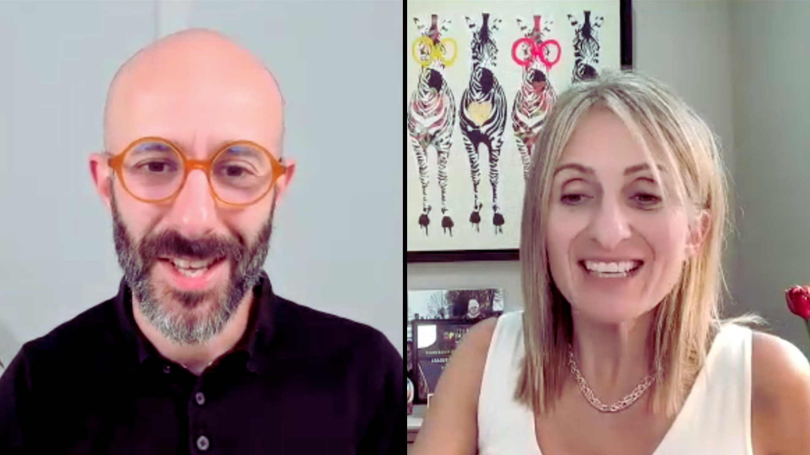

## Make every presentation count

A great idea deserves to be heard. But too often, messages get lost in **complexity, nerves** or **lack of structure.**

The **Confident Presenter Programme** helps you turn your ideas into clear, compelling stories that **guide potential clients to the next step.** You’ll work privately with a **communication expert** who understands what it takes to deliver impactful client-facing presentations.

Whether you’re preparing for a specific talk or looking to transform your skills long term, this is a **focused, personalised journey** to becoming a more **credible, convincing presenter.**

## Who it’s for

The programme is designed for **entrepreneurs, business owners and leaders** who want to:

- Communicate ideas with **clarity** and **confidence**
- Deliver presentations that **engage prospects** and **build trust**
- Strengthen their **leadership presence** and **influence**

If you’re serious about improving how you present – and ready for **tailored support** and **honest feedback** – this programme is for you.

## What you’ll get out of it

By the end of the programme, you’ll be able to:

- Craft messages that connect and inspire
- Present with clarity and confidence 
- Structure your content for maximum impact
- Handle nerves and feel more in control 
- Speak as a trusted expert in client-facing situations

## What’s included

Every coaching experience is personalised, but each includes:

- **Private 1:1 sessions** tailored to your goals 
- **Hands-on feedback** and **practical assignments** between sessions
- **Access to an AI Coach**, your 24/7 presentation coach for instant guidance
- **Resources, templates and tools** to apply what you learn straight away
- **Ongoing guidance and accountability** to help you reach your full potential

## What clients say

Leaders who complete the **Confident Presenter Programme** report lasting improvements in **confidence, clarity and results**.









## Ready to communicate with confidence?

**Start the conversation** to design a coaching plan that fits your goals and helps you **make every presentation to prospects count.**
