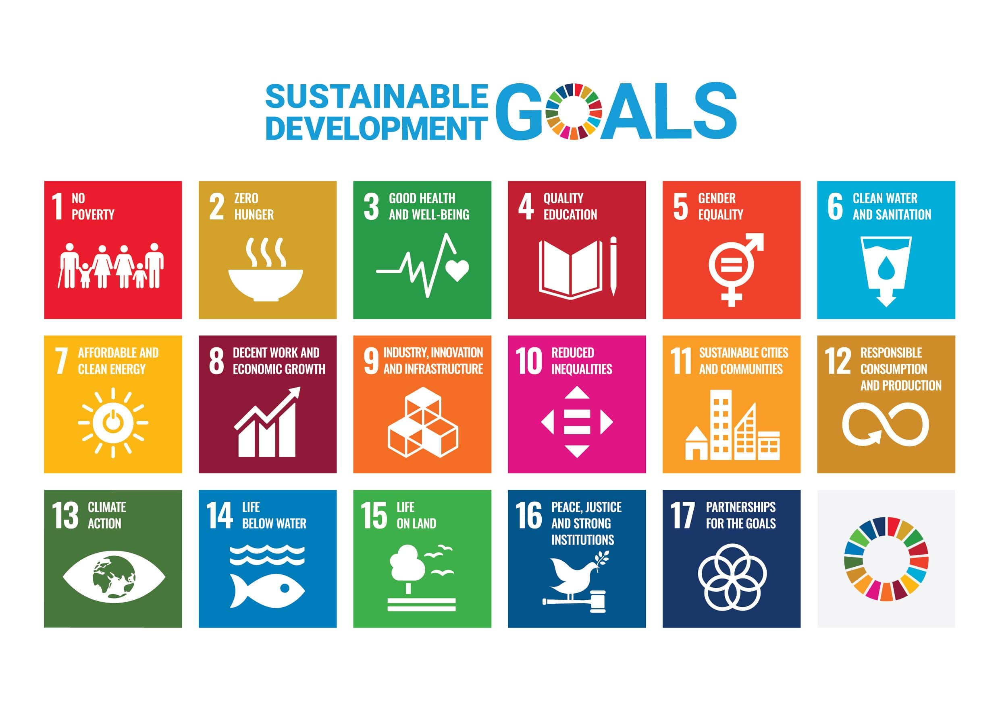

**Doing business. Doing good.**

At the heart of everything we do are leaders who want to make a difference. That’s why every new client helps us make a difference too. Through **Kids on Stage**, we fund school tuition for underprivileged children so they can access education and build a better future. This initiative is run in partnership with **Missioni Estere**, our trusted charity partner.

We’ve also joined the **1% Pledge**, committing 1% of our revenue to support this project – because we believe business should be a force for good.

Our work contributes to the **United Nations Sustainable Development Goal 4: Quality Education**, promoting inclusive and equitable education for all. 

  
_“One child, one teacher, one book and one pen can change the world.”_
— **Malala Yousafzai, Nobel Peace Prize, 2014**


**One client. One child. One chance to grow.**