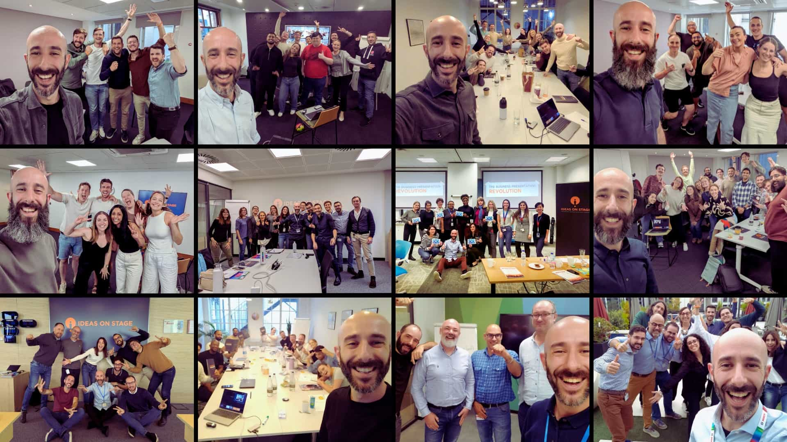









## Turn presentations into opportunities

Too many great ideas fall flat because they’re not presented well.

The **Confident Presenter Workshop** helps your team turn complex information into clear, compelling messages that guide potential clients to the next step.

Built on the proven _Presentation SCORE_ method, it blends **practical tools, real examples** and **expert feedback** in a way that keeps participants engaged from start to finish. They leave with **new confidence, stronger communication skills** and a **framework they can use for life.**

Available **online** or **in person**, adapted to your team’s goals and challenges.

## Who it’s for

The Confident Presenter Workshop is designed for business leaders and teams who want to:

- Communicate ideas with **clarity** and **confidence**
- Present more effectively to **prospects** and **clients**
- **Stand out** in their industry through stronger communication

If you’re ready to move beyond “good enough” and help your team present with real presence, this is the place to start.

  

## What your team will walk away with

After the workshop, your team will be able to:

- Shape messages that people remember
- Deliver with confidence and credibility
- Engage any audience – in person or online
- Use client-facing presentations to lead, influence and drive change

## What’s inside the experience

Each workshop includes:

- **Expert-led training** tailored to your goals
- **Hands-on exercises** built around your real presentations
- **Personalised feedback** to make improvements stick
- **Access to resources** that help the learning last

## What our clients are saying

Teams that complete the **Confident Presenter Workshop** see real results – more confidence, more clarity and more wins.









## Let’s get your team ready to shine

**Contact us** to discuss your workshop and find the format that fits your organisation best.
